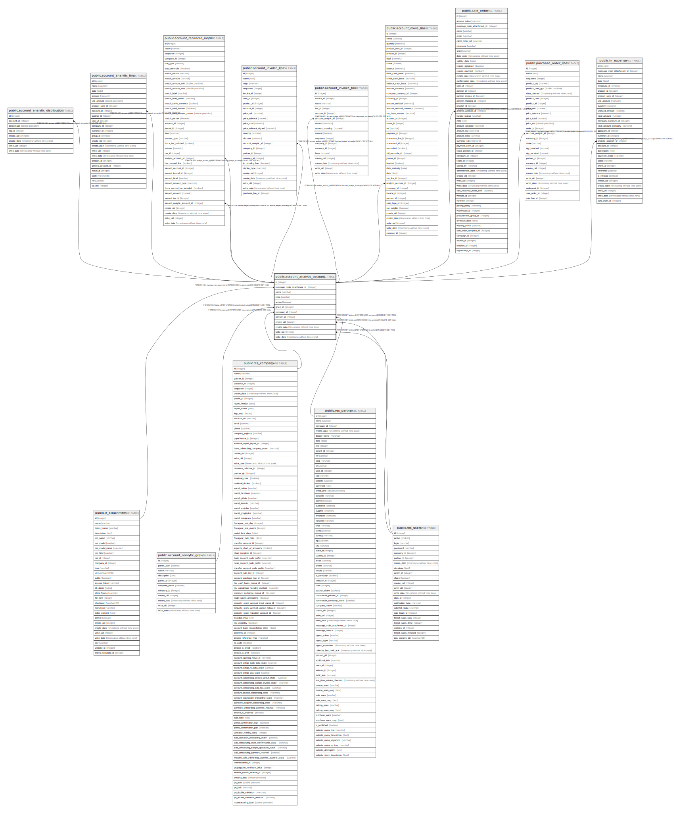

# public.account_analytic_account

## Description

Analytic Account

## Columns

| Name | Type | Default | Nullable | Children | Parents | Comment |
| ---- | ---- | ------- | -------- | -------- | ------- | ------- |
| id | integer | nextval('account_analytic_account_id_seq'::regclass) | false | [public.account_analytic_distribution](public.account_analytic_distribution.md) [public.account_analytic_line](public.account_analytic_line.md) [public.account_reconcile_model](public.account_reconcile_model.md) [public.account_invoice_line](public.account_invoice_line.md) [public.account_invoice_tax](public.account_invoice_tax.md) [public.account_move_line](public.account_move_line.md) [public.sale_order](public.sale_order.md) [public.purchase_order_line](public.purchase_order_line.md) [public.hr_expense](public.hr_expense.md) |  |  |
| message_main_attachment_id | integer |  | true |  | [public.ir_attachment](public.ir_attachment.md) | Main Attachment |
| name | varchar |  | false |  |  | Analytic Account |
| code | varchar |  | true |  |  | Reference |
| active | boolean |  | true |  |  | Active |
| group_id | integer |  | true |  | [public.account_analytic_group](public.account_analytic_group.md) | Group |
| company_id | integer |  | true |  | [public.res_company](public.res_company.md) | Company |
| partner_id | integer |  | true |  | [public.res_partner](public.res_partner.md) | Customer |
| create_uid | integer |  | true |  | [public.res_users](public.res_users.md) | Created by |
| create_date | timestamp without time zone |  | true |  |  | Created on |
| write_uid | integer |  | true |  | [public.res_users](public.res_users.md) | Last Updated by |
| write_date | timestamp without time zone |  | true |  |  | Last Updated on |

## Constraints

| Name | Type | Definition |
| ---- | ---- | ---------- |
| account_analytic_account_create_uid_fkey | FOREIGN KEY | FOREIGN KEY (create_uid) REFERENCES res_users(id) ON DELETE SET NULL |
| account_analytic_account_write_uid_fkey | FOREIGN KEY | FOREIGN KEY (write_uid) REFERENCES res_users(id) ON DELETE SET NULL |
| account_analytic_account_company_id_fkey | FOREIGN KEY | FOREIGN KEY (company_id) REFERENCES res_company(id) ON DELETE SET NULL |
| account_analytic_account_partner_id_fkey | FOREIGN KEY | FOREIGN KEY (partner_id) REFERENCES res_partner(id) ON DELETE SET NULL |
| account_analytic_account_message_main_attachment_id_fkey | FOREIGN KEY | FOREIGN KEY (message_main_attachment_id) REFERENCES ir_attachment(id) ON DELETE SET NULL |
| account_analytic_account_group_id_fkey | FOREIGN KEY | FOREIGN KEY (group_id) REFERENCES account_analytic_group(id) ON DELETE SET NULL |
| account_analytic_account_pkey | PRIMARY KEY | PRIMARY KEY (id) |

## Indexes

| Name | Definition |
| ---- | ---------- |
| account_analytic_account_pkey | CREATE UNIQUE INDEX account_analytic_account_pkey ON public.account_analytic_account USING btree (id) |
| account_analytic_account_message_main_attachment_id_index | CREATE INDEX account_analytic_account_message_main_attachment_id_index ON public.account_analytic_account USING btree (message_main_attachment_id) |
| account_analytic_account_name_index | CREATE INDEX account_analytic_account_name_index ON public.account_analytic_account USING btree (name) |
| account_analytic_account_code_index | CREATE INDEX account_analytic_account_code_index ON public.account_analytic_account USING btree (code) |

## Relations

---

> Generated by [tbls](https://github.com/k1LoW/tbls)
