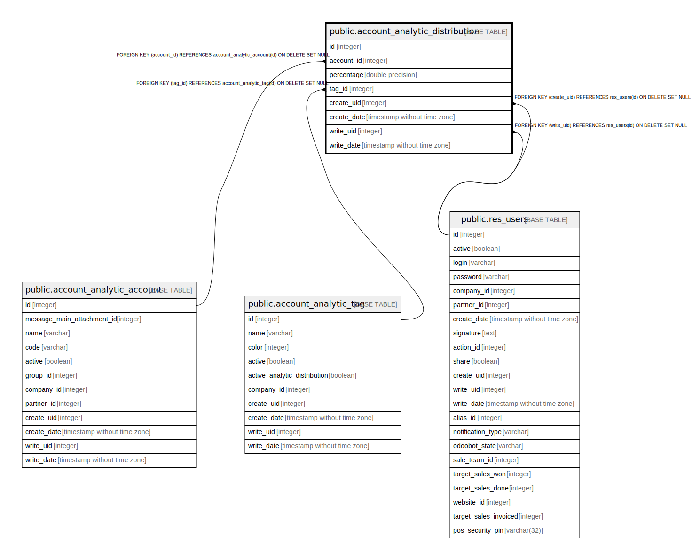

# public.account_analytic_distribution

## Description

Analytic Account Distribution

## Columns

| Name | Type | Default | Nullable | Children | Parents | Comment |
| ---- | ---- | ------- | -------- | -------- | ------- | ------- |
| id | integer | nextval('account_analytic_distribution_id_seq'::regclass) | false |  |  |  |
| account_id | integer |  | false |  | [public.account_analytic_account](public.account_analytic_account.md) | Analytic Account |
| percentage | double precision |  | false |  |  | Percentage |
| tag_id | integer |  | false |  | [public.account_analytic_tag](public.account_analytic_tag.md) | Parent tag |
| create_uid | integer |  | true |  | [public.res_users](public.res_users.md) | Created by |
| create_date | timestamp without time zone |  | true |  |  | Created on |
| write_uid | integer |  | true |  | [public.res_users](public.res_users.md) | Last Updated by |
| write_date | timestamp without time zone |  | true |  |  | Last Updated on |

## Constraints

| Name | Type | Definition | Comment |
| ---- | ---- | ---------- | ------- |
| account_analytic_distribution_check_percentage | CHECK | CHECK (((percentage >= (0)::double precision) AND (percentage <= (100)::double precision))) | CHECK(percentage >= 0 AND percentage <= 100) |
| account_analytic_distribution_create_uid_fkey | FOREIGN KEY | FOREIGN KEY (create_uid) REFERENCES res_users(id) ON DELETE SET NULL |  |
| account_analytic_distribution_write_uid_fkey | FOREIGN KEY | FOREIGN KEY (write_uid) REFERENCES res_users(id) ON DELETE SET NULL |  |
| account_analytic_distribution_pkey | PRIMARY KEY | PRIMARY KEY (id) |  |
| account_analytic_distribution_tag_id_fkey | FOREIGN KEY | FOREIGN KEY (tag_id) REFERENCES account_analytic_tag(id) ON DELETE SET NULL |  |
| account_analytic_distribution_account_id_fkey | FOREIGN KEY | FOREIGN KEY (account_id) REFERENCES account_analytic_account(id) ON DELETE SET NULL |  |

## Indexes

| Name | Definition |
| ---- | ---------- |
| account_analytic_distribution_pkey | CREATE UNIQUE INDEX account_analytic_distribution_pkey ON public.account_analytic_distribution USING btree (id) |

## Relations

---

> Generated by [tbls](https://github.com/k1LoW/tbls)
