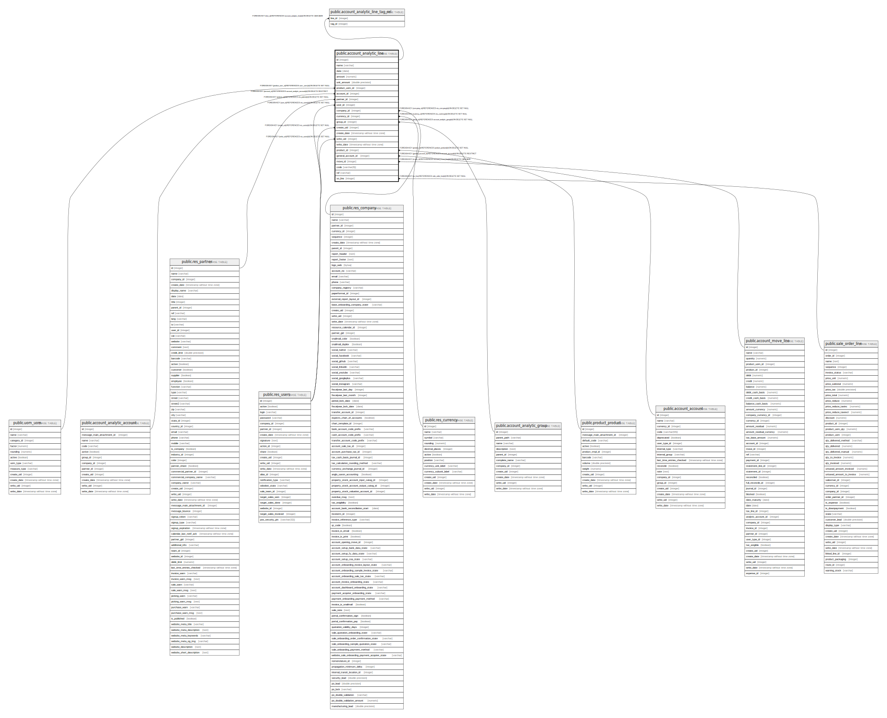

# public.account_analytic_line

## Description

Analytic Line

## Columns

| Name | Type | Default | Nullable | Children | Parents | Comment |
| ---- | ---- | ------- | -------- | -------- | ------- | ------- |
| id | integer | nextval('account_analytic_line_id_seq'::regclass) | false | [public.account_analytic_line_tag_rel](public.account_analytic_line_tag_rel.md) |  |  |
| name | varchar |  | false |  |  | Description |
| date | date |  | false |  |  | Date |
| amount | numeric |  | false |  |  | Amount |
| unit_amount | double precision |  | true |  |  | Quantity |
| product_uom_id | integer |  | true |  | [public.uom_uom](public.uom_uom.md) | Unit of Measure |
| account_id | integer |  | false |  | [public.account_analytic_account](public.account_analytic_account.md) | Analytic Account |
| partner_id | integer |  | true |  | [public.res_partner](public.res_partner.md) | Partner |
| user_id | integer |  | true |  | [public.res_users](public.res_users.md) | User |
| company_id | integer |  | false |  | [public.res_company](public.res_company.md) | Company |
| currency_id | integer |  | true |  | [public.res_currency](public.res_currency.md) | Currency |
| group_id | integer |  | true |  | [public.account_analytic_group](public.account_analytic_group.md) | Group |
| create_uid | integer |  | true |  | [public.res_users](public.res_users.md) | Created by |
| create_date | timestamp without time zone |  | true |  |  | Created on |
| write_uid | integer |  | true |  | [public.res_users](public.res_users.md) | Last Updated by |
| write_date | timestamp without time zone |  | true |  |  | Last Updated on |
| product_id | integer |  | true |  | [public.product_product](public.product_product.md) | Product |
| general_account_id | integer |  | true |  | [public.account_account](public.account_account.md) | Financial Account |
| move_id | integer |  | true |  | [public.account_move_line](public.account_move_line.md) | Journal Item |
| code | varchar(8) |  | true |  |  | Code |
| ref | varchar |  | true |  |  | Ref. |
| so_line | integer |  | true |  | [public.sale_order_line](public.sale_order_line.md) | Sales Order Item |

## Constraints

| Name | Type | Definition |
| ---- | ---- | ---------- |
| account_analytic_line_create_uid_fkey | FOREIGN KEY | FOREIGN KEY (create_uid) REFERENCES res_users(id) ON DELETE SET NULL |
| account_analytic_line_user_id_fkey | FOREIGN KEY | FOREIGN KEY (user_id) REFERENCES res_users(id) ON DELETE SET NULL |
| account_analytic_line_write_uid_fkey | FOREIGN KEY | FOREIGN KEY (write_uid) REFERENCES res_users(id) ON DELETE SET NULL |
| account_analytic_line_currency_id_fkey | FOREIGN KEY | FOREIGN KEY (currency_id) REFERENCES res_currency(id) ON DELETE SET NULL |
| account_analytic_line_company_id_fkey | FOREIGN KEY | FOREIGN KEY (company_id) REFERENCES res_company(id) ON DELETE SET NULL |
| account_analytic_line_partner_id_fkey | FOREIGN KEY | FOREIGN KEY (partner_id) REFERENCES res_partner(id) ON DELETE SET NULL |
| account_analytic_line_product_uom_id_fkey | FOREIGN KEY | FOREIGN KEY (product_uom_id) REFERENCES uom_uom(id) ON DELETE SET NULL |
| account_analytic_line_group_id_fkey | FOREIGN KEY | FOREIGN KEY (group_id) REFERENCES account_analytic_group(id) ON DELETE SET NULL |
| account_analytic_line_account_id_fkey | FOREIGN KEY | FOREIGN KEY (account_id) REFERENCES account_analytic_account(id) ON DELETE RESTRICT |
| account_analytic_line_pkey | PRIMARY KEY | PRIMARY KEY (id) |
| account_analytic_line_product_id_fkey | FOREIGN KEY | FOREIGN KEY (product_id) REFERENCES product_product(id) ON DELETE SET NULL |
| account_analytic_line_general_account_id_fkey | FOREIGN KEY | FOREIGN KEY (general_account_id) REFERENCES account_account(id) ON DELETE RESTRICT |
| account_analytic_line_move_id_fkey | FOREIGN KEY | FOREIGN KEY (move_id) REFERENCES account_move_line(id) ON DELETE CASCADE |
| account_analytic_line_so_line_fkey | FOREIGN KEY | FOREIGN KEY (so_line) REFERENCES sale_order_line(id) ON DELETE SET NULL |

## Indexes

| Name | Definition |
| ---- | ---------- |
| account_analytic_line_pkey | CREATE UNIQUE INDEX account_analytic_line_pkey ON public.account_analytic_line USING btree (id) |
| account_analytic_line_date_index | CREATE INDEX account_analytic_line_date_index ON public.account_analytic_line USING btree (date) |
| account_analytic_line_account_id_index | CREATE INDEX account_analytic_line_account_id_index ON public.account_analytic_line USING btree (account_id) |
| account_analytic_line_move_id_index | CREATE INDEX account_analytic_line_move_id_index ON public.account_analytic_line USING btree (move_id) |

## Relations

---

> Generated by [tbls](https://github.com/k1LoW/tbls)
