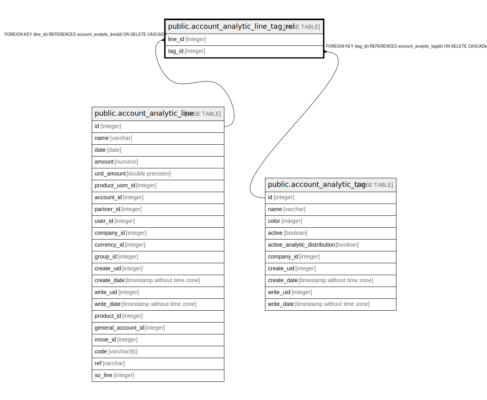

# public.account_analytic_line_tag_rel

## Description

RELATION BETWEEN account_analytic_line AND account_analytic_tag

## Columns

| Name | Type | Default | Nullable | Children | Parents | Comment |
| ---- | ---- | ------- | -------- | -------- | ------- | ------- |
| line_id | integer |  | false |  | [public.account_analytic_line](public.account_analytic_line.md) |  |
| tag_id | integer |  | false |  | [public.account_analytic_tag](public.account_analytic_tag.md) |  |

## Constraints

| Name | Type | Definition |
| ---- | ---- | ---------- |
| account_analytic_line_tag_rel_tag_id_fkey | FOREIGN KEY | FOREIGN KEY (tag_id) REFERENCES account_analytic_tag(id) ON DELETE CASCADE |
| account_analytic_line_tag_rel_line_id_fkey | FOREIGN KEY | FOREIGN KEY (line_id) REFERENCES account_analytic_line(id) ON DELETE CASCADE |
| account_analytic_line_tag_rel_line_id_tag_id_key | UNIQUE | UNIQUE (line_id, tag_id) |

## Indexes

| Name | Definition |
| ---- | ---------- |
| account_analytic_line_tag_rel_line_id_tag_id_key | CREATE UNIQUE INDEX account_analytic_line_tag_rel_line_id_tag_id_key ON public.account_analytic_line_tag_rel USING btree (line_id, tag_id) |
| account_analytic_line_tag_rel_line_id_idx | CREATE INDEX account_analytic_line_tag_rel_line_id_idx ON public.account_analytic_line_tag_rel USING btree (line_id) |
| account_analytic_line_tag_rel_tag_id_idx | CREATE INDEX account_analytic_line_tag_rel_tag_id_idx ON public.account_analytic_line_tag_rel USING btree (tag_id) |

## Relations

---

> Generated by [tbls](https://github.com/k1LoW/tbls)
