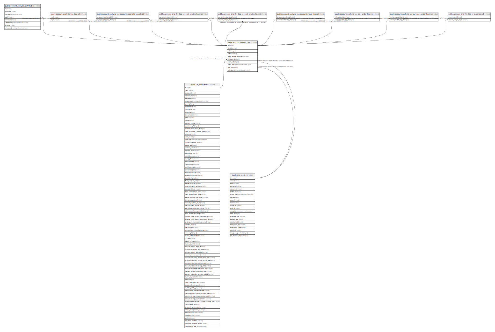

# public.account_analytic_tag

## Description

Analytic Tags

## Columns

| Name | Type | Default | Nullable | Children | Parents | Comment |
| ---- | ---- | ------- | -------- | -------- | ------- | ------- |
| id | integer | nextval('account_analytic_tag_id_seq'::regclass) | false | [public.account_analytic_distribution](public.account_analytic_distribution.md) [public.account_analytic_line_tag_rel](public.account_analytic_line_tag_rel.md) [public.account_analytic_tag_account_reconcile_model_rel](public.account_analytic_tag_account_reconcile_model_rel.md) [public.account_analytic_tag_account_invoice_line_rel](public.account_analytic_tag_account_invoice_line_rel.md) [public.account_analytic_tag_account_invoice_tax_rel](public.account_analytic_tag_account_invoice_tax_rel.md) [public.account_analytic_tag_account_move_line_rel](public.account_analytic_tag_account_move_line_rel.md) [public.account_analytic_tag_sale_order_line_rel](public.account_analytic_tag_sale_order_line_rel.md) [public.account_analytic_tag_purchase_order_line_rel](public.account_analytic_tag_purchase_order_line_rel.md) [public.account_analytic_tag_hr_expense_rel](public.account_analytic_tag_hr_expense_rel.md) |  |  |
| name | varchar |  | false |  |  | Analytic Tag |
| color | integer |  | true |  |  | Color Index |
| active | boolean |  | true |  |  | Active |
| active_analytic_distribution | boolean |  | true |  |  | Analytic Distribution |
| company_id | integer |  | true |  | [public.res_company](public.res_company.md) | Company |
| create_uid | integer |  | true |  | [public.res_users](public.res_users.md) | Created by |
| create_date | timestamp without time zone |  | true |  |  | Created on |
| write_uid | integer |  | true |  | [public.res_users](public.res_users.md) | Last Updated by |
| write_date | timestamp without time zone |  | true |  |  | Last Updated on |

## Constraints

| Name | Type | Definition |
| ---- | ---- | ---------- |
| account_analytic_tag_create_uid_fkey | FOREIGN KEY | FOREIGN KEY (create_uid) REFERENCES res_users(id) ON DELETE SET NULL |
| account_analytic_tag_write_uid_fkey | FOREIGN KEY | FOREIGN KEY (write_uid) REFERENCES res_users(id) ON DELETE SET NULL |
| account_analytic_tag_company_id_fkey | FOREIGN KEY | FOREIGN KEY (company_id) REFERENCES res_company(id) ON DELETE SET NULL |
| account_analytic_tag_pkey | PRIMARY KEY | PRIMARY KEY (id) |

## Indexes

| Name | Definition |
| ---- | ---------- |
| account_analytic_tag_pkey | CREATE UNIQUE INDEX account_analytic_tag_pkey ON public.account_analytic_tag USING btree (id) |
| account_analytic_tag_name_index | CREATE INDEX account_analytic_tag_name_index ON public.account_analytic_tag USING btree (name) |

## Relations

---

> Generated by [tbls](https://github.com/k1LoW/tbls)
