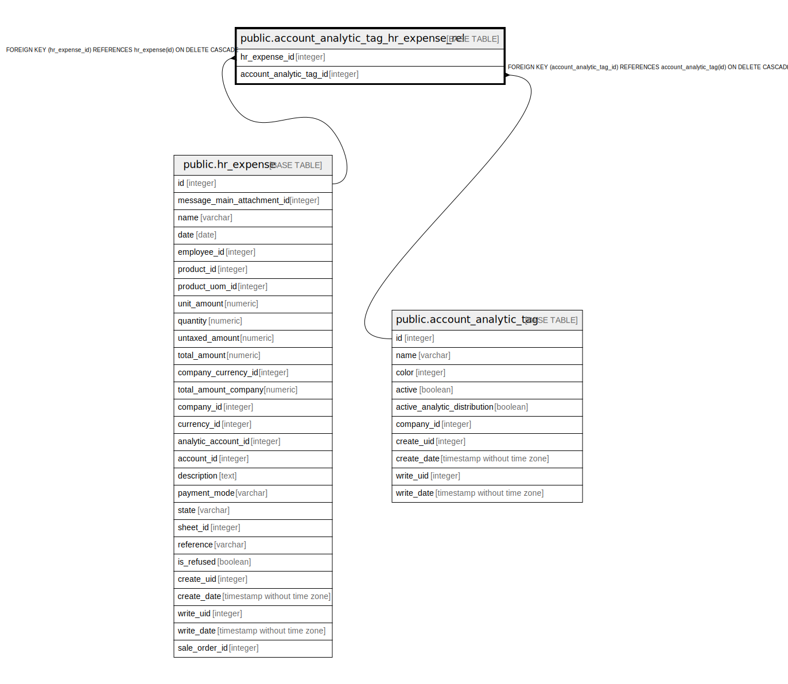

# public.account_analytic_tag_hr_expense_rel

## Description

RELATION BETWEEN hr_expense AND account_analytic_tag

## Columns

| Name | Type | Default | Nullable | Children | Parents | Comment |
| ---- | ---- | ------- | -------- | -------- | ------- | ------- |
| hr_expense_id | integer |  | false |  | [public.hr_expense](public.hr_expense.md) |  |
| account_analytic_tag_id | integer |  | false |  | [public.account_analytic_tag](public.account_analytic_tag.md) |  |

## Constraints

| Name | Type | Definition |
| ---- | ---- | ---------- |
| account_analytic_tag_hr_expense_re_account_analytic_tag_id_fkey | FOREIGN KEY | FOREIGN KEY (account_analytic_tag_id) REFERENCES account_analytic_tag(id) ON DELETE CASCADE |
| account_analytic_tag_hr_expense_rel_hr_expense_id_fkey | FOREIGN KEY | FOREIGN KEY (hr_expense_id) REFERENCES hr_expense(id) ON DELETE CASCADE |
| account_analytic_tag_hr_expen_hr_expense_id_account_analyti_key | UNIQUE | UNIQUE (hr_expense_id, account_analytic_tag_id) |

## Indexes

| Name | Definition |
| ---- | ---------- |
| account_analytic_tag_hr_expen_hr_expense_id_account_analyti_key | CREATE UNIQUE INDEX account_analytic_tag_hr_expen_hr_expense_id_account_analyti_key ON public.account_analytic_tag_hr_expense_rel USING btree (hr_expense_id, account_analytic_tag_id) |
| account_analytic_tag_hr_expense_rel_hr_expense_id_idx | CREATE INDEX account_analytic_tag_hr_expense_rel_hr_expense_id_idx ON public.account_analytic_tag_hr_expense_rel USING btree (hr_expense_id) |
| account_analytic_tag_hr_expense_rel_account_analytic_tag_id_idx | CREATE INDEX account_analytic_tag_hr_expense_rel_account_analytic_tag_id_idx ON public.account_analytic_tag_hr_expense_rel USING btree (account_analytic_tag_id) |

## Relations

---

> Generated by [tbls](https://github.com/k1LoW/tbls)
