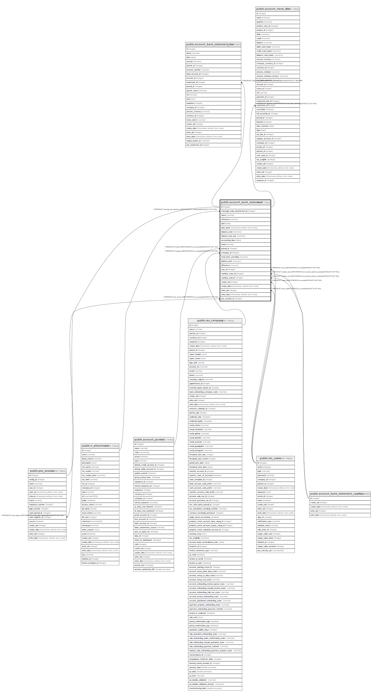

# public.account_bank_statement

## Description

Bank Statement

## Columns

| Name | Type | Default | Nullable | Children | Parents | Comment |
| ---- | ---- | ------- | -------- | -------- | ------- | ------- |
| id | integer | nextval('account_bank_statement_id_seq'::regclass) | false | [public.account_bank_statement_line](public.account_bank_statement_line.md) [public.account_move_line](public.account_move_line.md) [public.pos_session](public.pos_session.md) |  |  |
| message_main_attachment_id | integer |  | true |  | [public.ir_attachment](public.ir_attachment.md) | Main Attachment |
| name | varchar |  | true |  |  | Reference |
| reference | varchar |  | true |  |  | External Reference |
| date | date |  | false |  |  | Date |
| date_done | timestamp without time zone |  | true |  |  | Closed On |
| balance_start | numeric |  | true |  |  | Starting Balance |
| balance_end_real | numeric |  | true |  |  | Ending Balance |
| accounting_date | date |  | true |  |  | Accounting Date |
| state | varchar |  | false |  |  | Status |
| journal_id | integer |  | false |  | [public.account_journal](public.account_journal.md) | Journal |
| company_id | integer |  | true |  | [public.res_company](public.res_company.md) | Company |
| total_entry_encoding | numeric |  | true |  |  | Transactions Subtotal |
| balance_end | numeric |  | true |  |  | Computed Balance |
| difference | numeric |  | true |  |  | Difference |
| user_id | integer |  | true |  | [public.res_users](public.res_users.md) | Responsible |
| cashbox_start_id | integer |  | true |  | [public.account_bank_statement_cashbox](public.account_bank_statement_cashbox.md) | Starting Cashbox |
| cashbox_end_id | integer |  | true |  | [public.account_bank_statement_cashbox](public.account_bank_statement_cashbox.md) | Ending Cashbox |
| create_uid | integer |  | true |  | [public.res_users](public.res_users.md) | Created by |
| create_date | timestamp without time zone |  | true |  |  | Created on |
| write_uid | integer |  | true |  | [public.res_users](public.res_users.md) | Last Updated by |
| write_date | timestamp without time zone |  | true |  |  | Last Updated on |
| pos_session_id | integer |  | true |  | [public.pos_session](public.pos_session.md) | Session |

## Constraints

| Name | Type | Definition |
| ---- | ---- | ---------- |
| account_bank_statement_create_uid_fkey | FOREIGN KEY | FOREIGN KEY (create_uid) REFERENCES res_users(id) ON DELETE SET NULL |
| account_bank_statement_user_id_fkey | FOREIGN KEY | FOREIGN KEY (user_id) REFERENCES res_users(id) ON DELETE SET NULL |
| account_bank_statement_write_uid_fkey | FOREIGN KEY | FOREIGN KEY (write_uid) REFERENCES res_users(id) ON DELETE SET NULL |
| account_bank_statement_company_id_fkey | FOREIGN KEY | FOREIGN KEY (company_id) REFERENCES res_company(id) ON DELETE SET NULL |
| account_bank_statement_message_main_attachment_id_fkey | FOREIGN KEY | FOREIGN KEY (message_main_attachment_id) REFERENCES ir_attachment(id) ON DELETE SET NULL |
| account_bank_statement_journal_id_fkey | FOREIGN KEY | FOREIGN KEY (journal_id) REFERENCES account_journal(id) ON DELETE SET NULL |
| account_bank_statement_cashbox_end_id_fkey | FOREIGN KEY | FOREIGN KEY (cashbox_end_id) REFERENCES account_bank_statement_cashbox(id) ON DELETE SET NULL |
| account_bank_statement_cashbox_start_id_fkey | FOREIGN KEY | FOREIGN KEY (cashbox_start_id) REFERENCES account_bank_statement_cashbox(id) ON DELETE SET NULL |
| account_bank_statement_pkey | PRIMARY KEY | PRIMARY KEY (id) |
| account_bank_statement_pos_session_id_fkey | FOREIGN KEY | FOREIGN KEY (pos_session_id) REFERENCES pos_session(id) ON DELETE SET NULL |

## Indexes

| Name | Definition |
| ---- | ---------- |
| account_bank_statement_pkey | CREATE UNIQUE INDEX account_bank_statement_pkey ON public.account_bank_statement USING btree (id) |
| account_bank_statement_message_main_attachment_id_index | CREATE INDEX account_bank_statement_message_main_attachment_id_index ON public.account_bank_statement USING btree (message_main_attachment_id) |
| account_bank_statement_date_index | CREATE INDEX account_bank_statement_date_index ON public.account_bank_statement USING btree (date) |

## Relations

---

> Generated by [tbls](https://github.com/k1LoW/tbls)
