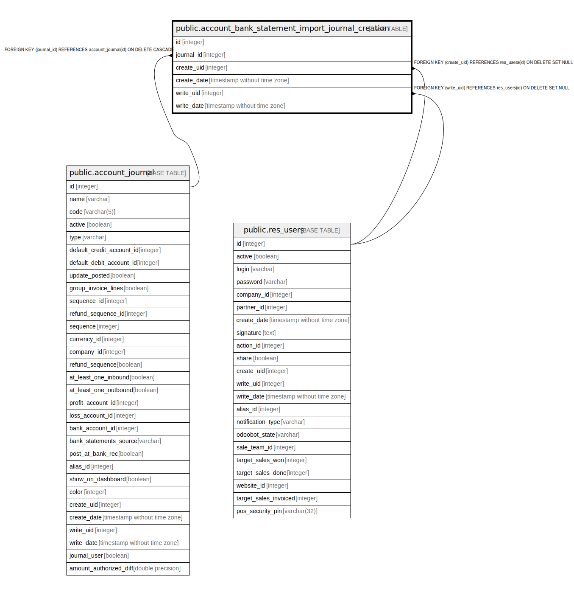

# public.account_bank_statement_import_journal_creation

## Description

Journal Creation on Bank Statement Import

## Columns

| Name | Type | Default | Nullable | Children | Parents | Comment |
| ---- | ---- | ------- | -------- | -------- | ------- | ------- |
| id | integer | nextval('account_bank_statement_import_journal_creation_id_seq'::regclass) | false |  |  |  |
| journal_id | integer |  | false |  | [public.account_journal](public.account_journal.md) | Journal |
| create_uid | integer |  | true |  | [public.res_users](public.res_users.md) | Created by |
| create_date | timestamp without time zone |  | true |  |  | Created on |
| write_uid | integer |  | true |  | [public.res_users](public.res_users.md) | Last Updated by |
| write_date | timestamp without time zone |  | true |  |  | Last Updated on |

## Constraints

| Name | Type | Definition |
| ---- | ---- | ---------- |
| account_bank_statement_import_journal_creation_create_uid_fkey | FOREIGN KEY | FOREIGN KEY (create_uid) REFERENCES res_users(id) ON DELETE SET NULL |
| account_bank_statement_import_journal_creation_write_uid_fkey | FOREIGN KEY | FOREIGN KEY (write_uid) REFERENCES res_users(id) ON DELETE SET NULL |
| account_bank_statement_import_journal_creation_journal_id_fkey | FOREIGN KEY | FOREIGN KEY (journal_id) REFERENCES account_journal(id) ON DELETE CASCADE |
| account_bank_statement_import_journal_creation_pkey | PRIMARY KEY | PRIMARY KEY (id) |

## Indexes

| Name | Definition |
| ---- | ---------- |
| account_bank_statement_import_journal_creation_pkey | CREATE UNIQUE INDEX account_bank_statement_import_journal_creation_pkey ON public.account_bank_statement_import_journal_creation USING btree (id) |

## Relations

---

> Generated by [tbls](https://github.com/k1LoW/tbls)
