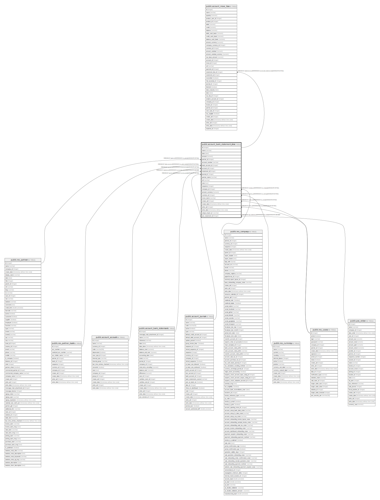

# public.account_bank_statement_line

## Description

Bank Statement Line

## Columns

| Name | Type | Default | Nullable | Children | Parents | Comment |
| ---- | ---- | ------- | -------- | -------- | ------- | ------- |
| id | integer | nextval('account_bank_statement_line_id_seq'::regclass) | false | [public.account_move_line](public.account_move_line.md) |  |  |
| name | varchar |  | false |  |  | Label |
| date | date |  | false |  |  | Date |
| amount | numeric |  | true |  |  | Amount |
| partner_id | integer |  | true |  | [public.res_partner](public.res_partner.md) | Partner |
| account_number | varchar |  | true |  |  | Bank Account Number |
| bank_account_id | integer |  | true |  | [public.res_partner_bank](public.res_partner_bank.md) | Bank Account |
| account_id | integer |  | true |  | [public.account_account](public.account_account.md) | Counterpart Account |
| statement_id | integer |  | false |  | [public.account_bank_statement](public.account_bank_statement.md) | Statement |
| journal_id | integer |  | true |  | [public.account_journal](public.account_journal.md) | Journal |
| partner_name | varchar |  | true |  |  | Partner Name |
| ref | varchar |  | true |  |  | Reference |
| note | text |  | true |  |  | Notes |
| sequence | integer |  | true |  |  | Sequence |
| company_id | integer |  | true |  | [public.res_company](public.res_company.md) | Company |
| amount_currency | numeric |  | true |  |  | Amount Currency |
| currency_id | integer |  | true |  | [public.res_currency](public.res_currency.md) | Currency |
| move_name | varchar |  | true |  |  | Journal Entry Name |
| create_uid | integer |  | true |  | [public.res_users](public.res_users.md) | Created by |
| create_date | timestamp without time zone |  | true |  |  | Created on |
| write_uid | integer |  | true |  | [public.res_users](public.res_users.md) | Last Updated by |
| write_date | timestamp without time zone |  | true |  |  | Last Updated on |
| unique_import_id | varchar |  | true |  |  | Import ID |
| pos_statement_id | integer |  | true |  | [public.pos_order](public.pos_order.md) | POS statement |

## Constraints

| Name | Type | Definition | Comment |
| ---- | ---- | ---------- | ------- |
| account_bank_statement_line_create_uid_fkey | FOREIGN KEY | FOREIGN KEY (create_uid) REFERENCES res_users(id) ON DELETE SET NULL |  |
| account_bank_statement_line_write_uid_fkey | FOREIGN KEY | FOREIGN KEY (write_uid) REFERENCES res_users(id) ON DELETE SET NULL |  |
| account_bank_statement_line_currency_id_fkey | FOREIGN KEY | FOREIGN KEY (currency_id) REFERENCES res_currency(id) ON DELETE SET NULL |  |
| account_bank_statement_line_company_id_fkey | FOREIGN KEY | FOREIGN KEY (company_id) REFERENCES res_company(id) ON DELETE SET NULL |  |
| account_bank_statement_line_partner_id_fkey | FOREIGN KEY | FOREIGN KEY (partner_id) REFERENCES res_partner(id) ON DELETE SET NULL |  |
| account_bank_statement_line_bank_account_id_fkey | FOREIGN KEY | FOREIGN KEY (bank_account_id) REFERENCES res_partner_bank(id) ON DELETE SET NULL |  |
| account_bank_statement_line_account_id_fkey | FOREIGN KEY | FOREIGN KEY (account_id) REFERENCES account_account(id) ON DELETE SET NULL |  |
| account_bank_statement_line_journal_id_fkey | FOREIGN KEY | FOREIGN KEY (journal_id) REFERENCES account_journal(id) ON DELETE SET NULL |  |
| account_bank_statement_line_statement_id_fkey | FOREIGN KEY | FOREIGN KEY (statement_id) REFERENCES account_bank_statement(id) ON DELETE CASCADE |  |
| account_bank_statement_line_pkey | PRIMARY KEY | PRIMARY KEY (id) |  |
| account_bank_statement_line_unique_import_id | UNIQUE | UNIQUE (unique_import_id) | unique (unique_import_id) |
| account_bank_statement_line_pos_statement_id_fkey | FOREIGN KEY | FOREIGN KEY (pos_statement_id) REFERENCES pos_order(id) ON DELETE CASCADE |  |

## Indexes

| Name | Definition |
| ---- | ---------- |
| account_bank_statement_line_pkey | CREATE UNIQUE INDEX account_bank_statement_line_pkey ON public.account_bank_statement_line USING btree (id) |
| account_bank_statement_line_statement_id_index | CREATE INDEX account_bank_statement_line_statement_id_index ON public.account_bank_statement_line USING btree (statement_id) |
| account_bank_statement_line_sequence_index | CREATE INDEX account_bank_statement_line_sequence_index ON public.account_bank_statement_line USING btree (sequence) |
| account_bank_statement_line_unique_import_id | CREATE UNIQUE INDEX account_bank_statement_line_unique_import_id ON public.account_bank_statement_line USING btree (unique_import_id) |

## Relations

---

> Generated by [tbls](https://github.com/k1LoW/tbls)
