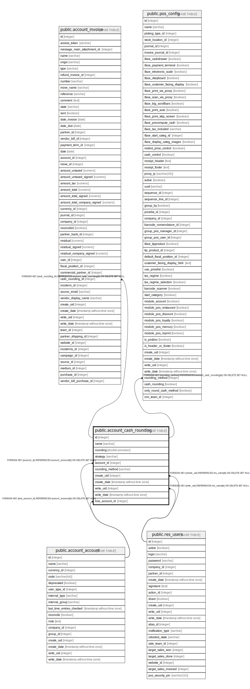

# public.account_cash_rounding

## Description

Account Cash Rounding

## Columns

| Name | Type | Default | Nullable | Children | Parents | Comment |
| ---- | ---- | ------- | -------- | -------- | ------- | ------- |
| id | integer | nextval('account_cash_rounding_id_seq'::regclass) | false | [public.account_invoice](public.account_invoice.md) [public.pos_config](public.pos_config.md) |  |  |
| name | varchar |  | false |  |  | Name |
| rounding | double precision |  | false |  |  | Rounding Precision |
| strategy | varchar |  | false |  |  | Rounding Strategy |
| account_id | integer |  | true |  | [public.account_account](public.account_account.md) | Account |
| rounding_method | varchar |  | false |  |  | Rounding Method |
| create_uid | integer |  | true |  | [public.res_users](public.res_users.md) | Created by |
| create_date | timestamp without time zone |  | true |  |  | Created on |
| write_uid | integer |  | true |  | [public.res_users](public.res_users.md) | Last Updated by |
| write_date | timestamp without time zone |  | true |  |  | Last Updated on |
| loss_account_id | integer |  | true |  | [public.account_account](public.account_account.md) | Loss Account |

## Constraints

| Name | Type | Definition |
| ---- | ---- | ---------- |
| account_cash_rounding_create_uid_fkey | FOREIGN KEY | FOREIGN KEY (create_uid) REFERENCES res_users(id) ON DELETE SET NULL |
| account_cash_rounding_write_uid_fkey | FOREIGN KEY | FOREIGN KEY (write_uid) REFERENCES res_users(id) ON DELETE SET NULL |
| account_cash_rounding_account_id_fkey | FOREIGN KEY | FOREIGN KEY (account_id) REFERENCES account_account(id) ON DELETE SET NULL |
| account_cash_rounding_loss_account_id_fkey | FOREIGN KEY | FOREIGN KEY (loss_account_id) REFERENCES account_account(id) ON DELETE SET NULL |
| account_cash_rounding_pkey | PRIMARY KEY | PRIMARY KEY (id) |

## Indexes

| Name | Definition |
| ---- | ---------- |
| account_cash_rounding_pkey | CREATE UNIQUE INDEX account_cash_rounding_pkey ON public.account_cash_rounding USING btree (id) |

## Relations

---

> Generated by [tbls](https://github.com/k1LoW/tbls)
