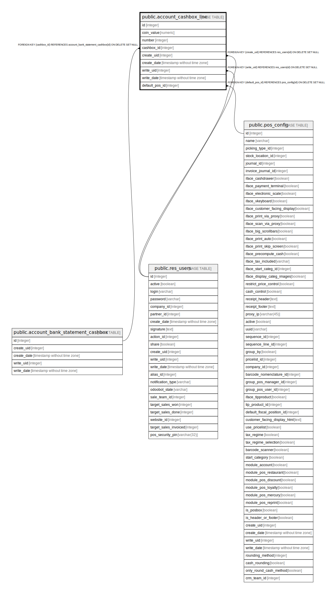

# public.account_cashbox_line

## Description

CashBox Line

## Columns

| Name | Type | Default | Nullable | Children | Parents | Comment |
| ---- | ---- | ------- | -------- | -------- | ------- | ------- |
| id | integer | nextval('account_cashbox_line_id_seq'::regclass) | false |  |  |  |
| coin_value | numeric |  | false |  |  | Coin/Bill Value |
| number | integer |  | true |  |  | Number of Coins/Bills |
| cashbox_id | integer |  | true |  | [public.account_bank_statement_cashbox](public.account_bank_statement_cashbox.md) | Cashbox |
| create_uid | integer |  | true |  | [public.res_users](public.res_users.md) | Created by |
| create_date | timestamp without time zone |  | true |  |  | Created on |
| write_uid | integer |  | true |  | [public.res_users](public.res_users.md) | Last Updated by |
| write_date | timestamp without time zone |  | true |  |  | Last Updated on |
| default_pos_id | integer |  | true |  | [public.pos_config](public.pos_config.md) | This cashbox line is used by default when opening or closing a balance for this point of sale |

## Constraints

| Name | Type | Definition |
| ---- | ---- | ---------- |
| account_cashbox_line_create_uid_fkey | FOREIGN KEY | FOREIGN KEY (create_uid) REFERENCES res_users(id) ON DELETE SET NULL |
| account_cashbox_line_write_uid_fkey | FOREIGN KEY | FOREIGN KEY (write_uid) REFERENCES res_users(id) ON DELETE SET NULL |
| account_cashbox_line_pkey | PRIMARY KEY | PRIMARY KEY (id) |
| account_cashbox_line_cashbox_id_fkey | FOREIGN KEY | FOREIGN KEY (cashbox_id) REFERENCES account_bank_statement_cashbox(id) ON DELETE SET NULL |
| account_cashbox_line_default_pos_id_fkey | FOREIGN KEY | FOREIGN KEY (default_pos_id) REFERENCES pos_config(id) ON DELETE SET NULL |

## Indexes

| Name | Definition |
| ---- | ---------- |
| account_cashbox_line_pkey | CREATE UNIQUE INDEX account_cashbox_line_pkey ON public.account_cashbox_line USING btree (id) |

## Relations

---

> Generated by [tbls](https://github.com/k1LoW/tbls)
