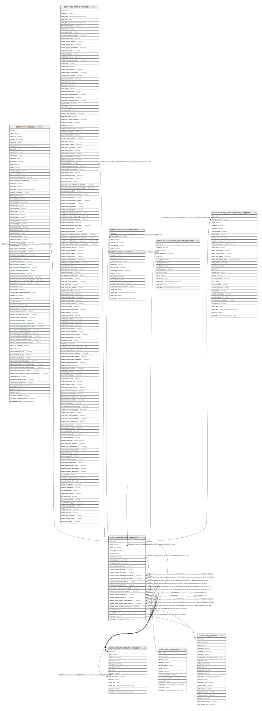

# public.account_chart_template

## Description

Account Chart Template

## Columns

| Name | Type | Default | Nullable | Children | Parents | Comment |
| ---- | ---- | ------- | -------- | -------- | ------- | ------- |
| id | integer | nextval('account_chart_template_id_seq'::regclass) | false | [public.res_company](public.res_company.md) [public.res_config_settings](public.res_config_settings.md) [public.account_account_template](public.account_account_template.md) [public.account_chart_template](public.account_chart_template.md) [public.account_tax_template](public.account_tax_template.md) [public.account_fiscal_position_template](public.account_fiscal_position_template.md) [public.account_reconcile_model_template](public.account_reconcile_model_template.md) |  |  |
| name | varchar |  | false |  |  | Name |
| parent_id | integer |  | true |  | [public.account_chart_template](public.account_chart_template.md) | Parent Chart Template |
| code_digits | integer |  | false |  |  | # of Digits |
| visible | boolean |  | true |  |  | Can be Visible? |
| currency_id | integer |  | false |  | [public.res_currency](public.res_currency.md) | Currency |
| use_anglo_saxon | boolean |  | true |  |  | Use Anglo-Saxon accounting |
| complete_tax_set | boolean |  | true |  |  | Complete Set of Taxes |
| bank_account_code_prefix | varchar |  | false |  |  | Prefix of the bank accounts |
| cash_account_code_prefix | varchar |  | false |  |  | Prefix of the main cash accounts |
| transfer_account_code_prefix | varchar |  | false |  |  | Prefix of the main transfer accounts |
| income_currency_exchange_account_id | integer |  | true |  | [public.account_account_template](public.account_account_template.md) | Gain Exchange Rate Account |
| expense_currency_exchange_account_id | integer |  | true |  | [public.account_account_template](public.account_account_template.md) | Loss Exchange Rate Account |
| property_account_receivable_id | integer |  | true |  | [public.account_account_template](public.account_account_template.md) | Receivable Account |
| property_account_payable_id | integer |  | true |  | [public.account_account_template](public.account_account_template.md) | Payable Account |
| property_account_expense_categ_id | integer |  | true |  | [public.account_account_template](public.account_account_template.md) | Category of Expense Account |
| property_account_income_categ_id | integer |  | true |  | [public.account_account_template](public.account_account_template.md) | Category of Income Account |
| property_account_expense_id | integer |  | true |  | [public.account_account_template](public.account_account_template.md) | Expense Account on Product Template |
| property_account_income_id | integer |  | true |  | [public.account_account_template](public.account_account_template.md) | Income Account on Product Template |
| property_stock_account_input_categ_id | integer |  | true |  | [public.account_account_template](public.account_account_template.md) | Input Account for Stock Valuation |
| property_stock_account_output_categ_id | integer |  | true |  | [public.account_account_template](public.account_account_template.md) | Output Account for Stock Valuation |
| property_stock_valuation_account_id | integer |  | true |  | [public.account_account_template](public.account_account_template.md) | Account Template for Stock Valuation |
| create_uid | integer |  | true |  | [public.res_users](public.res_users.md) | Created by |
| create_date | timestamp without time zone |  | true |  |  | Created on |
| write_uid | integer |  | true |  | [public.res_users](public.res_users.md) | Last Updated by |
| write_date | timestamp without time zone |  | true |  |  | Last Updated on |

## Constraints

| Name | Type | Definition |
| ---- | ---- | ---------- |
| account_chart_template_create_uid_fkey | FOREIGN KEY | FOREIGN KEY (create_uid) REFERENCES res_users(id) ON DELETE SET NULL |
| account_chart_template_write_uid_fkey | FOREIGN KEY | FOREIGN KEY (write_uid) REFERENCES res_users(id) ON DELETE SET NULL |
| account_chart_template_currency_id_fkey | FOREIGN KEY | FOREIGN KEY (currency_id) REFERENCES res_currency(id) ON DELETE SET NULL |
| account_chart_template_expense_currency_exchange_account_i_fkey | FOREIGN KEY | FOREIGN KEY (expense_currency_exchange_account_id) REFERENCES account_account_template(id) ON DELETE SET NULL |
| account_chart_template_income_currency_exchange_account_id_fkey | FOREIGN KEY | FOREIGN KEY (income_currency_exchange_account_id) REFERENCES account_account_template(id) ON DELETE SET NULL |
| account_chart_template_property_account_expense_categ_id_fkey | FOREIGN KEY | FOREIGN KEY (property_account_expense_categ_id) REFERENCES account_account_template(id) ON DELETE SET NULL |
| account_chart_template_property_account_expense_id_fkey | FOREIGN KEY | FOREIGN KEY (property_account_expense_id) REFERENCES account_account_template(id) ON DELETE SET NULL |
| account_chart_template_property_account_income_categ_id_fkey | FOREIGN KEY | FOREIGN KEY (property_account_income_categ_id) REFERENCES account_account_template(id) ON DELETE SET NULL |
| account_chart_template_property_account_income_id_fkey | FOREIGN KEY | FOREIGN KEY (property_account_income_id) REFERENCES account_account_template(id) ON DELETE SET NULL |
| account_chart_template_property_account_payable_id_fkey | FOREIGN KEY | FOREIGN KEY (property_account_payable_id) REFERENCES account_account_template(id) ON DELETE SET NULL |
| account_chart_template_property_account_receivable_id_fkey | FOREIGN KEY | FOREIGN KEY (property_account_receivable_id) REFERENCES account_account_template(id) ON DELETE SET NULL |
| account_chart_template_property_stock_account_input_categ__fkey | FOREIGN KEY | FOREIGN KEY (property_stock_account_input_categ_id) REFERENCES account_account_template(id) ON DELETE SET NULL |
| account_chart_template_property_stock_account_output_categ_fkey | FOREIGN KEY | FOREIGN KEY (property_stock_account_output_categ_id) REFERENCES account_account_template(id) ON DELETE SET NULL |
| account_chart_template_property_stock_valuation_account_id_fkey | FOREIGN KEY | FOREIGN KEY (property_stock_valuation_account_id) REFERENCES account_account_template(id) ON DELETE SET NULL |
| account_chart_template_parent_id_fkey | FOREIGN KEY | FOREIGN KEY (parent_id) REFERENCES account_chart_template(id) ON DELETE SET NULL |
| account_chart_template_pkey | PRIMARY KEY | PRIMARY KEY (id) |

## Indexes

| Name | Definition |
| ---- | ---------- |
| account_chart_template_pkey | CREATE UNIQUE INDEX account_chart_template_pkey ON public.account_chart_template USING btree (id) |

## Relations

---

> Generated by [tbls](https://github.com/k1LoW/tbls)
