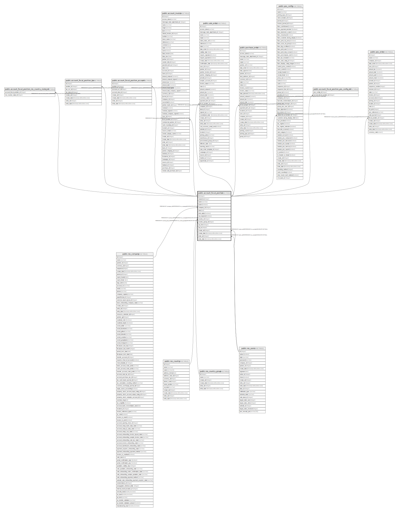

# public.account_fiscal_position

## Description

Fiscal Position

## Columns

| Name | Type | Default | Nullable | Children | Parents | Comment |
| ---- | ---- | ------- | -------- | -------- | ------- | ------- |
| id | integer | nextval('account_fiscal_position_id_seq'::regclass) | false | [public.account_fiscal_position_res_country_state_rel](public.account_fiscal_position_res_country_state_rel.md) [public.account_fiscal_position_tax](public.account_fiscal_position_tax.md) [public.account_fiscal_position_account](public.account_fiscal_position_account.md) [public.account_invoice](public.account_invoice.md) [public.sale_order](public.sale_order.md) [public.purchase_order](public.purchase_order.md) [public.pos_config](public.pos_config.md) [public.account_fiscal_position_pos_config_rel](public.account_fiscal_position_pos_config_rel.md) [public.pos_order](public.pos_order.md) |  |  |
| sequence | integer |  | true |  |  | Sequence |
| name | varchar |  | false |  |  | Fiscal Position |
| active | boolean |  | true |  |  | Active |
| company_id | integer |  | true |  | [public.res_company](public.res_company.md) | Company |
| note | text |  | true |  |  | Notes |
| auto_apply | boolean |  | true |  |  | Detect Automatically |
| vat_required | boolean |  | true |  |  | VAT required |
| country_id | integer |  | true |  | [public.res_country](public.res_country.md) | Country |
| country_group_id | integer |  | true |  | [public.res_country_group](public.res_country_group.md) | Country Group |
| zip_from | integer |  | true |  |  | Zip Range From |
| zip_to | integer |  | true |  |  | Zip Range To |
| create_uid | integer |  | true |  | [public.res_users](public.res_users.md) | Created by |
| create_date | timestamp without time zone |  | true |  |  | Created on |
| write_uid | integer |  | true |  | [public.res_users](public.res_users.md) | Last Updated by |
| write_date | timestamp without time zone |  | true |  |  | Last Updated on |

## Constraints

| Name | Type | Definition |
| ---- | ---- | ---------- |
| account_fiscal_position_create_uid_fkey | FOREIGN KEY | FOREIGN KEY (create_uid) REFERENCES res_users(id) ON DELETE SET NULL |
| account_fiscal_position_write_uid_fkey | FOREIGN KEY | FOREIGN KEY (write_uid) REFERENCES res_users(id) ON DELETE SET NULL |
| account_fiscal_position_company_id_fkey | FOREIGN KEY | FOREIGN KEY (company_id) REFERENCES res_company(id) ON DELETE SET NULL |
| account_fiscal_position_country_id_fkey | FOREIGN KEY | FOREIGN KEY (country_id) REFERENCES res_country(id) ON DELETE SET NULL |
| account_fiscal_position_country_group_id_fkey | FOREIGN KEY | FOREIGN KEY (country_group_id) REFERENCES res_country_group(id) ON DELETE SET NULL |
| account_fiscal_position_pkey | PRIMARY KEY | PRIMARY KEY (id) |

## Indexes

| Name | Definition |
| ---- | ---------- |
| account_fiscal_position_pkey | CREATE UNIQUE INDEX account_fiscal_position_pkey ON public.account_fiscal_position USING btree (id) |

## Relations

---

> Generated by [tbls](https://github.com/k1LoW/tbls)
