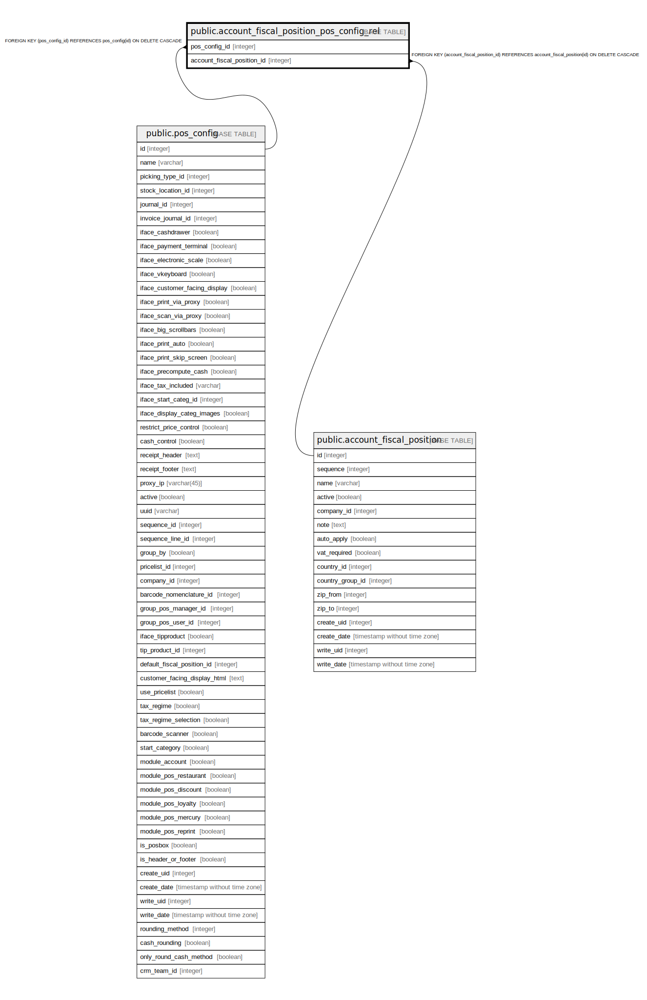

# public.account_fiscal_position_pos_config_rel

## Description

RELATION BETWEEN pos_config AND account_fiscal_position

## Columns

| Name | Type | Default | Nullable | Children | Parents | Comment |
| ---- | ---- | ------- | -------- | -------- | ------- | ------- |
| pos_config_id | integer |  | false |  | [public.pos_config](public.pos_config.md) |  |
| account_fiscal_position_id | integer |  | false |  | [public.account_fiscal_position](public.account_fiscal_position.md) |  |

## Constraints

| Name | Type | Definition |
| ---- | ---- | ---------- |
| account_fiscal_position_pos_con_account_fiscal_position_id_fkey | FOREIGN KEY | FOREIGN KEY (account_fiscal_position_id) REFERENCES account_fiscal_position(id) ON DELETE CASCADE |
| account_fiscal_position_pos_config_rel_pos_config_id_fkey | FOREIGN KEY | FOREIGN KEY (pos_config_id) REFERENCES pos_config(id) ON DELETE CASCADE |
| account_fiscal_position_pos_c_pos_config_id_account_fiscal__key | UNIQUE | UNIQUE (pos_config_id, account_fiscal_position_id) |

## Indexes

| Name | Definition |
| ---- | ---------- |
| account_fiscal_position_pos_c_pos_config_id_account_fiscal__key | CREATE UNIQUE INDEX account_fiscal_position_pos_c_pos_config_id_account_fiscal__key ON public.account_fiscal_position_pos_config_rel USING btree (pos_config_id, account_fiscal_position_id) |
| account_fiscal_position_pos_config_rel_pos_config_id_idx | CREATE INDEX account_fiscal_position_pos_config_rel_pos_config_id_idx ON public.account_fiscal_position_pos_config_rel USING btree (pos_config_id) |
| account_fiscal_position_pos_conf_account_fiscal_position_id_idx | CREATE INDEX account_fiscal_position_pos_conf_account_fiscal_position_id_idx ON public.account_fiscal_position_pos_config_rel USING btree (account_fiscal_position_id) |

## Relations

---

> Generated by [tbls](https://github.com/k1LoW/tbls)
