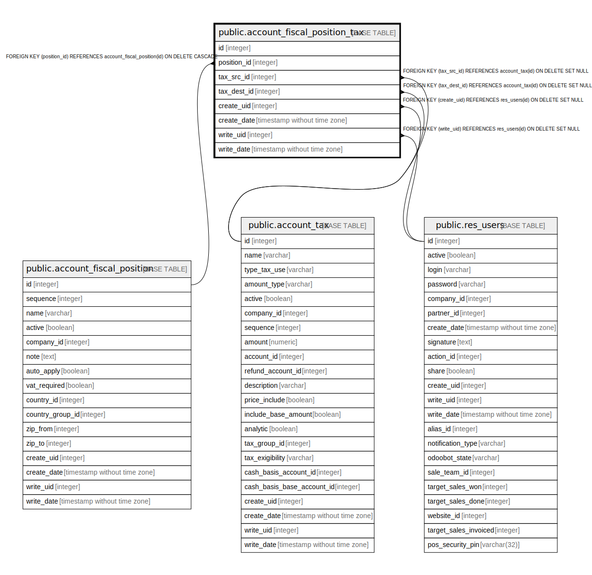

# public.account_fiscal_position_tax

## Description

Tax Mapping of Fiscal Position

## Columns

| Name | Type | Default | Nullable | Children | Parents | Comment |
| ---- | ---- | ------- | -------- | -------- | ------- | ------- |
| id | integer | nextval('account_fiscal_position_tax_id_seq'::regclass) | false |  |  |  |
| position_id | integer |  | false |  | [public.account_fiscal_position](public.account_fiscal_position.md) | Fiscal Position |
| tax_src_id | integer |  | false |  | [public.account_tax](public.account_tax.md) | Tax on Product |
| tax_dest_id | integer |  | true |  | [public.account_tax](public.account_tax.md) | Tax to Apply |
| create_uid | integer |  | true |  | [public.res_users](public.res_users.md) | Created by |
| create_date | timestamp without time zone |  | true |  |  | Created on |
| write_uid | integer |  | true |  | [public.res_users](public.res_users.md) | Last Updated by |
| write_date | timestamp without time zone |  | true |  |  | Last Updated on |

## Constraints

| Name | Type | Definition | Comment |
| ---- | ---- | ---------- | ------- |
| account_fiscal_position_tax_create_uid_fkey | FOREIGN KEY | FOREIGN KEY (create_uid) REFERENCES res_users(id) ON DELETE SET NULL |  |
| account_fiscal_position_tax_write_uid_fkey | FOREIGN KEY | FOREIGN KEY (write_uid) REFERENCES res_users(id) ON DELETE SET NULL |  |
| account_fiscal_position_tax_position_id_fkey | FOREIGN KEY | FOREIGN KEY (position_id) REFERENCES account_fiscal_position(id) ON DELETE CASCADE |  |
| account_fiscal_position_tax_pkey | PRIMARY KEY | PRIMARY KEY (id) |  |
| account_fiscal_position_tax_tax_src_dest_uniq | UNIQUE | UNIQUE (position_id, tax_src_id, tax_dest_id) | unique (position_id,tax_src_id,tax_dest_id) |
| account_fiscal_position_tax_tax_dest_id_fkey | FOREIGN KEY | FOREIGN KEY (tax_dest_id) REFERENCES account_tax(id) ON DELETE SET NULL |  |
| account_fiscal_position_tax_tax_src_id_fkey | FOREIGN KEY | FOREIGN KEY (tax_src_id) REFERENCES account_tax(id) ON DELETE SET NULL |  |

## Indexes

| Name | Definition |
| ---- | ---------- |
| account_fiscal_position_tax_pkey | CREATE UNIQUE INDEX account_fiscal_position_tax_pkey ON public.account_fiscal_position_tax USING btree (id) |
| account_fiscal_position_tax_tax_src_dest_uniq | CREATE UNIQUE INDEX account_fiscal_position_tax_tax_src_dest_uniq ON public.account_fiscal_position_tax USING btree (position_id, tax_src_id, tax_dest_id) |

## Relations

---

> Generated by [tbls](https://github.com/k1LoW/tbls)
