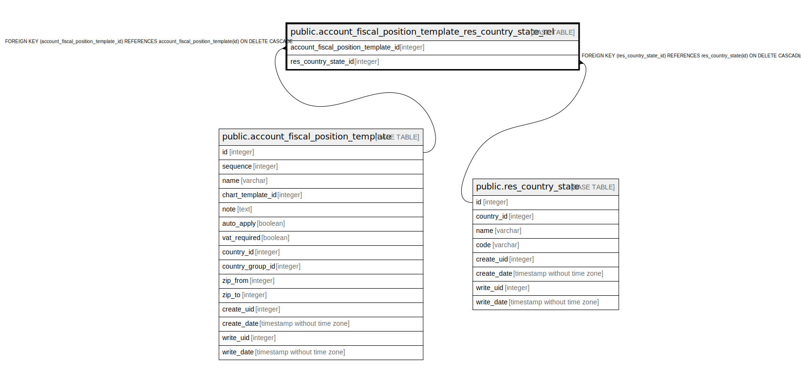

# public.account_fiscal_position_template_res_country_state_rel

## Description

RELATION BETWEEN account_fiscal_position_template AND res_country_state

## Columns

| Name | Type | Default | Nullable | Children | Parents | Comment |
| ---- | ---- | ------- | -------- | -------- | ------- | ------- |
| account_fiscal_position_template_id | integer |  | false |  | [public.account_fiscal_position_template](public.account_fiscal_position_template.md) |  |
| res_country_state_id | integer |  | false |  | [public.res_country_state](public.res_country_state.md) |  |

## Constraints

| Name | Type | Definition |
| ---- | ---- | ---------- |
| account_fiscal_position_template_res__res_country_state_id_fkey | FOREIGN KEY | FOREIGN KEY (res_country_state_id) REFERENCES res_country_state(id) ON DELETE CASCADE |
| account_fiscal_position_templ_account_fiscal_position_temp_fkey | FOREIGN KEY | FOREIGN KEY (account_fiscal_position_template_id) REFERENCES account_fiscal_position_template(id) ON DELETE CASCADE |
| account_fiscal_position_templ_account_fiscal_position_templ_key | UNIQUE | UNIQUE (account_fiscal_position_template_id, res_country_state_id) |

## Indexes

| Name | Definition |
| ---- | ---------- |
| account_fiscal_position_templ_account_fiscal_position_templ_key | CREATE UNIQUE INDEX account_fiscal_position_templ_account_fiscal_position_templ_key ON public.account_fiscal_position_template_res_country_state_rel USING btree (account_fiscal_position_template_id, res_country_state_id) |
| account_fiscal_position_templ_account_fiscal_position_templ_idx | CREATE INDEX account_fiscal_position_templ_account_fiscal_position_templ_idx ON public.account_fiscal_position_template_res_country_state_rel USING btree (account_fiscal_position_template_id) |
| account_fiscal_position_template_res_c_res_country_state_id_idx | CREATE INDEX account_fiscal_position_template_res_c_res_country_state_id_idx ON public.account_fiscal_position_template_res_country_state_rel USING btree (res_country_state_id) |

## Relations

---

> Generated by [tbls](https://github.com/k1LoW/tbls)
