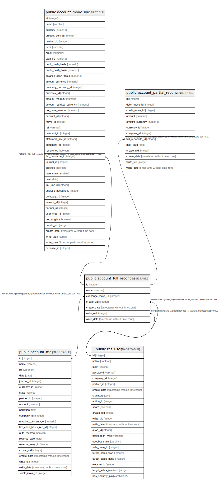

# public.account_full_reconcile

## Description

Full Reconcile

## Columns

| Name | Type | Default | Nullable | Children | Parents | Comment |
| ---- | ---- | ------- | -------- | -------- | ------- | ------- |
| id | integer | nextval('account_full_reconcile_id_seq'::regclass) | false | [public.account_move_line](public.account_move_line.md) [public.account_partial_reconcile](public.account_partial_reconcile.md) |  |  |
| name | varchar |  | false |  |  | Number |
| exchange_move_id | integer |  | true |  | [public.account_move](public.account_move.md) | Exchange Move |
| create_uid | integer |  | true |  | [public.res_users](public.res_users.md) | Created by |
| create_date | timestamp without time zone |  | true |  |  | Created on |
| write_uid | integer |  | true |  | [public.res_users](public.res_users.md) | Last Updated by |
| write_date | timestamp without time zone |  | true |  |  | Last Updated on |

## Constraints

| Name | Type | Definition |
| ---- | ---- | ---------- |
| account_full_reconcile_create_uid_fkey | FOREIGN KEY | FOREIGN KEY (create_uid) REFERENCES res_users(id) ON DELETE SET NULL |
| account_full_reconcile_write_uid_fkey | FOREIGN KEY | FOREIGN KEY (write_uid) REFERENCES res_users(id) ON DELETE SET NULL |
| account_full_reconcile_exchange_move_id_fkey | FOREIGN KEY | FOREIGN KEY (exchange_move_id) REFERENCES account_move(id) ON DELETE SET NULL |
| account_full_reconcile_pkey | PRIMARY KEY | PRIMARY KEY (id) |

## Indexes

| Name | Definition |
| ---- | ---------- |
| account_full_reconcile_pkey | CREATE UNIQUE INDEX account_full_reconcile_pkey ON public.account_full_reconcile USING btree (id) |

## Relations

---

> Generated by [tbls](https://github.com/k1LoW/tbls)
