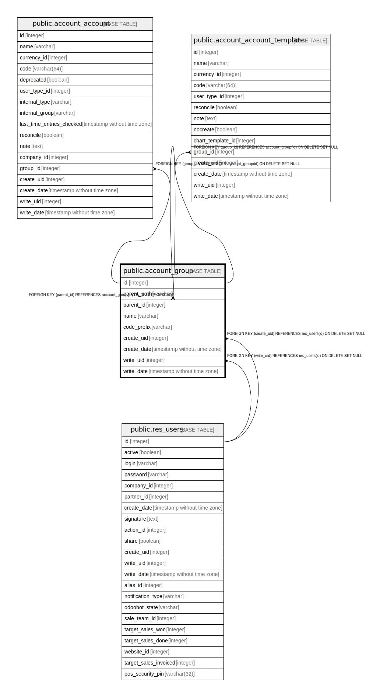

# public.account_group

## Description

Account Group

## Columns

| Name | Type | Default | Nullable | Children | Parents | Comment |
| ---- | ---- | ------- | -------- | -------- | ------- | ------- |
| id | integer | nextval('account_group_id_seq'::regclass) | false | [public.account_account](public.account_account.md) [public.account_group](public.account_group.md) [public.account_account_template](public.account_account_template.md) |  |  |
| parent_path | varchar |  | true |  |  |  |
| parent_id | integer |  | true |  | [public.account_group](public.account_group.md) | Parent |
| name | varchar |  | false |  |  | Name |
| code_prefix | varchar |  | true |  |  | Code Prefix |
| create_uid | integer |  | true |  | [public.res_users](public.res_users.md) | Created by |
| create_date | timestamp without time zone |  | true |  |  | Created on |
| write_uid | integer |  | true |  | [public.res_users](public.res_users.md) | Last Updated by |
| write_date | timestamp without time zone |  | true |  |  | Last Updated on |

## Constraints

| Name | Type | Definition |
| ---- | ---- | ---------- |
| account_group_create_uid_fkey | FOREIGN KEY | FOREIGN KEY (create_uid) REFERENCES res_users(id) ON DELETE SET NULL |
| account_group_write_uid_fkey | FOREIGN KEY | FOREIGN KEY (write_uid) REFERENCES res_users(id) ON DELETE SET NULL |
| account_group_parent_id_fkey | FOREIGN KEY | FOREIGN KEY (parent_id) REFERENCES account_group(id) ON DELETE CASCADE |
| account_group_pkey | PRIMARY KEY | PRIMARY KEY (id) |

## Indexes

| Name | Definition |
| ---- | ---------- |
| account_group_pkey | CREATE UNIQUE INDEX account_group_pkey ON public.account_group USING btree (id) |
| account_group_parent_id_index | CREATE INDEX account_group_parent_id_index ON public.account_group USING btree (parent_id) |
| account_group_parent_path_index | CREATE INDEX account_group_parent_path_index ON public.account_group USING btree (parent_path) |

## Relations

---

> Generated by [tbls](https://github.com/k1LoW/tbls)
