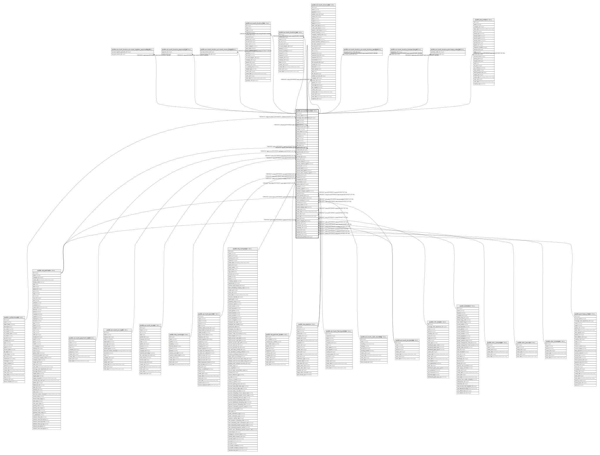

# public.account_invoice

## Description

Invoice

## Columns

| Name | Type | Default | Nullable | Children | Parents | Comment |
| ---- | ---- | ------- | -------- | -------- | ------- | ------- |
| id | integer | nextval('account_invoice_id_seq'::regclass) | false | [public.account_invoice_account_register_payments_rel](public.account_invoice_account_register_payments_rel.md) [public.account_invoice_payment_rel](public.account_invoice_payment_rel.md) [public.account_invoice](public.account_invoice.md) [public.account_invoice_account_move_line_rel](public.account_invoice_account_move_line_rel.md) [public.account_invoice_line](public.account_invoice_line.md) [public.account_invoice_tax](public.account_invoice_tax.md) [public.account_move_line](public.account_move_line.md) [public.account_invoice_account_invoice_send_rel](public.account_invoice_account_invoice_send_rel.md) [public.account_invoice_transaction_rel](public.account_invoice_transaction_rel.md) [public.account_invoice_purchase_order_rel](public.account_invoice_purchase_order_rel.md) [public.pos_order](public.pos_order.md) |  |  |
| access_token | varchar |  | true |  |  | Security Token |
| message_main_attachment_id | integer |  | true |  | [public.ir_attachment](public.ir_attachment.md) | Main Attachment |
| name | varchar |  | true |  |  | Reference/Description |
| origin | varchar |  | true |  |  | Source Document |
| type | varchar |  | true |  |  | Type |
| refund_invoice_id | integer |  | true |  | [public.account_invoice](public.account_invoice.md) | Invoice for which this invoice is the credit note |
| number | varchar |  | true |  |  | Number |
| move_name | varchar |  | true |  |  | Journal Entry Name |
| reference | varchar |  | true |  |  | Payment Ref. |
| comment | text |  | true |  |  | Additional Information |
| state | varchar |  | true |  |  | Status |
| sent | boolean |  | true |  |  | Sent |
| date_invoice | date |  | true |  |  | Invoice Date |
| date_due | date |  | true |  |  | Due Date |
| partner_id | integer |  | true |  | [public.res_partner](public.res_partner.md) | Partner |
| vendor_bill_id | integer |  | true |  | [public.account_invoice](public.account_invoice.md) | Vendor Bill |
| payment_term_id | integer |  | true |  | [public.account_payment_term](public.account_payment_term.md) | Payment Terms |
| date | date |  | true |  |  | Accounting Date |
| account_id | integer |  | true |  | [public.account_account](public.account_account.md) | Account |
| move_id | integer |  | true |  | [public.account_move](public.account_move.md) | Journal Entry |
| amount_untaxed | numeric |  | true |  |  | Untaxed Amount |
| amount_untaxed_signed | numeric |  | true |  |  | Untaxed Amount in Company Currency |
| amount_tax | numeric |  | true |  |  | Tax |
| amount_total | numeric |  | true |  |  | Total |
| amount_total_signed | numeric |  | true |  |  | Total in Invoice Currency |
| amount_total_company_signed | numeric |  | true |  |  | Total in Company Currency |
| currency_id | integer |  | false |  | [public.res_currency](public.res_currency.md) | Currency |
| journal_id | integer |  | false |  | [public.account_journal](public.account_journal.md) | Journal |
| company_id | integer |  | false |  | [public.res_company](public.res_company.md) | Company |
| reconciled | boolean |  | true |  |  | Paid/Reconciled |
| partner_bank_id | integer |  | true |  | [public.res_partner_bank](public.res_partner_bank.md) | Bank Account |
| residual | numeric |  | true |  |  | Amount Due |
| residual_signed | numeric |  | true |  |  | Amount Due in Invoice Currency |
| residual_company_signed | numeric |  | true |  |  | Amount Due in Company Currency |
| user_id | integer |  | true |  | [public.res_users](public.res_users.md) | Salesperson |
| fiscal_position_id | integer |  | true |  | [public.account_fiscal_position](public.account_fiscal_position.md) | Fiscal Position |
| commercial_partner_id | integer |  | true |  | [public.res_partner](public.res_partner.md) | Commercial Entity |
| cash_rounding_id | integer |  | true |  | [public.account_cash_rounding](public.account_cash_rounding.md) | Cash Rounding Method |
| incoterm_id | integer |  | true |  | [public.account_incoterms](public.account_incoterms.md) | Incoterm |
| source_email | varchar |  | true |  |  | Source Email |
| vendor_display_name | varchar |  | true |  |  | Vendor Display Name |
| create_uid | integer |  | true |  | [public.res_users](public.res_users.md) | Created by |
| create_date | timestamp without time zone |  | true |  |  | Created on |
| write_uid | integer |  | true |  | [public.res_users](public.res_users.md) | Last Updated by |
| write_date | timestamp without time zone |  | true |  |  | Last Updated on |
| team_id | integer |  | true |  | [public.crm_team](public.crm_team.md) | Sales Team |
| partner_shipping_id | integer |  | true |  | [public.res_partner](public.res_partner.md) | Delivery Address |
| website_id | integer |  | true |  | [public.website](public.website.md) | Website |
| incoterms_id | integer |  | true |  | [public.account_incoterms](public.account_incoterms.md) | Incoterms |
| campaign_id | integer |  | true |  | [public.utm_campaign](public.utm_campaign.md) | Campaign |
| source_id | integer |  | true |  | [public.utm_source](public.utm_source.md) | Source |
| medium_id | integer |  | true |  | [public.utm_medium](public.utm_medium.md) | Medium |
| purchase_id | integer |  | true |  | [public.purchase_order](public.purchase_order.md) | Add Purchase Order |
| vendor_bill_purchase_id | integer |  | true |  |  | Auto-Complete |

## Constraints

| Name | Type | Definition | Comment |
| ---- | ---- | ---------- | ------- |
| account_invoice_create_uid_fkey | FOREIGN KEY | FOREIGN KEY (create_uid) REFERENCES res_users(id) ON DELETE SET NULL |  |
| account_invoice_user_id_fkey | FOREIGN KEY | FOREIGN KEY (user_id) REFERENCES res_users(id) ON DELETE SET NULL |  |
| account_invoice_write_uid_fkey | FOREIGN KEY | FOREIGN KEY (write_uid) REFERENCES res_users(id) ON DELETE SET NULL |  |
| account_invoice_currency_id_fkey | FOREIGN KEY | FOREIGN KEY (currency_id) REFERENCES res_currency(id) ON DELETE SET NULL |  |
| account_invoice_company_id_fkey | FOREIGN KEY | FOREIGN KEY (company_id) REFERENCES res_company(id) ON DELETE SET NULL |  |
| account_invoice_commercial_partner_id_fkey | FOREIGN KEY | FOREIGN KEY (commercial_partner_id) REFERENCES res_partner(id) ON DELETE SET NULL |  |
| account_invoice_partner_id_fkey | FOREIGN KEY | FOREIGN KEY (partner_id) REFERENCES res_partner(id) ON DELETE RESTRICT |  |
| account_invoice_partner_shipping_id_fkey | FOREIGN KEY | FOREIGN KEY (partner_shipping_id) REFERENCES res_partner(id) ON DELETE SET NULL |  |
| account_invoice_message_main_attachment_id_fkey | FOREIGN KEY | FOREIGN KEY (message_main_attachment_id) REFERENCES ir_attachment(id) ON DELETE SET NULL |  |
| account_invoice_partner_bank_id_fkey | FOREIGN KEY | FOREIGN KEY (partner_bank_id) REFERENCES res_partner_bank(id) ON DELETE SET NULL |  |
| account_invoice_medium_id_fkey | FOREIGN KEY | FOREIGN KEY (medium_id) REFERENCES utm_medium(id) ON DELETE SET NULL |  |
| account_invoice_campaign_id_fkey | FOREIGN KEY | FOREIGN KEY (campaign_id) REFERENCES utm_campaign(id) ON DELETE SET NULL |  |
| account_invoice_source_id_fkey | FOREIGN KEY | FOREIGN KEY (source_id) REFERENCES utm_source(id) ON DELETE SET NULL |  |
| account_invoice_team_id_fkey | FOREIGN KEY | FOREIGN KEY (team_id) REFERENCES crm_team(id) ON DELETE SET NULL |  |
| account_invoice_website_id_fkey | FOREIGN KEY | FOREIGN KEY (website_id) REFERENCES website(id) ON DELETE SET NULL |  |
| account_invoice_fiscal_position_id_fkey | FOREIGN KEY | FOREIGN KEY (fiscal_position_id) REFERENCES account_fiscal_position(id) ON DELETE SET NULL |  |
| account_invoice_account_id_fkey | FOREIGN KEY | FOREIGN KEY (account_id) REFERENCES account_account(id) ON DELETE SET NULL |  |
| account_invoice_journal_id_fkey | FOREIGN KEY | FOREIGN KEY (journal_id) REFERENCES account_journal(id) ON DELETE SET NULL |  |
| account_invoice_pkey | PRIMARY KEY | PRIMARY KEY (id) |  |
| account_invoice_refund_invoice_id_fkey | FOREIGN KEY | FOREIGN KEY (refund_invoice_id) REFERENCES account_invoice(id) ON DELETE SET NULL |  |
| account_invoice_vendor_bill_id_fkey | FOREIGN KEY | FOREIGN KEY (vendor_bill_id) REFERENCES account_invoice(id) ON DELETE SET NULL |  |
| account_invoice_number_uniq | UNIQUE | UNIQUE (number, company_id, journal_id, type) | unique(number, company_id, journal_id, type) |
| account_invoice_payment_term_id_fkey | FOREIGN KEY | FOREIGN KEY (payment_term_id) REFERENCES account_payment_term(id) ON DELETE SET NULL |  |
| account_invoice_move_id_fkey | FOREIGN KEY | FOREIGN KEY (move_id) REFERENCES account_move(id) ON DELETE RESTRICT |  |
| account_invoice_cash_rounding_id_fkey | FOREIGN KEY | FOREIGN KEY (cash_rounding_id) REFERENCES account_cash_rounding(id) ON DELETE SET NULL |  |
| account_invoice_incoterm_id_fkey | FOREIGN KEY | FOREIGN KEY (incoterm_id) REFERENCES account_incoterms(id) ON DELETE SET NULL |  |
| account_invoice_incoterms_id_fkey | FOREIGN KEY | FOREIGN KEY (incoterms_id) REFERENCES account_incoterms(id) ON DELETE SET NULL |  |
| account_invoice_purchase_id_fkey | FOREIGN KEY | FOREIGN KEY (purchase_id) REFERENCES purchase_order(id) ON DELETE SET NULL |  |

## Indexes

| Name | Definition |
| ---- | ---------- |
| account_invoice_pkey | CREATE UNIQUE INDEX account_invoice_pkey ON public.account_invoice USING btree (id) |
| account_invoice_message_main_attachment_id_index | CREATE INDEX account_invoice_message_main_attachment_id_index ON public.account_invoice USING btree (message_main_attachment_id) |
| account_invoice_name_index | CREATE INDEX account_invoice_name_index ON public.account_invoice USING btree (name) |
| account_invoice_type_index | CREATE INDEX account_invoice_type_index ON public.account_invoice USING btree (type) |
| account_invoice_state_index | CREATE INDEX account_invoice_state_index ON public.account_invoice USING btree (state) |
| account_invoice_date_invoice_index | CREATE INDEX account_invoice_date_invoice_index ON public.account_invoice USING btree (date_invoice) |
| account_invoice_date_due_index | CREATE INDEX account_invoice_date_due_index ON public.account_invoice USING btree (date_due) |
| account_invoice_move_id_index | CREATE INDEX account_invoice_move_id_index ON public.account_invoice USING btree (move_id) |
| account_invoice_number_uniq | CREATE UNIQUE INDEX account_invoice_number_uniq ON public.account_invoice USING btree (number, company_id, journal_id, type) |

## Relations

---

> Generated by [tbls](https://github.com/k1LoW/tbls)
