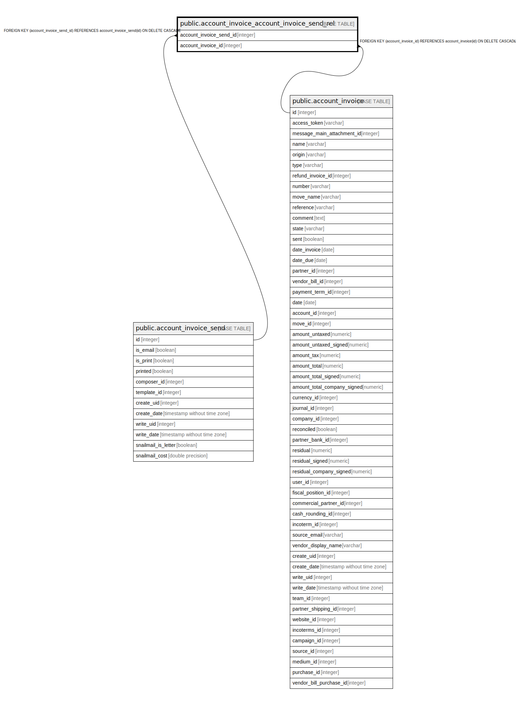

# public.account_invoice_account_invoice_send_rel

## Description

RELATION BETWEEN account_invoice_send AND account_invoice

## Columns

| Name | Type | Default | Nullable | Children | Parents | Comment |
| ---- | ---- | ------- | -------- | -------- | ------- | ------- |
| account_invoice_send_id | integer |  | false |  | [public.account_invoice_send](public.account_invoice_send.md) |  |
| account_invoice_id | integer |  | false |  | [public.account_invoice](public.account_invoice.md) |  |

## Constraints

| Name | Type | Definition |
| ---- | ---- | ---------- |
| account_invoice_account_invoice_send_re_account_invoice_id_fkey | FOREIGN KEY | FOREIGN KEY (account_invoice_id) REFERENCES account_invoice(id) ON DELETE CASCADE |
| account_invoice_account_invoice_se_account_invoice_send_id_fkey | FOREIGN KEY | FOREIGN KEY (account_invoice_send_id) REFERENCES account_invoice_send(id) ON DELETE CASCADE |
| account_invoice_account_invoi_account_invoice_send_id_accou_key | UNIQUE | UNIQUE (account_invoice_send_id, account_invoice_id) |

## Indexes

| Name | Definition |
| ---- | ---------- |
| account_invoice_account_invoi_account_invoice_send_id_accou_key | CREATE UNIQUE INDEX account_invoice_account_invoi_account_invoice_send_id_accou_key ON public.account_invoice_account_invoice_send_rel USING btree (account_invoice_send_id, account_invoice_id) |
| account_invoice_account_invoice_sen_account_invoice_send_id_idx | CREATE INDEX account_invoice_account_invoice_sen_account_invoice_send_id_idx ON public.account_invoice_account_invoice_send_rel USING btree (account_invoice_send_id) |
| account_invoice_account_invoice_send_rel_account_invoice_id_idx | CREATE INDEX account_invoice_account_invoice_send_rel_account_invoice_id_idx ON public.account_invoice_account_invoice_send_rel USING btree (account_invoice_id) |

## Relations

---

> Generated by [tbls](https://github.com/k1LoW/tbls)
