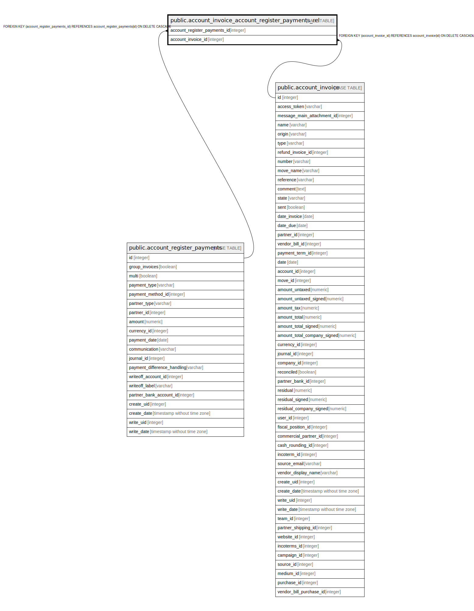

# public.account_invoice_account_register_payments_rel

## Description

RELATION BETWEEN account_register_payments AND account_invoice

## Columns

| Name | Type | Default | Nullable | Children | Parents | Comment |
| ---- | ---- | ------- | -------- | -------- | ------- | ------- |
| account_register_payments_id | integer |  | false |  | [public.account_register_payments](public.account_register_payments.md) |  |
| account_invoice_id | integer |  | false |  | [public.account_invoice](public.account_invoice.md) |  |

## Constraints

| Name | Type | Definition |
| ---- | ---- | ---------- |
| account_invoice_account_regis_account_register_payments_id_fkey | FOREIGN KEY | FOREIGN KEY (account_register_payments_id) REFERENCES account_register_payments(id) ON DELETE CASCADE |
| account_invoice_account_regis_account_register_payments_id__key | UNIQUE | UNIQUE (account_register_payments_id, account_invoice_id) |
| account_invoice_account_register_paymen_account_invoice_id_fkey | FOREIGN KEY | FOREIGN KEY (account_invoice_id) REFERENCES account_invoice(id) ON DELETE CASCADE |

## Indexes

| Name | Definition |
| ---- | ---------- |
| account_invoice_account_regis_account_register_payments_id__key | CREATE UNIQUE INDEX account_invoice_account_regis_account_register_payments_id__key ON public.account_invoice_account_register_payments_rel USING btree (account_register_payments_id, account_invoice_id) |
| account_invoice_account_regist_account_register_payments_id_idx | CREATE INDEX account_invoice_account_regist_account_register_payments_id_idx ON public.account_invoice_account_register_payments_rel USING btree (account_register_payments_id) |
| account_invoice_account_register_payment_account_invoice_id_idx | CREATE INDEX account_invoice_account_register_payment_account_invoice_id_idx ON public.account_invoice_account_register_payments_rel USING btree (account_invoice_id) |

## Relations

---

> Generated by [tbls](https://github.com/k1LoW/tbls)
