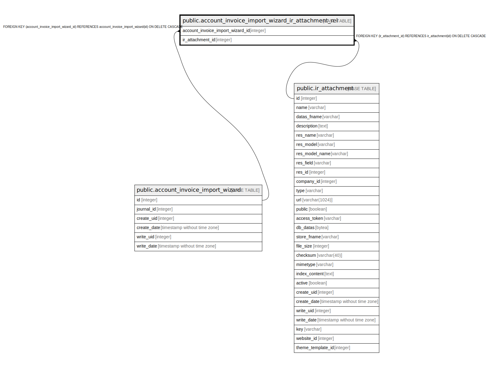

# public.account_invoice_import_wizard_ir_attachment_rel

## Description

RELATION BETWEEN account_invoice_import_wizard AND ir_attachment

## Columns

| Name | Type | Default | Nullable | Children | Parents | Comment |
| ---- | ---- | ------- | -------- | -------- | ------- | ------- |
| account_invoice_import_wizard_id | integer |  | false |  | [public.account_invoice_import_wizard](public.account_invoice_import_wizard.md) |  |
| ir_attachment_id | integer |  | false |  | [public.ir_attachment](public.ir_attachment.md) |  |

## Constraints

| Name | Type | Definition |
| ---- | ---- | ---------- |
| account_invoice_import_wizard_ir_attachme_ir_attachment_id_fkey | FOREIGN KEY | FOREIGN KEY (ir_attachment_id) REFERENCES ir_attachment(id) ON DELETE CASCADE |
| account_invoice_import_wizard_account_invoice_import_wizar_fkey | FOREIGN KEY | FOREIGN KEY (account_invoice_import_wizard_id) REFERENCES account_invoice_import_wizard(id) ON DELETE CASCADE |
| account_invoice_import_wizard_account_invoice_import_wizard_key | UNIQUE | UNIQUE (account_invoice_import_wizard_id, ir_attachment_id) |

## Indexes

| Name | Definition |
| ---- | ---------- |
| account_invoice_import_wizard_account_invoice_import_wizard_key | CREATE UNIQUE INDEX account_invoice_import_wizard_account_invoice_import_wizard_key ON public.account_invoice_import_wizard_ir_attachment_rel USING btree (account_invoice_import_wizard_id, ir_attachment_id) |
| account_invoice_import_wizard_account_invoice_import_wizard_idx | CREATE INDEX account_invoice_import_wizard_account_invoice_import_wizard_idx ON public.account_invoice_import_wizard_ir_attachment_rel USING btree (account_invoice_import_wizard_id) |
| account_invoice_import_wizard_ir_attachmen_ir_attachment_id_idx | CREATE INDEX account_invoice_import_wizard_ir_attachmen_ir_attachment_id_idx ON public.account_invoice_import_wizard_ir_attachment_rel USING btree (ir_attachment_id) |

## Relations

---

> Generated by [tbls](https://github.com/k1LoW/tbls)
