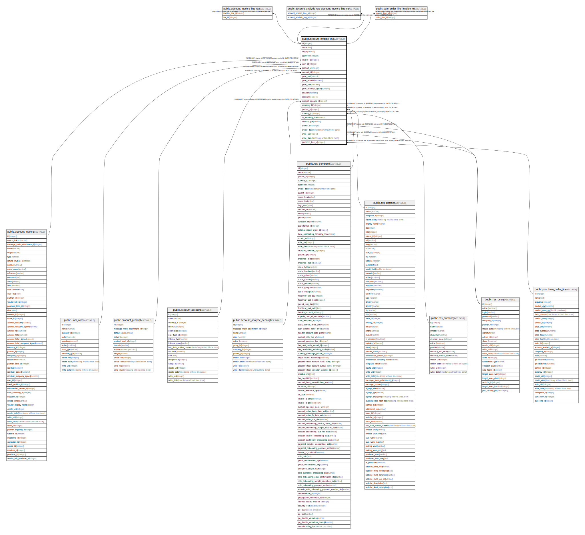

# public.account_invoice_line

## Description

Invoice Line

## Columns

| Name | Type | Default | Nullable | Children | Parents | Comment |
| ---- | ---- | ------- | -------- | -------- | ------- | ------- |
| id | integer | nextval('account_invoice_line_id_seq'::regclass) | false | [public.account_invoice_line_tax](public.account_invoice_line_tax.md) [public.account_analytic_tag_account_invoice_line_rel](public.account_analytic_tag_account_invoice_line_rel.md) [public.sale_order_line_invoice_rel](public.sale_order_line_invoice_rel.md) |  |  |
| name | text |  | false |  |  | Description |
| origin | varchar |  | true |  |  | Source Document |
| sequence | integer |  | true |  |  | Sequence |
| invoice_id | integer |  | true |  | [public.account_invoice](public.account_invoice.md) | Invoice Reference |
| uom_id | integer |  | true |  | [public.uom_uom](public.uom_uom.md) | Unit of Measure |
| product_id | integer |  | true |  | [public.product_product](public.product_product.md) | Product |
| account_id | integer |  | true |  | [public.account_account](public.account_account.md) | Account |
| price_unit | numeric |  | false |  |  | Unit Price |
| price_subtotal | numeric |  | true |  |  | Amount (without Taxes) |
| price_total | numeric |  | true |  |  | Amount (with Taxes) |
| price_subtotal_signed | numeric |  | true |  |  | Amount Signed |
| quantity | numeric |  | false |  |  | Quantity |
| discount | numeric |  | true |  |  | Discount (%) |
| account_analytic_id | integer |  | true |  | [public.account_analytic_account](public.account_analytic_account.md) | Analytic Account |
| company_id | integer |  | true |  | [public.res_company](public.res_company.md) | Company |
| partner_id | integer |  | true |  | [public.res_partner](public.res_partner.md) | Partner |
| currency_id | integer |  | true |  | [public.res_currency](public.res_currency.md) | Currency |
| is_rounding_line | boolean |  | true |  |  | Rounding Line |
| display_type | varchar |  | true |  |  | Display Type |
| create_uid | integer |  | true |  | [public.res_users](public.res_users.md) | Created by |
| create_date | timestamp without time zone |  | true |  |  | Created on |
| write_uid | integer |  | true |  | [public.res_users](public.res_users.md) | Last Updated by |
| write_date | timestamp without time zone |  | true |  |  | Last Updated on |
| purchase_line_id | integer |  | true |  | [public.purchase_order_line](public.purchase_order_line.md) | Purchase Order Line |

## Constraints

| Name | Type | Definition | Comment |
| ---- | ---- | ---------- | ------- |
| account_invoice_line_accountable_required_fields | CHECK | CHECK (((display_type IS NOT NULL) OR (account_id IS NOT NULL))) | CHECK(display_type IS NOT NULL OR account_id IS NOT NULL) |
| account_invoice_line_non_accountable_fields_null | CHECK | CHECK (((display_type IS NULL) OR ((price_unit = (0)::numeric) AND (account_id IS NULL) AND (quantity = (0)::numeric)))) | CHECK(display_type IS NULL OR (price_unit = 0 AND account_id IS NULL and quantity = 0)) |
| account_invoice_line_create_uid_fkey | FOREIGN KEY | FOREIGN KEY (create_uid) REFERENCES res_users(id) ON DELETE SET NULL |  |
| account_invoice_line_write_uid_fkey | FOREIGN KEY | FOREIGN KEY (write_uid) REFERENCES res_users(id) ON DELETE SET NULL |  |
| account_invoice_line_currency_id_fkey | FOREIGN KEY | FOREIGN KEY (currency_id) REFERENCES res_currency(id) ON DELETE SET NULL |  |
| account_invoice_line_company_id_fkey | FOREIGN KEY | FOREIGN KEY (company_id) REFERENCES res_company(id) ON DELETE SET NULL |  |
| account_invoice_line_partner_id_fkey | FOREIGN KEY | FOREIGN KEY (partner_id) REFERENCES res_partner(id) ON DELETE SET NULL |  |
| account_invoice_line_uom_id_fkey | FOREIGN KEY | FOREIGN KEY (uom_id) REFERENCES uom_uom(id) ON DELETE SET NULL |  |
| account_invoice_line_account_analytic_id_fkey | FOREIGN KEY | FOREIGN KEY (account_analytic_id) REFERENCES account_analytic_account(id) ON DELETE SET NULL |  |
| account_invoice_line_product_id_fkey | FOREIGN KEY | FOREIGN KEY (product_id) REFERENCES product_product(id) ON DELETE RESTRICT |  |
| account_invoice_line_account_id_fkey | FOREIGN KEY | FOREIGN KEY (account_id) REFERENCES account_account(id) ON DELETE SET NULL |  |
| account_invoice_line_invoice_id_fkey | FOREIGN KEY | FOREIGN KEY (invoice_id) REFERENCES account_invoice(id) ON DELETE CASCADE |  |
| account_invoice_line_pkey | PRIMARY KEY | PRIMARY KEY (id) |  |
| account_invoice_line_purchase_line_id_fkey | FOREIGN KEY | FOREIGN KEY (purchase_line_id) REFERENCES purchase_order_line(id) ON DELETE SET NULL |  |

## Indexes

| Name | Definition |
| ---- | ---------- |
| account_invoice_line_pkey | CREATE UNIQUE INDEX account_invoice_line_pkey ON public.account_invoice_line USING btree (id) |
| account_invoice_line_invoice_id_index | CREATE INDEX account_invoice_line_invoice_id_index ON public.account_invoice_line USING btree (invoice_id) |
| account_invoice_line_uom_id_index | CREATE INDEX account_invoice_line_uom_id_index ON public.account_invoice_line USING btree (uom_id) |
| account_invoice_line_product_id_index | CREATE INDEX account_invoice_line_product_id_index ON public.account_invoice_line USING btree (product_id) |
| account_invoice_line_purchase_line_id_index | CREATE INDEX account_invoice_line_purchase_line_id_index ON public.account_invoice_line USING btree (purchase_line_id) |

## Relations

---

> Generated by [tbls](https://github.com/k1LoW/tbls)
