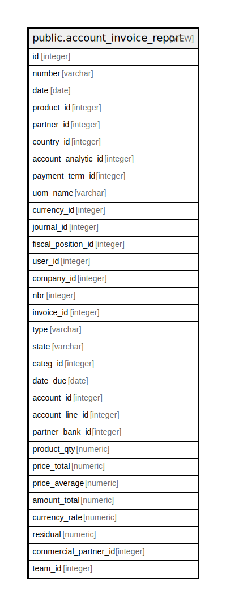

# public.account_invoice_report

## Description

<details>
<summary><strong>Table Definition</strong></summary>

```sql
CREATE VIEW account_invoice_report AS (
 WITH currency_rate AS (
         SELECT r.currency_id,
            COALESCE(r.company_id, c.id) AS company_id,
            r.rate,
            r.name AS date_start,
            ( SELECT r2.name
                   FROM res_currency_rate r2
                  WHERE ((r2.name > r.name) AND (r2.currency_id = r.currency_id) AND ((r2.company_id IS NULL) OR (r2.company_id = c.id)))
                  ORDER BY r2.name
                 LIMIT 1) AS date_end
           FROM (res_currency_rate r
             JOIN res_company c ON (((r.company_id IS NULL) OR (r.company_id = c.id))))
        )
 SELECT sub.id,
    sub.number,
    sub.date,
    sub.product_id,
    sub.partner_id,
    sub.country_id,
    sub.account_analytic_id,
    sub.payment_term_id,
    sub.uom_name,
    sub.currency_id,
    sub.journal_id,
    sub.fiscal_position_id,
    sub.user_id,
    sub.company_id,
    sub.nbr,
    sub.invoice_id,
    sub.type,
    sub.state,
    sub.categ_id,
    sub.date_due,
    sub.account_id,
    sub.account_line_id,
    sub.partner_bank_id,
    sub.product_qty,
    sub.price_total,
    sub.price_average,
    (sub.amount_total / COALESCE(cr.rate, (1)::numeric)) AS amount_total,
    COALESCE(cr.rate, (1)::numeric) AS currency_rate,
    sub.residual,
    sub.commercial_partner_id,
    sub.team_id
   FROM (( SELECT ail.id,
            ai.date_invoice AS date,
            ai.number,
            ail.product_id,
            ai.partner_id,
            ai.payment_term_id,
            ail.account_analytic_id,
            u2.name AS uom_name,
            ai.currency_id,
            ai.journal_id,
            ai.fiscal_position_id,
            ai.user_id,
            ai.company_id,
            1 AS nbr,
            ai.id AS invoice_id,
            ai.type,
            ai.state,
            pt.categ_id,
            ai.date_due,
            ai.account_id,
            ail.account_id AS account_line_id,
            ai.partner_bank_id,
            sum(((((invoice_type.sign_qty)::numeric * ail.quantity) / COALESCE(u.factor, (1)::numeric)) * COALESCE(u2.factor, (1)::numeric))) AS product_qty,
            sum((ail.price_subtotal_signed * (invoice_type.sign)::numeric)) AS price_total,
            sum((ail.price_total * (invoice_type.sign_qty)::numeric)) AS amount_total,
            (sum(abs(ail.price_subtotal_signed)) /
                CASE
                    WHEN (sum(((ail.quantity / COALESCE(u.factor, (1)::numeric)) * COALESCE(u2.factor, (1)::numeric))) <> (0)::numeric) THEN sum(((ail.quantity / COALESCE(u.factor, (1)::numeric)) * COALESCE(u2.factor, (1)::numeric)))
                    ELSE (1)::numeric
                END) AS price_average,
            (((ai.residual_company_signed / (( SELECT count(*) AS count
                   FROM account_invoice_line l
                  WHERE (l.invoice_id = ai.id)))::numeric) * (count(*))::numeric) * (invoice_type.sign)::numeric) AS residual,
            ai.commercial_partner_id,
            COALESCE(partner.country_id, partner_ai.country_id) AS country_id,
            ai.team_id
           FROM ((((((((account_invoice_line ail
             JOIN account_invoice ai ON ((ai.id = ail.invoice_id)))
             JOIN res_partner partner ON ((ai.commercial_partner_id = partner.id)))
             JOIN res_partner partner_ai ON ((ai.partner_id = partner_ai.id)))
             LEFT JOIN product_product pr ON ((pr.id = ail.product_id)))
             LEFT JOIN product_template pt ON ((pt.id = pr.product_tmpl_id)))
             LEFT JOIN uom_uom u ON ((u.id = ail.uom_id)))
             LEFT JOIN uom_uom u2 ON ((u2.id = pt.uom_id)))
             JOIN ( SELECT ai_1.id,
                        CASE
                            WHEN ((ai_1.type)::text = ANY (ARRAY[('in_refund'::character varying)::text, ('in_invoice'::character varying)::text])) THEN '-1'::integer
                            ELSE 1
                        END AS sign,
                        CASE
                            WHEN ((ai_1.type)::text = ANY (ARRAY[('out_refund'::character varying)::text, ('in_invoice'::character varying)::text])) THEN '-1'::integer
                            ELSE 1
                        END AS sign_qty
                   FROM account_invoice ai_1) invoice_type ON ((invoice_type.id = ai.id)))
          WHERE (ail.account_id IS NOT NULL)
          GROUP BY ail.id, ail.product_id, ail.account_analytic_id, ai.date_invoice, ai.id, ai.partner_id, ai.payment_term_id, u2.name, u2.id, ai.currency_id, ai.journal_id, ai.fiscal_position_id, ai.user_id, ai.company_id, ai.type, invoice_type.sign, ai.state, pt.categ_id, ai.date_due, ai.account_id, ail.account_id, ai.partner_bank_id, ai.residual_company_signed, ai.amount_total_company_signed, ai.commercial_partner_id, COALESCE(partner.country_id, partner_ai.country_id), ai.team_id) sub
     LEFT JOIN currency_rate cr ON (((cr.currency_id = sub.currency_id) AND (cr.company_id = sub.company_id) AND (cr.date_start <= COALESCE((sub.date)::timestamp with time zone, now())) AND ((cr.date_end IS NULL) OR (cr.date_end > COALESCE((sub.date)::timestamp with time zone, now()))))))
)
```

</details>

## Columns

| Name | Type | Default | Nullable | Children | Parents | Comment |
| ---- | ---- | ------- | -------- | -------- | ------- | ------- |
| id | integer |  | true |  |  |  |
| number | varchar |  | true |  |  |  |
| date | date |  | true |  |  |  |
| product_id | integer |  | true |  |  |  |
| partner_id | integer |  | true |  |  |  |
| country_id | integer |  | true |  |  |  |
| account_analytic_id | integer |  | true |  |  |  |
| payment_term_id | integer |  | true |  |  |  |
| uom_name | varchar |  | true |  |  |  |
| currency_id | integer |  | true |  |  |  |
| journal_id | integer |  | true |  |  |  |
| fiscal_position_id | integer |  | true |  |  |  |
| user_id | integer |  | true |  |  |  |
| company_id | integer |  | true |  |  |  |
| nbr | integer |  | true |  |  |  |
| invoice_id | integer |  | true |  |  |  |
| type | varchar |  | true |  |  |  |
| state | varchar |  | true |  |  |  |
| categ_id | integer |  | true |  |  |  |
| date_due | date |  | true |  |  |  |
| account_id | integer |  | true |  |  |  |
| account_line_id | integer |  | true |  |  |  |
| partner_bank_id | integer |  | true |  |  |  |
| product_qty | numeric |  | true |  |  |  |
| price_total | numeric |  | true |  |  |  |
| price_average | numeric |  | true |  |  |  |
| amount_total | numeric |  | true |  |  |  |
| currency_rate | numeric |  | true |  |  |  |
| residual | numeric |  | true |  |  |  |
| commercial_partner_id | integer |  | true |  |  |  |
| team_id | integer |  | true |  |  |  |

## Relations



---

> Generated by [tbls](https://github.com/k1LoW/tbls)
