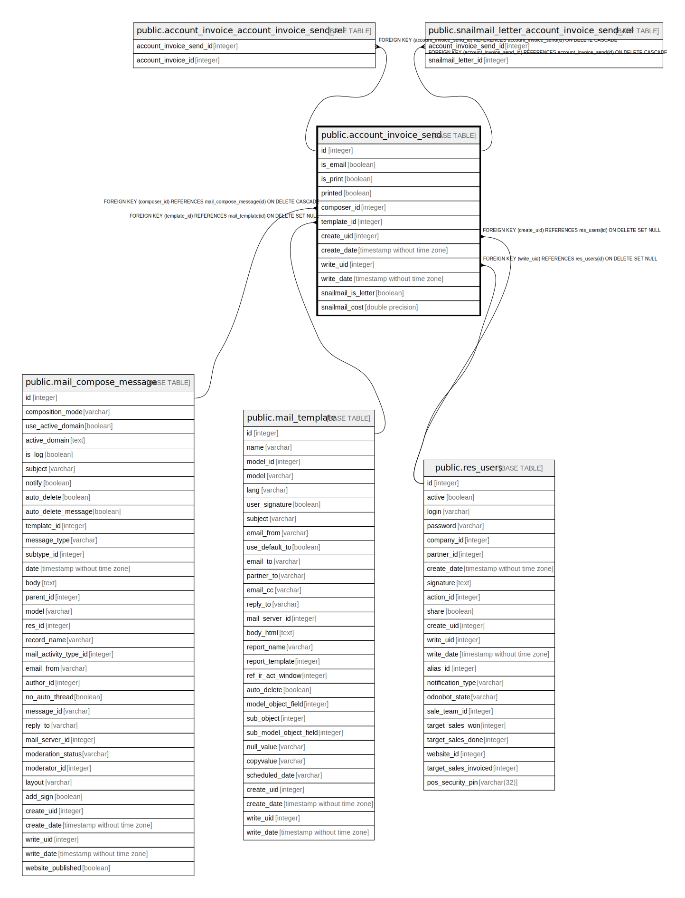

# public.account_invoice_send

## Description

Account Invoice Send

## Columns

| Name | Type | Default | Nullable | Children | Parents | Comment |
| ---- | ---- | ------- | -------- | -------- | ------- | ------- |
| id | integer | nextval('account_invoice_send_id_seq'::regclass) | false | [public.account_invoice_account_invoice_send_rel](public.account_invoice_account_invoice_send_rel.md) [public.snailmail_letter_account_invoice_send_rel](public.snailmail_letter_account_invoice_send_rel.md) |  |  |
| is_email | boolean |  | true |  |  | Email |
| is_print | boolean |  | true |  |  | Print |
| printed | boolean |  | true |  |  | Is Printed |
| composer_id | integer |  | false |  | [public.mail_compose_message](public.mail_compose_message.md) | Composer |
| template_id | integer |  | true |  | [public.mail_template](public.mail_template.md) | Use template |
| create_uid | integer |  | true |  | [public.res_users](public.res_users.md) | Created by |
| create_date | timestamp without time zone |  | true |  |  | Created on |
| write_uid | integer |  | true |  | [public.res_users](public.res_users.md) | Last Updated by |
| write_date | timestamp without time zone |  | true |  |  | Last Updated on |
| snailmail_is_letter | boolean |  | true |  |  | Send by Post |
| snailmail_cost | double precision |  | true |  |  | Stamp(s) |

## Constraints

| Name | Type | Definition |
| ---- | ---- | ---------- |
| account_invoice_send_create_uid_fkey | FOREIGN KEY | FOREIGN KEY (create_uid) REFERENCES res_users(id) ON DELETE SET NULL |
| account_invoice_send_write_uid_fkey | FOREIGN KEY | FOREIGN KEY (write_uid) REFERENCES res_users(id) ON DELETE SET NULL |
| account_invoice_send_template_id_fkey | FOREIGN KEY | FOREIGN KEY (template_id) REFERENCES mail_template(id) ON DELETE SET NULL |
| account_invoice_send_composer_id_fkey | FOREIGN KEY | FOREIGN KEY (composer_id) REFERENCES mail_compose_message(id) ON DELETE CASCADE |
| account_invoice_send_pkey | PRIMARY KEY | PRIMARY KEY (id) |

## Indexes

| Name | Definition |
| ---- | ---------- |
| account_invoice_send_pkey | CREATE UNIQUE INDEX account_invoice_send_pkey ON public.account_invoice_send USING btree (id) |
| account_invoice_send_template_id_index | CREATE INDEX account_invoice_send_template_id_index ON public.account_invoice_send USING btree (template_id) |

## Relations

---

> Generated by [tbls](https://github.com/k1LoW/tbls)
