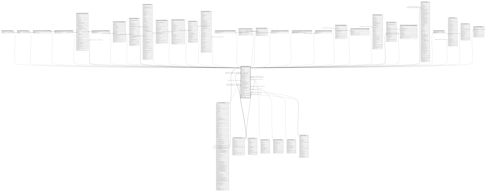

# public.account_journal

## Description

Journal

## Columns

| Name | Type | Default | Nullable | Children | Parents | Comment |
| ---- | ---- | ------- | -------- | -------- | ------- | ------- |
| id | integer | nextval('account_journal_id_seq'::regclass) | false | [public.res_company](public.res_company.md) [public.account_journal_type_rel](public.account_journal_type_rel.md) [public.account_account_type_rel](public.account_account_type_rel.md) [public.account_journal_inbound_payment_method_rel](public.account_journal_inbound_payment_method_rel.md) [public.account_journal_outbound_payment_method_rel](public.account_journal_outbound_payment_method_rel.md) [public.account_reconcile_model](public.account_reconcile_model.md) [public.account_journal_account_reconcile_model_rel](public.account_journal_account_reconcile_model_rel.md) [public.account_register_payments](public.account_register_payments.md) [public.account_payment](public.account_payment.md) [public.account_invoice](public.account_invoice.md) [public.account_bank_statement](public.account_bank_statement.md) [public.account_bank_statement_line](public.account_bank_statement_line.md) [public.account_move](public.account_move.md) [public.account_move_line](public.account_move_line.md) [public.account_journal_account_reconcile_model_template_rel](public.account_journal_account_reconcile_model_template_rel.md) [public.account_invoice_import_wizard](public.account_invoice_import_wizard.md) [public.account_move_reversal](public.account_move_reversal.md) [public.account_common_report_account_journal_rel](public.account_common_report_account_journal_rel.md) [public.account_common_journal_report_account_journal_rel](public.account_common_journal_report_account_journal_rel.md) [public.account_journal_account_print_journal_rel](public.account_journal_account_print_journal_rel.md) [public.tax_adjustments_wizard](public.tax_adjustments_wizard.md) [public.account_bank_statement_import_journal_creation](public.account_bank_statement_import_journal_creation.md) [public.payment_acquirer](public.payment_acquirer.md) [public.hr_expense_sheet](public.hr_expense_sheet.md) [public.hr_expense_sheet_register_payment_wizard](public.hr_expense_sheet_register_payment_wizard.md) [public.pos_config](public.pos_config.md) [public.pos_config_journal_rel](public.pos_config_journal_rel.md) [public.pos_order](public.pos_order.md) [public.pos_session](public.pos_session.md) [public.pos_make_payment](public.pos_make_payment.md) |  |  |
| name | varchar |  | false |  |  | Journal Name |
| code | varchar(5) |  | false |  |  | Short Code |
| active | boolean |  | true |  |  | Active |
| type | varchar |  | false |  |  | Type |
| default_credit_account_id | integer |  | true |  | [public.account_account](public.account_account.md) | Default Credit Account |
| default_debit_account_id | integer |  | true |  | [public.account_account](public.account_account.md) | Default Debit Account |
| update_posted | boolean |  | true |  |  | Allow Cancelling Entries |
| group_invoice_lines | boolean |  | true |  |  | Group Invoice Lines |
| sequence_id | integer |  | false |  | [public.ir_sequence](public.ir_sequence.md) | Entry Sequence |
| refund_sequence_id | integer |  | true |  | [public.ir_sequence](public.ir_sequence.md) | Credit Note Entry Sequence |
| sequence | integer |  | true |  |  | Sequence |
| currency_id | integer |  | true |  | [public.res_currency](public.res_currency.md) | Currency |
| company_id | integer |  | false |  | [public.res_company](public.res_company.md) | Company |
| refund_sequence | boolean |  | true |  |  | Dedicated Credit Note Sequence |
| at_least_one_inbound | boolean |  | true |  |  | At Least One Inbound |
| at_least_one_outbound | boolean |  | true |  |  | At Least One Outbound |
| profit_account_id | integer |  | true |  | [public.account_account](public.account_account.md) | Profit Account |
| loss_account_id | integer |  | true |  | [public.account_account](public.account_account.md) | Loss Account |
| bank_account_id | integer |  | true |  | [public.res_partner_bank](public.res_partner_bank.md) | Bank Account |
| bank_statements_source | varchar |  | true |  |  | Bank Feeds |
| post_at_bank_rec | boolean |  | true |  |  | Post At Bank Reconciliation |
| alias_id | integer |  | true |  | [public.mail_alias](public.mail_alias.md) | Alias |
| show_on_dashboard | boolean |  | true |  |  | Show journal on dashboard |
| color | integer |  | true |  |  | Color Index |
| create_uid | integer |  | true |  | [public.res_users](public.res_users.md) | Created by |
| create_date | timestamp without time zone |  | true |  |  | Created on |
| write_uid | integer |  | true |  | [public.res_users](public.res_users.md) | Last Updated by |
| write_date | timestamp without time zone |  | true |  |  | Last Updated on |
| journal_user | boolean |  | true |  |  | Use in Point of Sale |
| amount_authorized_diff | double precision |  | true |  |  | Amount Authorized Difference |

## Constraints

| Name | Type | Definition | Comment |
| ---- | ---- | ---------- | ------- |
| account_journal_create_uid_fkey | FOREIGN KEY | FOREIGN KEY (create_uid) REFERENCES res_users(id) ON DELETE SET NULL |  |
| account_journal_write_uid_fkey | FOREIGN KEY | FOREIGN KEY (write_uid) REFERENCES res_users(id) ON DELETE SET NULL |  |
| account_journal_currency_id_fkey | FOREIGN KEY | FOREIGN KEY (currency_id) REFERENCES res_currency(id) ON DELETE SET NULL |  |
| account_journal_company_id_fkey | FOREIGN KEY | FOREIGN KEY (company_id) REFERENCES res_company(id) ON DELETE SET NULL |  |
| account_journal_refund_sequence_id_fkey | FOREIGN KEY | FOREIGN KEY (refund_sequence_id) REFERENCES ir_sequence(id) ON DELETE SET NULL |  |
| account_journal_sequence_id_fkey | FOREIGN KEY | FOREIGN KEY (sequence_id) REFERENCES ir_sequence(id) ON DELETE SET NULL |  |
| account_journal_bank_account_id_fkey | FOREIGN KEY | FOREIGN KEY (bank_account_id) REFERENCES res_partner_bank(id) ON DELETE RESTRICT |  |
| account_journal_alias_id_fkey | FOREIGN KEY | FOREIGN KEY (alias_id) REFERENCES mail_alias(id) ON DELETE SET NULL |  |
| account_journal_default_credit_account_id_fkey | FOREIGN KEY | FOREIGN KEY (default_credit_account_id) REFERENCES account_account(id) ON DELETE SET NULL |  |
| account_journal_default_debit_account_id_fkey | FOREIGN KEY | FOREIGN KEY (default_debit_account_id) REFERENCES account_account(id) ON DELETE SET NULL |  |
| account_journal_loss_account_id_fkey | FOREIGN KEY | FOREIGN KEY (loss_account_id) REFERENCES account_account(id) ON DELETE SET NULL |  |
| account_journal_profit_account_id_fkey | FOREIGN KEY | FOREIGN KEY (profit_account_id) REFERENCES account_account(id) ON DELETE SET NULL |  |
| account_journal_pkey | PRIMARY KEY | PRIMARY KEY (id) |  |
| account_journal_code_company_uniq | UNIQUE | UNIQUE (code, name, company_id) | unique (code, name, company_id) |

## Indexes

| Name | Definition |
| ---- | ---------- |
| account_journal_pkey | CREATE UNIQUE INDEX account_journal_pkey ON public.account_journal USING btree (id) |
| account_journal_company_id_index | CREATE INDEX account_journal_company_id_index ON public.account_journal USING btree (company_id) |
| account_journal_code_company_uniq | CREATE UNIQUE INDEX account_journal_code_company_uniq ON public.account_journal USING btree (code, name, company_id) |

## Relations

---

> Generated by [tbls](https://github.com/k1LoW/tbls)
