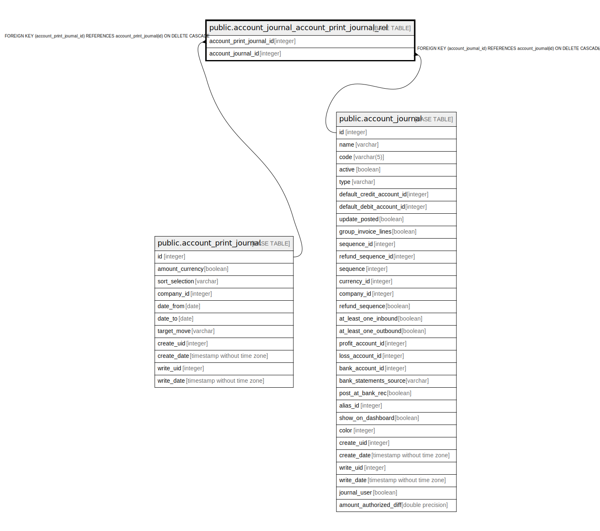

# public.account_journal_account_print_journal_rel

## Description

RELATION BETWEEN account_print_journal AND account_journal

## Columns

| Name | Type | Default | Nullable | Children | Parents | Comment |
| ---- | ---- | ------- | -------- | -------- | ------- | ------- |
| account_print_journal_id | integer |  | false |  | [public.account_print_journal](public.account_print_journal.md) |  |
| account_journal_id | integer |  | false |  | [public.account_journal](public.account_journal.md) |  |

## Constraints

| Name | Type | Definition |
| ---- | ---- | ---------- |
| account_journal_account_print_journal_r_account_journal_id_fkey | FOREIGN KEY | FOREIGN KEY (account_journal_id) REFERENCES account_journal(id) ON DELETE CASCADE |
| account_journal_account_print_jou_account_print_journal_id_fkey | FOREIGN KEY | FOREIGN KEY (account_print_journal_id) REFERENCES account_print_journal(id) ON DELETE CASCADE |
| account_journal_account_print_account_print_journal_id_acco_key | UNIQUE | UNIQUE (account_print_journal_id, account_journal_id) |

## Indexes

| Name | Definition |
| ---- | ---------- |
| account_journal_account_print_account_print_journal_id_acco_key | CREATE UNIQUE INDEX account_journal_account_print_account_print_journal_id_acco_key ON public.account_journal_account_print_journal_rel USING btree (account_print_journal_id, account_journal_id) |
| account_journal_account_print_jour_account_print_journal_id_idx | CREATE INDEX account_journal_account_print_jour_account_print_journal_id_idx ON public.account_journal_account_print_journal_rel USING btree (account_print_journal_id) |
| account_journal_account_print_journal_re_account_journal_id_idx | CREATE INDEX account_journal_account_print_journal_re_account_journal_id_idx ON public.account_journal_account_print_journal_rel USING btree (account_journal_id) |

## Relations

---

> Generated by [tbls](https://github.com/k1LoW/tbls)
