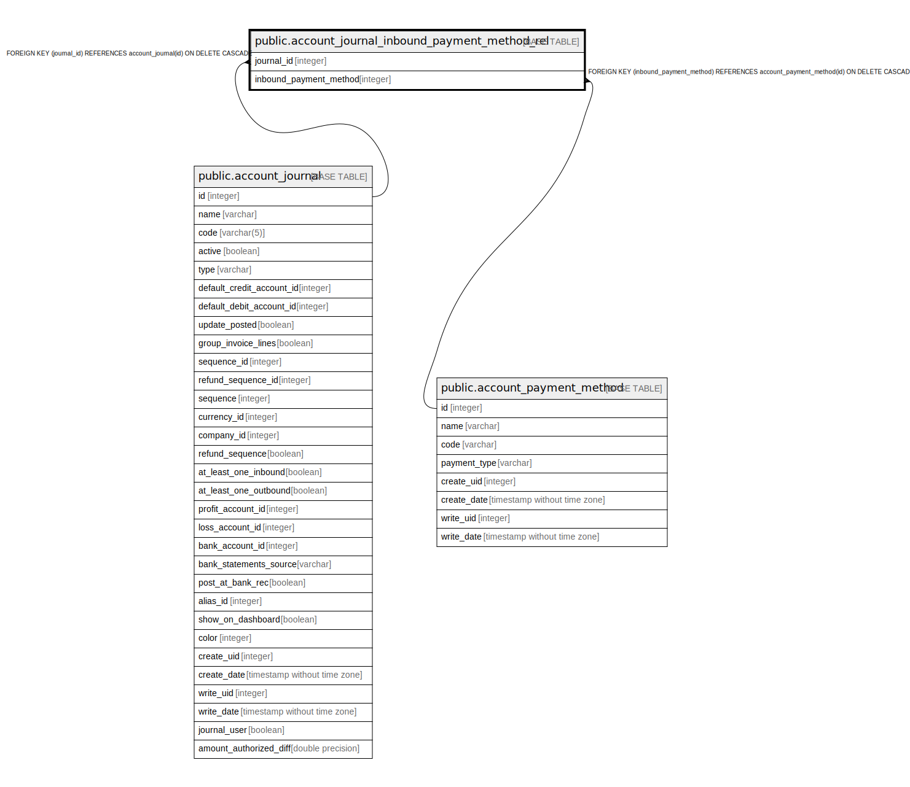

# public.account_journal_inbound_payment_method_rel

## Description

RELATION BETWEEN account_journal AND account_payment_method

## Columns

| Name | Type | Default | Nullable | Children | Parents | Comment |
| ---- | ---- | ------- | -------- | -------- | ------- | ------- |
| journal_id | integer |  | false |  | [public.account_journal](public.account_journal.md) |  |
| inbound_payment_method | integer |  | false |  | [public.account_payment_method](public.account_payment_method.md) |  |

## Constraints

| Name | Type | Definition |
| ---- | ---- | ---------- |
| account_journal_inbound_payment_method_rel_journal_id_fkey | FOREIGN KEY | FOREIGN KEY (journal_id) REFERENCES account_journal(id) ON DELETE CASCADE |
| account_journal_inbound_payme_journal_id_inbound_payment_me_key | UNIQUE | UNIQUE (journal_id, inbound_payment_method) |
| account_journal_inbound_payment_met_inbound_payment_method_fkey | FOREIGN KEY | FOREIGN KEY (inbound_payment_method) REFERENCES account_payment_method(id) ON DELETE CASCADE |

## Indexes

| Name | Definition |
| ---- | ---------- |
| account_journal_inbound_payme_journal_id_inbound_payment_me_key | CREATE UNIQUE INDEX account_journal_inbound_payme_journal_id_inbound_payment_me_key ON public.account_journal_inbound_payment_method_rel USING btree (journal_id, inbound_payment_method) |
| account_journal_inbound_payment_method_rel_journal_id_idx | CREATE INDEX account_journal_inbound_payment_method_rel_journal_id_idx ON public.account_journal_inbound_payment_method_rel USING btree (journal_id) |
| account_journal_inbound_payment_meth_inbound_payment_method_idx | CREATE INDEX account_journal_inbound_payment_meth_inbound_payment_method_idx ON public.account_journal_inbound_payment_method_rel USING btree (inbound_payment_method) |

## Relations

---

> Generated by [tbls](https://github.com/k1LoW/tbls)
