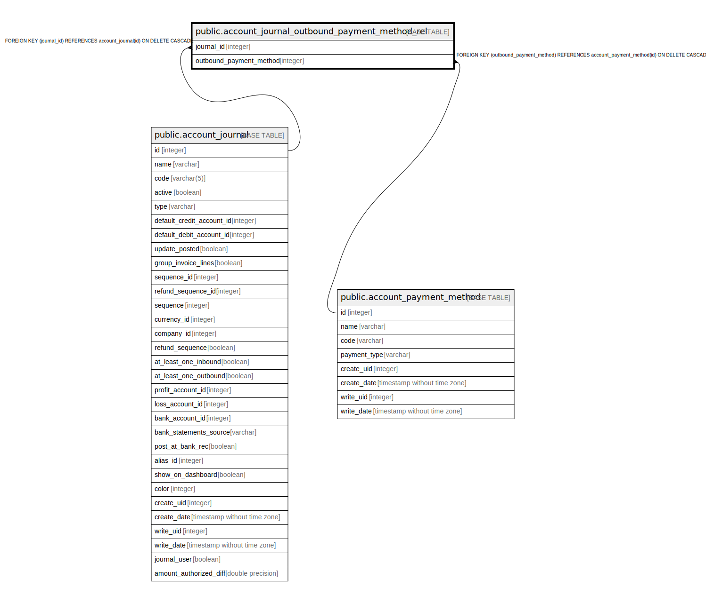

# public.account_journal_outbound_payment_method_rel

## Description

RELATION BETWEEN account_journal AND account_payment_method

## Columns

| Name | Type | Default | Nullable | Children | Parents | Comment |
| ---- | ---- | ------- | -------- | -------- | ------- | ------- |
| journal_id | integer |  | false |  | [public.account_journal](public.account_journal.md) |  |
| outbound_payment_method | integer |  | false |  | [public.account_payment_method](public.account_payment_method.md) |  |

## Constraints

| Name | Type | Definition |
| ---- | ---- | ---------- |
| account_journal_outbound_payment_method_rel_journal_id_fkey | FOREIGN KEY | FOREIGN KEY (journal_id) REFERENCES account_journal(id) ON DELETE CASCADE |
| account_journal_outbound_paym_journal_id_outbound_payment_m_key | UNIQUE | UNIQUE (journal_id, outbound_payment_method) |
| account_journal_outbound_payment_m_outbound_payment_method_fkey | FOREIGN KEY | FOREIGN KEY (outbound_payment_method) REFERENCES account_payment_method(id) ON DELETE CASCADE |

## Indexes

| Name | Definition |
| ---- | ---------- |
| account_journal_outbound_paym_journal_id_outbound_payment_m_key | CREATE UNIQUE INDEX account_journal_outbound_paym_journal_id_outbound_payment_m_key ON public.account_journal_outbound_payment_method_rel USING btree (journal_id, outbound_payment_method) |
| account_journal_outbound_payment_method_rel_journal_id_idx | CREATE INDEX account_journal_outbound_payment_method_rel_journal_id_idx ON public.account_journal_outbound_payment_method_rel USING btree (journal_id) |
| account_journal_outbound_payment_me_outbound_payment_method_idx | CREATE INDEX account_journal_outbound_payment_me_outbound_payment_method_idx ON public.account_journal_outbound_payment_method_rel USING btree (outbound_payment_method) |

## Relations

---

> Generated by [tbls](https://github.com/k1LoW/tbls)
