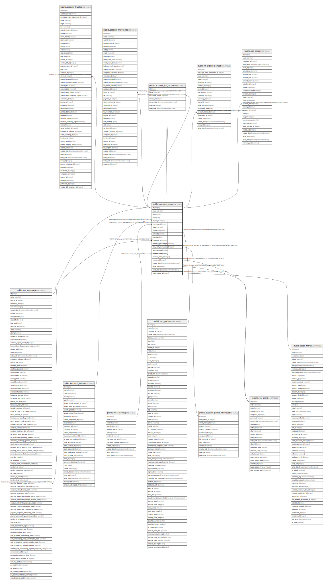

# public.account_move

## Description

Journal Entries

## Columns

| Name | Type | Default | Nullable | Children | Parents | Comment |
| ---- | ---- | ------- | -------- | -------- | ------- | ------- |
| id | integer | nextval('account_move_id_seq'::regclass) | false | [public.res_company](public.res_company.md) [public.account_invoice](public.account_invoice.md) [public.account_move](public.account_move.md) [public.account_move_line](public.account_move_line.md) [public.account_full_reconcile](public.account_full_reconcile.md) [public.hr_expense_sheet](public.hr_expense_sheet.md) [public.pos_order](public.pos_order.md) |  |  |
| name | varchar |  | false |  |  | Number |
| ref | varchar |  | true |  |  | Reference |
| date | date |  | false |  |  | Date |
| journal_id | integer |  | false |  | [public.account_journal](public.account_journal.md) | Journal |
| currency_id | integer |  | true |  | [public.res_currency](public.res_currency.md) | Currency |
| state | varchar |  | false |  |  | Status |
| partner_id | integer |  | true |  | [public.res_partner](public.res_partner.md) | Partner |
| amount | numeric |  | true |  |  | Amount |
| narration | text |  | true |  |  | Internal Note |
| company_id | integer |  | true |  | [public.res_company](public.res_company.md) | Company |
| matched_percentage | numeric |  | true |  |  | Percentage Matched |
| tax_cash_basis_rec_id | integer |  | true |  | [public.account_partial_reconcile](public.account_partial_reconcile.md) | Tax Cash Basis Entry of |
| auto_reverse | boolean |  | true |  |  | Reverse Automatically |
| reverse_date | date |  | true |  |  | Reversal Date |
| reverse_entry_id | integer |  | true |  | [public.account_move](public.account_move.md) | Reverse Entry |
| create_uid | integer |  | true |  | [public.res_users](public.res_users.md) | Created by |
| create_date | timestamp without time zone |  | true |  |  | Created on |
| write_uid | integer |  | true |  | [public.res_users](public.res_users.md) | Last Updated by |
| write_date | timestamp without time zone |  | true |  |  | Last Updated on |
| stock_move_id | integer |  | true |  | [public.stock_move](public.stock_move.md) | Stock Move |

## Constraints

| Name | Type | Definition |
| ---- | ---- | ---------- |
| account_move_create_uid_fkey | FOREIGN KEY | FOREIGN KEY (create_uid) REFERENCES res_users(id) ON DELETE SET NULL |
| account_move_write_uid_fkey | FOREIGN KEY | FOREIGN KEY (write_uid) REFERENCES res_users(id) ON DELETE SET NULL |
| account_move_currency_id_fkey | FOREIGN KEY | FOREIGN KEY (currency_id) REFERENCES res_currency(id) ON DELETE SET NULL |
| account_move_company_id_fkey | FOREIGN KEY | FOREIGN KEY (company_id) REFERENCES res_company(id) ON DELETE SET NULL |
| account_move_partner_id_fkey | FOREIGN KEY | FOREIGN KEY (partner_id) REFERENCES res_partner(id) ON DELETE SET NULL |
| account_move_journal_id_fkey | FOREIGN KEY | FOREIGN KEY (journal_id) REFERENCES account_journal(id) ON DELETE SET NULL |
| account_move_pkey | PRIMARY KEY | PRIMARY KEY (id) |
| account_move_reverse_entry_id_fkey | FOREIGN KEY | FOREIGN KEY (reverse_entry_id) REFERENCES account_move(id) ON DELETE SET NULL |
| account_move_tax_cash_basis_rec_id_fkey | FOREIGN KEY | FOREIGN KEY (tax_cash_basis_rec_id) REFERENCES account_partial_reconcile(id) ON DELETE SET NULL |
| account_move_stock_move_id_fkey | FOREIGN KEY | FOREIGN KEY (stock_move_id) REFERENCES stock_move(id) ON DELETE SET NULL |

## Indexes

| Name | Definition |
| ---- | ---------- |
| account_move_pkey | CREATE UNIQUE INDEX account_move_pkey ON public.account_move USING btree (id) |
| account_move_date_index | CREATE INDEX account_move_date_index ON public.account_move USING btree (date) |

## Relations

---

> Generated by [tbls](https://github.com/k1LoW/tbls)
