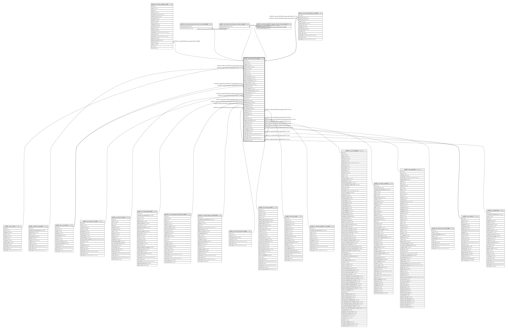

# public.account_move_line

## Description

Journal Item

## Columns

| Name | Type | Default | Nullable | Children | Parents | Comment |
| ---- | ---- | ------- | -------- | -------- | ------- | ------- |
| id | integer | nextval('account_move_line_id_seq'::regclass) | false | [public.account_analytic_line](public.account_analytic_line.md) [public.account_invoice_account_move_line_rel](public.account_invoice_account_move_line_rel.md) [public.account_move_line_account_tax_rel](public.account_move_line_account_tax_rel.md) [public.account_analytic_tag_account_move_line_rel](public.account_analytic_tag_account_move_line_rel.md) [public.account_partial_reconcile](public.account_partial_reconcile.md) |  |  |
| name | varchar |  | true |  |  | Label |
| quantity | numeric |  | true |  |  | Quantity |
| product_uom_id | integer |  | true |  | [public.uom_uom](public.uom_uom.md) | Unit of Measure |
| product_id | integer |  | true |  | [public.product_product](public.product_product.md) | Product |
| debit | numeric |  | true |  |  | Debit |
| credit | numeric |  | true |  |  | Credit |
| balance | numeric |  | true |  |  | Balance |
| debit_cash_basis | numeric |  | true |  |  | Debit Cash Basis |
| credit_cash_basis | numeric |  | true |  |  | Credit Cash Basis |
| balance_cash_basis | numeric |  | true |  |  | Balance Cash Basis |
| amount_currency | numeric |  | true |  |  | Amount Currency |
| company_currency_id | integer |  | true |  | [public.res_currency](public.res_currency.md) | Company Currency |
| currency_id | integer |  | true |  | [public.res_currency](public.res_currency.md) | Currency |
| amount_residual | numeric |  | true |  |  | Residual Amount |
| amount_residual_currency | numeric |  | true |  |  | Residual Amount in Currency |
| tax_base_amount | numeric |  | true |  |  | Base Amount |
| account_id | integer |  | false |  | [public.account_account](public.account_account.md) | Account |
| move_id | integer |  | false |  | [public.account_move](public.account_move.md) | Journal Entry |
| ref | varchar |  | true |  |  | Reference |
| payment_id | integer |  | true |  | [public.account_payment](public.account_payment.md) | Originator Payment |
| statement_line_id | integer |  | true |  | [public.account_bank_statement_line](public.account_bank_statement_line.md) | Bank statement line reconciled with this entry |
| statement_id | integer |  | true |  | [public.account_bank_statement](public.account_bank_statement.md) | Statement |
| reconciled | boolean |  | true |  |  | Reconciled |
| full_reconcile_id | integer |  | true |  | [public.account_full_reconcile](public.account_full_reconcile.md) | Matching Number |
| journal_id | integer |  | true |  | [public.account_journal](public.account_journal.md) | Journal |
| blocked | boolean |  | true |  |  | No Follow-up |
| date_maturity | date |  | false |  |  | Due date |
| date | date |  | true |  |  | Date |
| tax_line_id | integer |  | true |  | [public.account_tax](public.account_tax.md) | Originator tax |
| analytic_account_id | integer |  | true |  | [public.account_analytic_account](public.account_analytic_account.md) | Analytic Account |
| company_id | integer |  | true |  | [public.res_company](public.res_company.md) | Company |
| invoice_id | integer |  | true |  | [public.account_invoice](public.account_invoice.md) | Invoice |
| partner_id | integer |  | true |  | [public.res_partner](public.res_partner.md) | Partner |
| user_type_id | integer |  | true |  | [public.account_account_type](public.account_account_type.md) | Type |
| tax_exigible | boolean |  | true |  |  | Appears in VAT report |
| create_uid | integer |  | true |  | [public.res_users](public.res_users.md) | Created by |
| create_date | timestamp without time zone |  | true |  |  | Created on |
| write_uid | integer |  | true |  | [public.res_users](public.res_users.md) | Last Updated by |
| write_date | timestamp without time zone |  | true |  |  | Last Updated on |
| expense_id | integer |  | true |  | [public.hr_expense](public.hr_expense.md) | Expense |

## Constraints

| Name | Type | Definition | Comment |
| ---- | ---- | ---------- | ------- |
| account_move_line_credit_debit1 | CHECK | CHECK (((credit * debit) = (0)::numeric)) | CHECK (credit*debit=0) |
| account_move_line_credit_debit2 | CHECK | CHECK (((credit + debit) >= (0)::numeric)) | CHECK (credit+debit>=0) |
| account_move_line_create_uid_fkey | FOREIGN KEY | FOREIGN KEY (create_uid) REFERENCES res_users(id) ON DELETE SET NULL |  |
| account_move_line_write_uid_fkey | FOREIGN KEY | FOREIGN KEY (write_uid) REFERENCES res_users(id) ON DELETE SET NULL |  |
| account_move_line_company_currency_id_fkey | FOREIGN KEY | FOREIGN KEY (company_currency_id) REFERENCES res_currency(id) ON DELETE SET NULL |  |
| account_move_line_currency_id_fkey | FOREIGN KEY | FOREIGN KEY (currency_id) REFERENCES res_currency(id) ON DELETE SET NULL |  |
| account_move_line_company_id_fkey | FOREIGN KEY | FOREIGN KEY (company_id) REFERENCES res_company(id) ON DELETE SET NULL |  |
| account_move_line_partner_id_fkey | FOREIGN KEY | FOREIGN KEY (partner_id) REFERENCES res_partner(id) ON DELETE RESTRICT |  |
| account_move_line_product_uom_id_fkey | FOREIGN KEY | FOREIGN KEY (product_uom_id) REFERENCES uom_uom(id) ON DELETE SET NULL |  |
| account_move_line_analytic_account_id_fkey | FOREIGN KEY | FOREIGN KEY (analytic_account_id) REFERENCES account_analytic_account(id) ON DELETE SET NULL |  |
| account_move_line_product_id_fkey | FOREIGN KEY | FOREIGN KEY (product_id) REFERENCES product_product(id) ON DELETE SET NULL |  |
| account_move_line_user_type_id_fkey | FOREIGN KEY | FOREIGN KEY (user_type_id) REFERENCES account_account_type(id) ON DELETE SET NULL |  |
| account_move_line_account_id_fkey | FOREIGN KEY | FOREIGN KEY (account_id) REFERENCES account_account(id) ON DELETE RESTRICT |  |
| account_move_line_journal_id_fkey | FOREIGN KEY | FOREIGN KEY (journal_id) REFERENCES account_journal(id) ON DELETE SET NULL |  |
| account_move_line_tax_line_id_fkey | FOREIGN KEY | FOREIGN KEY (tax_line_id) REFERENCES account_tax(id) ON DELETE RESTRICT |  |
| account_move_line_payment_id_fkey | FOREIGN KEY | FOREIGN KEY (payment_id) REFERENCES account_payment(id) ON DELETE SET NULL |  |
| account_move_line_invoice_id_fkey | FOREIGN KEY | FOREIGN KEY (invoice_id) REFERENCES account_invoice(id) ON DELETE SET NULL |  |
| account_move_line_statement_id_fkey | FOREIGN KEY | FOREIGN KEY (statement_id) REFERENCES account_bank_statement(id) ON DELETE SET NULL |  |
| account_move_line_statement_line_id_fkey | FOREIGN KEY | FOREIGN KEY (statement_line_id) REFERENCES account_bank_statement_line(id) ON DELETE SET NULL |  |
| account_move_line_move_id_fkey | FOREIGN KEY | FOREIGN KEY (move_id) REFERENCES account_move(id) ON DELETE CASCADE |  |
| account_move_line_pkey | PRIMARY KEY | PRIMARY KEY (id) |  |
| account_move_line_full_reconcile_id_fkey | FOREIGN KEY | FOREIGN KEY (full_reconcile_id) REFERENCES account_full_reconcile(id) ON DELETE SET NULL |  |
| account_move_line_expense_id_fkey | FOREIGN KEY | FOREIGN KEY (expense_id) REFERENCES hr_expense(id) ON DELETE SET NULL |  |

## Indexes

| Name | Definition |
| ---- | ---------- |
| account_move_line_pkey | CREATE UNIQUE INDEX account_move_line_pkey ON public.account_move_line USING btree (id) |
| account_move_line_account_id_index | CREATE INDEX account_move_line_account_id_index ON public.account_move_line USING btree (account_id) |
| account_move_line_move_id_index | CREATE INDEX account_move_line_move_id_index ON public.account_move_line USING btree (move_id) |
| account_move_line_ref_index | CREATE INDEX account_move_line_ref_index ON public.account_move_line USING btree (ref) |
| account_move_line_statement_line_id_index | CREATE INDEX account_move_line_statement_line_id_index ON public.account_move_line USING btree (statement_line_id) |
| account_move_line_statement_id_index | CREATE INDEX account_move_line_statement_id_index ON public.account_move_line USING btree (statement_id) |
| account_move_line_journal_id_index | CREATE INDEX account_move_line_journal_id_index ON public.account_move_line USING btree (journal_id) |
| account_move_line_date_maturity_index | CREATE INDEX account_move_line_date_maturity_index ON public.account_move_line USING btree (date_maturity) |
| account_move_line_date_index | CREATE INDEX account_move_line_date_index ON public.account_move_line USING btree (date) |
| account_move_line_analytic_account_id_index | CREATE INDEX account_move_line_analytic_account_id_index ON public.account_move_line USING btree (analytic_account_id) |
| account_move_line_user_type_id_index | CREATE INDEX account_move_line_user_type_id_index ON public.account_move_line USING btree (user_type_id) |
| account_move_line_partner_id_ref_idx | CREATE INDEX account_move_line_partner_id_ref_idx ON public.account_move_line USING btree (partner_id, ref) |

## Relations

---

> Generated by [tbls](https://github.com/k1LoW/tbls)
