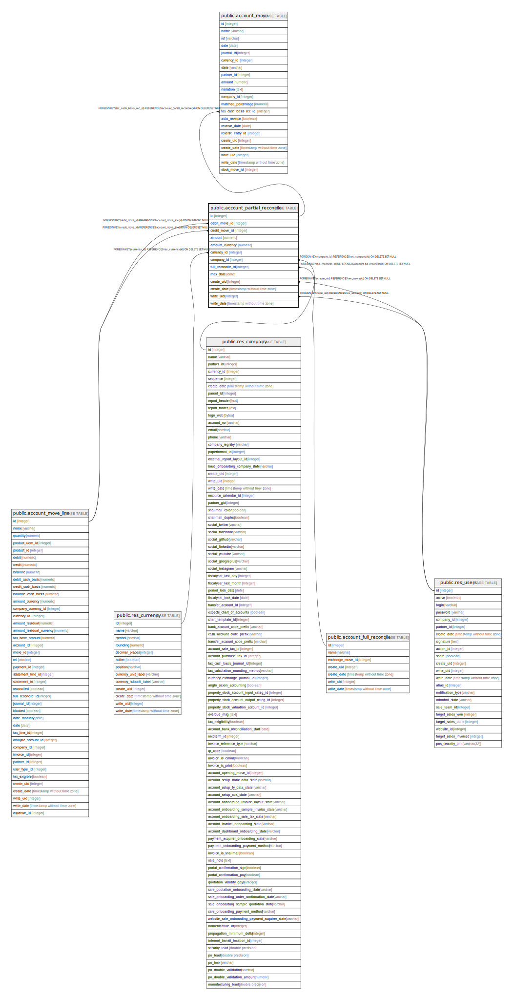

# public.account_partial_reconcile

## Description

Partial Reconcile

## Columns

| Name | Type | Default | Nullable | Children | Parents | Comment |
| ---- | ---- | ------- | -------- | -------- | ------- | ------- |
| id | integer | nextval('account_partial_reconcile_id_seq'::regclass) | false | [public.account_move](public.account_move.md) |  |  |
| debit_move_id | integer |  | false |  | [public.account_move_line](public.account_move_line.md) | Debit Move |
| credit_move_id | integer |  | false |  | [public.account_move_line](public.account_move_line.md) | Credit Move |
| amount | numeric |  | true |  |  | Amount |
| amount_currency | numeric |  | true |  |  | Amount in Currency |
| currency_id | integer |  | true |  | [public.res_currency](public.res_currency.md) | Currency |
| company_id | integer |  | true |  | [public.res_company](public.res_company.md) | Company |
| full_reconcile_id | integer |  | true |  | [public.account_full_reconcile](public.account_full_reconcile.md) | Full Reconcile |
| max_date | date |  | true |  |  | Max Date of Matched Lines |
| create_uid | integer |  | true |  | [public.res_users](public.res_users.md) | Created by |
| create_date | timestamp without time zone |  | true |  |  | Created on |
| write_uid | integer |  | true |  | [public.res_users](public.res_users.md) | Last Updated by |
| write_date | timestamp without time zone |  | true |  |  | Last Updated on |

## Constraints

| Name | Type | Definition |
| ---- | ---- | ---------- |
| account_partial_reconcile_create_uid_fkey | FOREIGN KEY | FOREIGN KEY (create_uid) REFERENCES res_users(id) ON DELETE SET NULL |
| account_partial_reconcile_write_uid_fkey | FOREIGN KEY | FOREIGN KEY (write_uid) REFERENCES res_users(id) ON DELETE SET NULL |
| account_partial_reconcile_currency_id_fkey | FOREIGN KEY | FOREIGN KEY (currency_id) REFERENCES res_currency(id) ON DELETE SET NULL |
| account_partial_reconcile_company_id_fkey | FOREIGN KEY | FOREIGN KEY (company_id) REFERENCES res_company(id) ON DELETE SET NULL |
| account_partial_reconcile_credit_move_id_fkey | FOREIGN KEY | FOREIGN KEY (credit_move_id) REFERENCES account_move_line(id) ON DELETE SET NULL |
| account_partial_reconcile_debit_move_id_fkey | FOREIGN KEY | FOREIGN KEY (debit_move_id) REFERENCES account_move_line(id) ON DELETE SET NULL |
| account_partial_reconcile_pkey | PRIMARY KEY | PRIMARY KEY (id) |
| account_partial_reconcile_full_reconcile_id_fkey | FOREIGN KEY | FOREIGN KEY (full_reconcile_id) REFERENCES account_full_reconcile(id) ON DELETE SET NULL |

## Indexes

| Name | Definition |
| ---- | ---------- |
| account_partial_reconcile_pkey | CREATE UNIQUE INDEX account_partial_reconcile_pkey ON public.account_partial_reconcile USING btree (id) |
| account_partial_reconcile_debit_move_id_index | CREATE INDEX account_partial_reconcile_debit_move_id_index ON public.account_partial_reconcile USING btree (debit_move_id) |
| account_partial_reconcile_credit_move_id_index | CREATE INDEX account_partial_reconcile_credit_move_id_index ON public.account_partial_reconcile USING btree (credit_move_id) |

## Relations

---

> Generated by [tbls](https://github.com/k1LoW/tbls)
