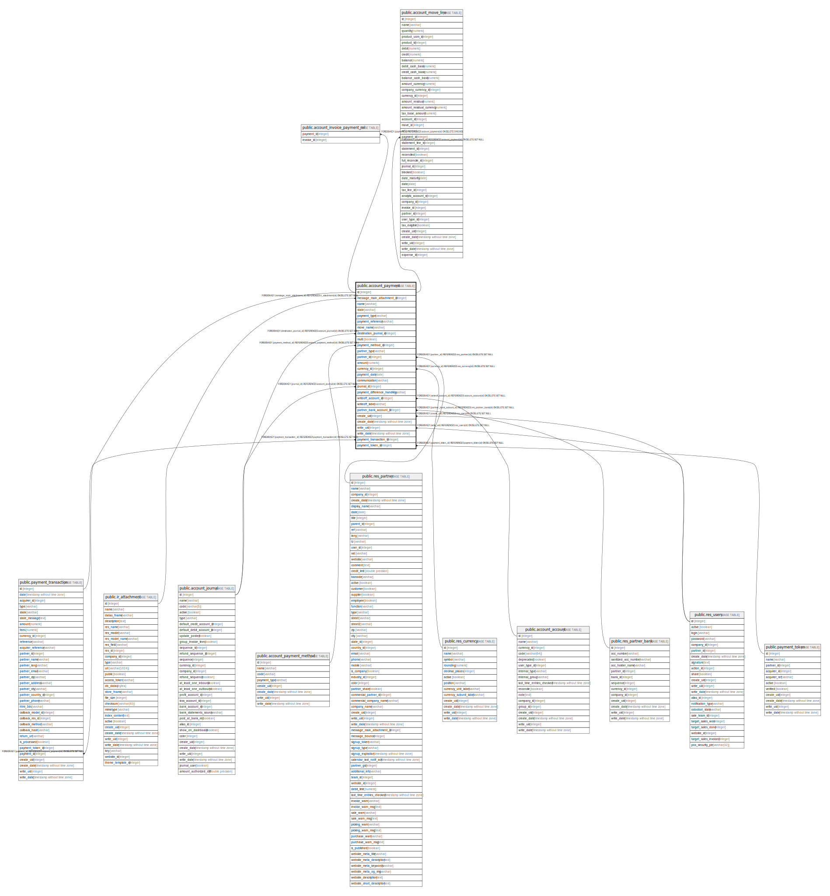

# public.account_payment

## Description

Payments

## Columns

| Name | Type | Default | Nullable | Children | Parents | Comment |
| ---- | ---- | ------- | -------- | -------- | ------- | ------- |
| id | integer | nextval('account_payment_id_seq'::regclass) | false | [public.account_invoice_payment_rel](public.account_invoice_payment_rel.md) [public.account_move_line](public.account_move_line.md) [public.payment_transaction](public.payment_transaction.md) |  |  |
| message_main_attachment_id | integer |  | true |  | [public.ir_attachment](public.ir_attachment.md) | Main Attachment |
| name | varchar |  | true |  |  | Name |
| state | varchar |  | true |  |  | Status |
| payment_type | varchar |  | false |  |  | Payment Type |
| payment_reference | varchar |  | true |  |  | Payment Reference |
| move_name | varchar |  | true |  |  | Journal Entry Name |
| destination_journal_id | integer |  | true |  | [public.account_journal](public.account_journal.md) | Transfer To |
| multi | boolean |  | true |  |  | Multi |
| payment_method_id | integer |  | false |  | [public.account_payment_method](public.account_payment_method.md) | Payment Method Type |
| partner_type | varchar |  | true |  |  | Partner Type |
| partner_id | integer |  | true |  | [public.res_partner](public.res_partner.md) | Partner |
| amount | numeric |  | false |  |  | Payment Amount |
| currency_id | integer |  | false |  | [public.res_currency](public.res_currency.md) | Currency |
| payment_date | date |  | false |  |  | Payment Date |
| communication | varchar |  | true |  |  | Memo |
| journal_id | integer |  | false |  | [public.account_journal](public.account_journal.md) | Payment Journal |
| payment_difference_handling | varchar |  | true |  |  | Payment Difference Handling |
| writeoff_account_id | integer |  | true |  | [public.account_account](public.account_account.md) | Difference Account |
| writeoff_label | varchar |  | true |  |  | Journal Item Label |
| partner_bank_account_id | integer |  | true |  | [public.res_partner_bank](public.res_partner_bank.md) | Recipient Bank Account |
| create_uid | integer |  | true |  | [public.res_users](public.res_users.md) | Created by |
| create_date | timestamp without time zone |  | true |  |  | Created on |
| write_uid | integer |  | true |  | [public.res_users](public.res_users.md) | Last Updated by |
| write_date | timestamp without time zone |  | true |  |  | Last Updated on |
| payment_transaction_id | integer |  | true |  | [public.payment_transaction](public.payment_transaction.md) | Payment Transaction |
| payment_token_id | integer |  | true |  | [public.payment_token](public.payment_token.md) | Saved payment token |

## Constraints

| Name | Type | Definition |
| ---- | ---- | ---------- |
| account_payment_create_uid_fkey | FOREIGN KEY | FOREIGN KEY (create_uid) REFERENCES res_users(id) ON DELETE SET NULL |
| account_payment_write_uid_fkey | FOREIGN KEY | FOREIGN KEY (write_uid) REFERENCES res_users(id) ON DELETE SET NULL |
| account_payment_currency_id_fkey | FOREIGN KEY | FOREIGN KEY (currency_id) REFERENCES res_currency(id) ON DELETE SET NULL |
| account_payment_partner_id_fkey | FOREIGN KEY | FOREIGN KEY (partner_id) REFERENCES res_partner(id) ON DELETE SET NULL |
| account_payment_message_main_attachment_id_fkey | FOREIGN KEY | FOREIGN KEY (message_main_attachment_id) REFERENCES ir_attachment(id) ON DELETE SET NULL |
| account_payment_partner_bank_account_id_fkey | FOREIGN KEY | FOREIGN KEY (partner_bank_account_id) REFERENCES res_partner_bank(id) ON DELETE SET NULL |
| account_payment_writeoff_account_id_fkey | FOREIGN KEY | FOREIGN KEY (writeoff_account_id) REFERENCES account_account(id) ON DELETE SET NULL |
| account_payment_destination_journal_id_fkey | FOREIGN KEY | FOREIGN KEY (destination_journal_id) REFERENCES account_journal(id) ON DELETE SET NULL |
| account_payment_journal_id_fkey | FOREIGN KEY | FOREIGN KEY (journal_id) REFERENCES account_journal(id) ON DELETE SET NULL |
| account_payment_payment_method_id_fkey | FOREIGN KEY | FOREIGN KEY (payment_method_id) REFERENCES account_payment_method(id) ON DELETE SET NULL |
| account_payment_pkey | PRIMARY KEY | PRIMARY KEY (id) |
| account_payment_payment_transaction_id_fkey | FOREIGN KEY | FOREIGN KEY (payment_transaction_id) REFERENCES payment_transaction(id) ON DELETE SET NULL |
| account_payment_payment_token_id_fkey | FOREIGN KEY | FOREIGN KEY (payment_token_id) REFERENCES payment_token(id) ON DELETE SET NULL |

## Indexes

| Name | Definition |
| ---- | ---------- |
| account_payment_pkey | CREATE UNIQUE INDEX account_payment_pkey ON public.account_payment USING btree (id) |
| account_payment_message_main_attachment_id_index | CREATE INDEX account_payment_message_main_attachment_id_index ON public.account_payment USING btree (message_main_attachment_id) |

## Relations

---

> Generated by [tbls](https://github.com/k1LoW/tbls)
