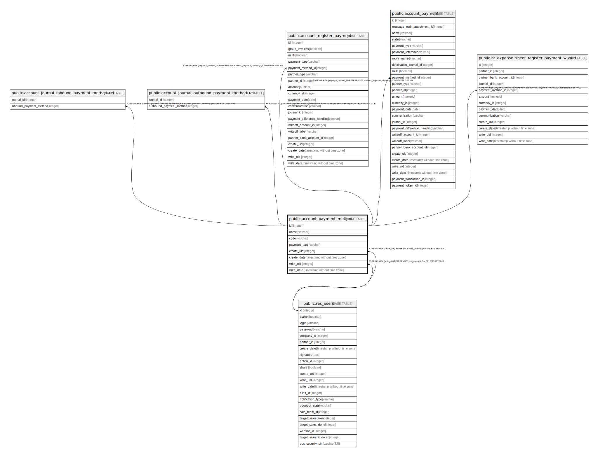

# public.account_payment_method

## Description

Payment Methods

## Columns

| Name | Type | Default | Nullable | Children | Parents | Comment |
| ---- | ---- | ------- | -------- | -------- | ------- | ------- |
| id | integer | nextval('account_payment_method_id_seq'::regclass) | false | [public.account_journal_inbound_payment_method_rel](public.account_journal_inbound_payment_method_rel.md) [public.account_journal_outbound_payment_method_rel](public.account_journal_outbound_payment_method_rel.md) [public.account_register_payments](public.account_register_payments.md) [public.account_payment](public.account_payment.md) [public.hr_expense_sheet_register_payment_wizard](public.hr_expense_sheet_register_payment_wizard.md) |  |  |
| name | varchar |  | false |  |  | Name |
| code | varchar |  | false |  |  | Code |
| payment_type | varchar |  | false |  |  | Payment Type |
| create_uid | integer |  | true |  | [public.res_users](public.res_users.md) | Created by |
| create_date | timestamp without time zone |  | true |  |  | Created on |
| write_uid | integer |  | true |  | [public.res_users](public.res_users.md) | Last Updated by |
| write_date | timestamp without time zone |  | true |  |  | Last Updated on |

## Constraints

| Name | Type | Definition |
| ---- | ---- | ---------- |
| account_payment_method_create_uid_fkey | FOREIGN KEY | FOREIGN KEY (create_uid) REFERENCES res_users(id) ON DELETE SET NULL |
| account_payment_method_write_uid_fkey | FOREIGN KEY | FOREIGN KEY (write_uid) REFERENCES res_users(id) ON DELETE SET NULL |
| account_payment_method_pkey | PRIMARY KEY | PRIMARY KEY (id) |

## Indexes

| Name | Definition |
| ---- | ---------- |
| account_payment_method_pkey | CREATE UNIQUE INDEX account_payment_method_pkey ON public.account_payment_method USING btree (id) |

## Relations

---

> Generated by [tbls](https://github.com/k1LoW/tbls)
