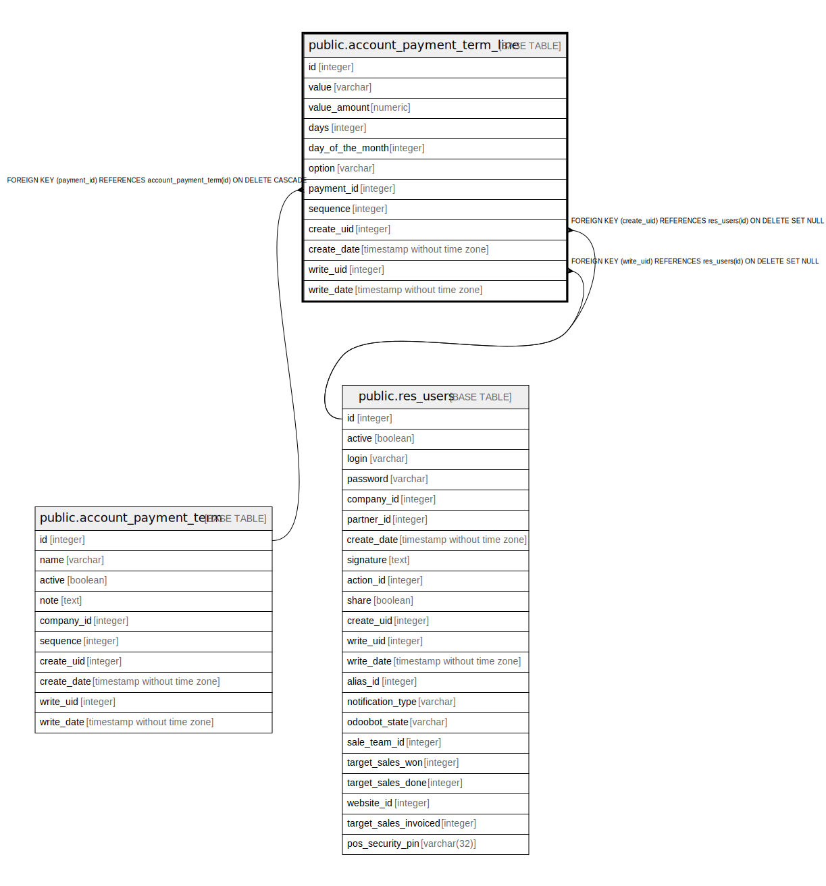

# public.account_payment_term_line

## Description

Payment Terms Line

## Columns

| Name | Type | Default | Nullable | Children | Parents | Comment |
| ---- | ---- | ------- | -------- | -------- | ------- | ------- |
| id | integer | nextval('account_payment_term_line_id_seq'::regclass) | false |  |  |  |
| value | varchar |  | false |  |  | Type |
| value_amount | numeric |  | true |  |  | Value |
| days | integer |  | false |  |  | Number of Days |
| day_of_the_month | integer |  | true |  |  | Day of the month |
| option | varchar |  | false |  |  | Options |
| payment_id | integer |  | false |  | [public.account_payment_term](public.account_payment_term.md) | Payment Terms |
| sequence | integer |  | true |  |  | Sequence |
| create_uid | integer |  | true |  | [public.res_users](public.res_users.md) | Created by |
| create_date | timestamp without time zone |  | true |  |  | Created on |
| write_uid | integer |  | true |  | [public.res_users](public.res_users.md) | Last Updated by |
| write_date | timestamp without time zone |  | true |  |  | Last Updated on |

## Constraints

| Name | Type | Definition |
| ---- | ---- | ---------- |
| account_payment_term_line_create_uid_fkey | FOREIGN KEY | FOREIGN KEY (create_uid) REFERENCES res_users(id) ON DELETE SET NULL |
| account_payment_term_line_write_uid_fkey | FOREIGN KEY | FOREIGN KEY (write_uid) REFERENCES res_users(id) ON DELETE SET NULL |
| account_payment_term_line_payment_id_fkey | FOREIGN KEY | FOREIGN KEY (payment_id) REFERENCES account_payment_term(id) ON DELETE CASCADE |
| account_payment_term_line_pkey | PRIMARY KEY | PRIMARY KEY (id) |

## Indexes

| Name | Definition |
| ---- | ---------- |
| account_payment_term_line_pkey | CREATE UNIQUE INDEX account_payment_term_line_pkey ON public.account_payment_term_line USING btree (id) |
| account_payment_term_line_payment_id_index | CREATE INDEX account_payment_term_line_payment_id_index ON public.account_payment_term_line USING btree (payment_id) |

## Relations

---

> Generated by [tbls](https://github.com/k1LoW/tbls)
