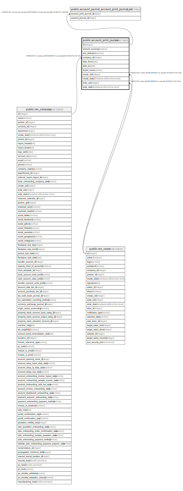

# public.account_print_journal

## Description

Account Print Journal

## Columns

| Name | Type | Default | Nullable | Children | Parents | Comment |
| ---- | ---- | ------- | -------- | -------- | ------- | ------- |
| id | integer | nextval('account_print_journal_id_seq'::regclass) | false | [public.account_journal_account_print_journal_rel](public.account_journal_account_print_journal_rel.md) |  |  |
| amount_currency | boolean |  | true |  |  | With Currency |
| sort_selection | varchar |  | false |  |  | Entries Sorted by |
| company_id | integer |  | false |  | [public.res_company](public.res_company.md) | Company |
| date_from | date |  | true |  |  | Start Date |
| date_to | date |  | true |  |  | End Date |
| target_move | varchar |  | false |  |  | Target Moves |
| create_uid | integer |  | true |  | [public.res_users](public.res_users.md) | Created by |
| create_date | timestamp without time zone |  | true |  |  | Created on |
| write_uid | integer |  | true |  | [public.res_users](public.res_users.md) | Last Updated by |
| write_date | timestamp without time zone |  | true |  |  | Last Updated on |

## Constraints

| Name | Type | Definition |
| ---- | ---- | ---------- |
| account_print_journal_create_uid_fkey | FOREIGN KEY | FOREIGN KEY (create_uid) REFERENCES res_users(id) ON DELETE SET NULL |
| account_print_journal_write_uid_fkey | FOREIGN KEY | FOREIGN KEY (write_uid) REFERENCES res_users(id) ON DELETE SET NULL |
| account_print_journal_company_id_fkey | FOREIGN KEY | FOREIGN KEY (company_id) REFERENCES res_company(id) ON DELETE SET NULL |
| account_print_journal_pkey | PRIMARY KEY | PRIMARY KEY (id) |

## Indexes

| Name | Definition |
| ---- | ---------- |
| account_print_journal_pkey | CREATE UNIQUE INDEX account_print_journal_pkey ON public.account_print_journal USING btree (id) |

## Relations

---

> Generated by [tbls](https://github.com/k1LoW/tbls)
