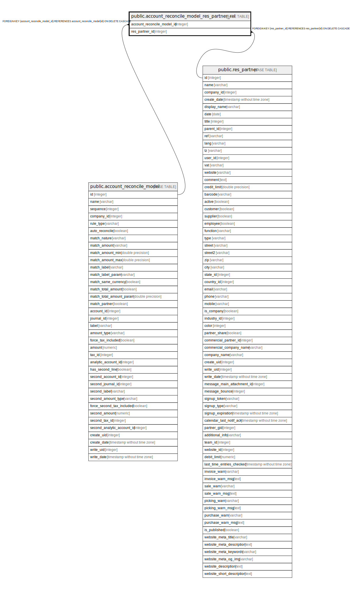

# public.account_reconcile_model_res_partner_rel

## Description

RELATION BETWEEN account_reconcile_model AND res_partner

## Columns

| Name | Type | Default | Nullable | Children | Parents | Comment |
| ---- | ---- | ------- | -------- | -------- | ------- | ------- |
| account_reconcile_model_id | integer |  | false |  | [public.account_reconcile_model](public.account_reconcile_model.md) |  |
| res_partner_id | integer |  | false |  | [public.res_partner](public.res_partner.md) |  |

## Constraints

| Name | Type | Definition |
| ---- | ---- | ---------- |
| account_reconcile_model_res_partner_rel_res_partner_id_fkey | FOREIGN KEY | FOREIGN KEY (res_partner_id) REFERENCES res_partner(id) ON DELETE CASCADE |
| account_reconcile_model_res_par_account_reconcile_model_id_fkey | FOREIGN KEY | FOREIGN KEY (account_reconcile_model_id) REFERENCES account_reconcile_model(id) ON DELETE CASCADE |
| account_reconcile_model_res_p_account_reconcile_model_id_re_key | UNIQUE | UNIQUE (account_reconcile_model_id, res_partner_id) |

## Indexes

| Name | Definition |
| ---- | ---------- |
| account_reconcile_model_res_p_account_reconcile_model_id_re_key | CREATE UNIQUE INDEX account_reconcile_model_res_p_account_reconcile_model_id_re_key ON public.account_reconcile_model_res_partner_rel USING btree (account_reconcile_model_id, res_partner_id) |
| account_reconcile_model_res_part_account_reconcile_model_id_idx | CREATE INDEX account_reconcile_model_res_part_account_reconcile_model_id_idx ON public.account_reconcile_model_res_partner_rel USING btree (account_reconcile_model_id) |
| account_reconcile_model_res_partner_rel_res_partner_id_idx | CREATE INDEX account_reconcile_model_res_partner_rel_res_partner_id_idx ON public.account_reconcile_model_res_partner_rel USING btree (res_partner_id) |

## Relations

---

> Generated by [tbls](https://github.com/k1LoW/tbls)
