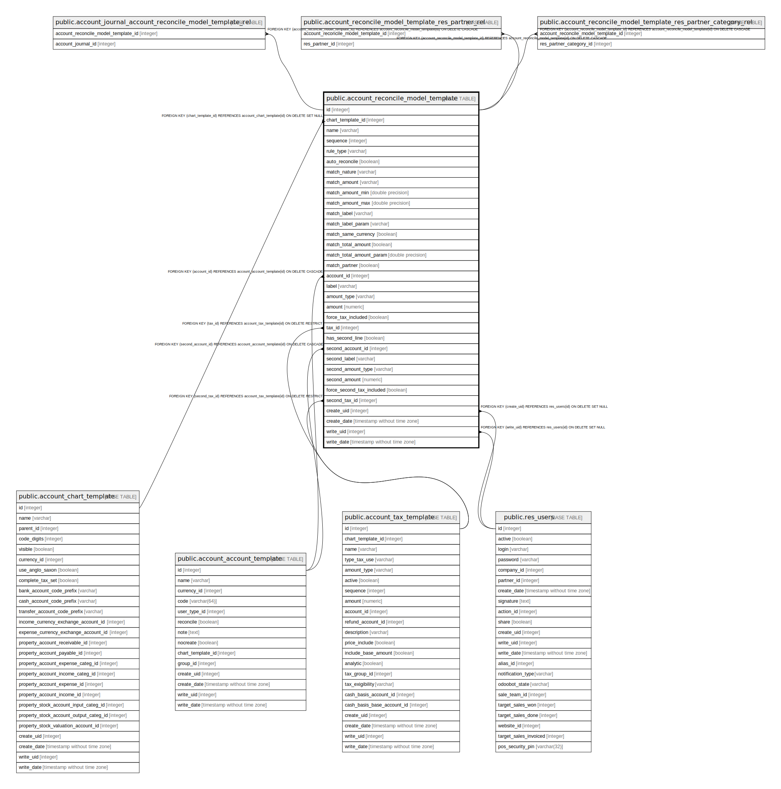

# public.account_reconcile_model_template

## Description

Reconcile Model Template

## Columns

| Name | Type | Default | Nullable | Children | Parents | Comment |
| ---- | ---- | ------- | -------- | -------- | ------- | ------- |
| id | integer | nextval('account_reconcile_model_template_id_seq'::regclass) | false | [public.account_journal_account_reconcile_model_template_rel](public.account_journal_account_reconcile_model_template_rel.md) [public.account_reconcile_model_template_res_partner_rel](public.account_reconcile_model_template_res_partner_rel.md) [public.account_reconcile_model_template_res_partner_category_rel](public.account_reconcile_model_template_res_partner_category_rel.md) |  |  |
| chart_template_id | integer |  | false |  | [public.account_chart_template](public.account_chart_template.md) | Chart Template |
| name | varchar |  | false |  |  | Button Label |
| sequence | integer |  | false |  |  | Sequence |
| rule_type | varchar |  | false |  |  | Type |
| auto_reconcile | boolean |  | true |  |  | Auto-validate |
| match_nature | varchar |  | false |  |  | Amount Nature |
| match_amount | varchar |  | true |  |  | Amount |
| match_amount_min | double precision |  | true |  |  | Amount Min Parameter |
| match_amount_max | double precision |  | true |  |  | Amount Max Parameter |
| match_label | varchar |  | true |  |  | Label |
| match_label_param | varchar |  | true |  |  | Label Parameter |
| match_same_currency | boolean |  | true |  |  | Same Currency Matching |
| match_total_amount | boolean |  | true |  |  | Amount Matching |
| match_total_amount_param | double precision |  | true |  |  | Amount Matching % |
| match_partner | boolean |  | true |  |  | Partner Is Set |
| account_id | integer |  | true |  | [public.account_account_template](public.account_account_template.md) | Account |
| label | varchar |  | true |  |  | Journal Item Label |
| amount_type | varchar |  | false |  |  | Amount Type |
| amount | numeric |  | false |  |  | Write-off Amount |
| force_tax_included | boolean |  | true |  |  | Tax Included in Price |
| tax_id | integer |  | true |  | [public.account_tax_template](public.account_tax_template.md) | Tax |
| has_second_line | boolean |  | true |  |  | Add a second line |
| second_account_id | integer |  | true |  | [public.account_account_template](public.account_account_template.md) | Second Account |
| second_label | varchar |  | true |  |  | Second Journal Item Label |
| second_amount_type | varchar |  | false |  |  | Second Amount type |
| second_amount | numeric |  | false |  |  | Second Write-off Amount |
| force_second_tax_included | boolean |  | true |  |  | Second Tax Included in Price |
| second_tax_id | integer |  | true |  | [public.account_tax_template](public.account_tax_template.md) | Second Tax |
| create_uid | integer |  | true |  | [public.res_users](public.res_users.md) | Created by |
| create_date | timestamp without time zone |  | true |  |  | Created on |
| write_uid | integer |  | true |  | [public.res_users](public.res_users.md) | Last Updated by |
| write_date | timestamp without time zone |  | true |  |  | Last Updated on |

## Constraints

| Name | Type | Definition |
| ---- | ---- | ---------- |
| account_reconcile_model_template_create_uid_fkey | FOREIGN KEY | FOREIGN KEY (create_uid) REFERENCES res_users(id) ON DELETE SET NULL |
| account_reconcile_model_template_write_uid_fkey | FOREIGN KEY | FOREIGN KEY (write_uid) REFERENCES res_users(id) ON DELETE SET NULL |
| account_reconcile_model_template_account_id_fkey | FOREIGN KEY | FOREIGN KEY (account_id) REFERENCES account_account_template(id) ON DELETE CASCADE |
| account_reconcile_model_template_second_account_id_fkey | FOREIGN KEY | FOREIGN KEY (second_account_id) REFERENCES account_account_template(id) ON DELETE CASCADE |
| account_reconcile_model_template_chart_template_id_fkey | FOREIGN KEY | FOREIGN KEY (chart_template_id) REFERENCES account_chart_template(id) ON DELETE SET NULL |
| account_reconcile_model_template_second_tax_id_fkey | FOREIGN KEY | FOREIGN KEY (second_tax_id) REFERENCES account_tax_template(id) ON DELETE RESTRICT |
| account_reconcile_model_template_tax_id_fkey | FOREIGN KEY | FOREIGN KEY (tax_id) REFERENCES account_tax_template(id) ON DELETE RESTRICT |
| account_reconcile_model_template_pkey | PRIMARY KEY | PRIMARY KEY (id) |

## Indexes

| Name | Definition |
| ---- | ---------- |
| account_reconcile_model_template_pkey | CREATE UNIQUE INDEX account_reconcile_model_template_pkey ON public.account_reconcile_model_template USING btree (id) |

## Relations

---

> Generated by [tbls](https://github.com/k1LoW/tbls)
