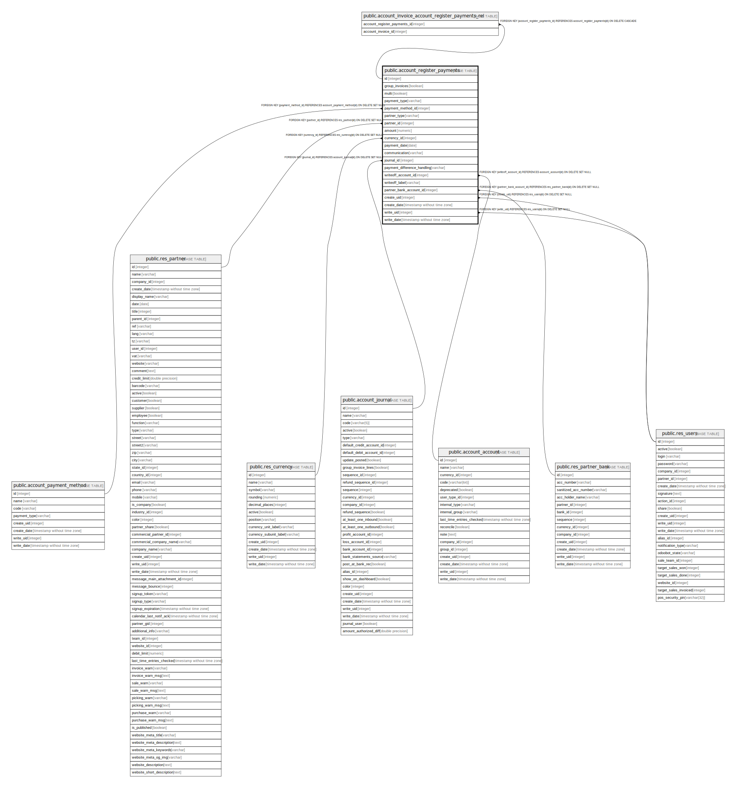

# public.account_register_payments

## Description

Register Payments

## Columns

| Name | Type | Default | Nullable | Children | Parents | Comment |
| ---- | ---- | ------- | -------- | -------- | ------- | ------- |
| id | integer | nextval('account_register_payments_id_seq'::regclass) | false | [public.account_invoice_account_register_payments_rel](public.account_invoice_account_register_payments_rel.md) |  |  |
| group_invoices | boolean |  | true |  |  | Group Invoices |
| multi | boolean |  | true |  |  | Multi |
| payment_type | varchar |  | false |  |  | Payment Type |
| payment_method_id | integer |  | false |  | [public.account_payment_method](public.account_payment_method.md) | Payment Method Type |
| partner_type | varchar |  | true |  |  | Partner Type |
| partner_id | integer |  | true |  | [public.res_partner](public.res_partner.md) | Partner |
| amount | numeric |  | false |  |  | Payment Amount |
| currency_id | integer |  | false |  | [public.res_currency](public.res_currency.md) | Currency |
| payment_date | date |  | false |  |  | Payment Date |
| communication | varchar |  | true |  |  | Memo |
| journal_id | integer |  | false |  | [public.account_journal](public.account_journal.md) | Payment Journal |
| payment_difference_handling | varchar |  | true |  |  | Payment Difference Handling |
| writeoff_account_id | integer |  | true |  | [public.account_account](public.account_account.md) | Difference Account |
| writeoff_label | varchar |  | true |  |  | Journal Item Label |
| partner_bank_account_id | integer |  | true |  | [public.res_partner_bank](public.res_partner_bank.md) | Recipient Bank Account |
| create_uid | integer |  | true |  | [public.res_users](public.res_users.md) | Created by |
| create_date | timestamp without time zone |  | true |  |  | Created on |
| write_uid | integer |  | true |  | [public.res_users](public.res_users.md) | Last Updated by |
| write_date | timestamp without time zone |  | true |  |  | Last Updated on |

## Constraints

| Name | Type | Definition |
| ---- | ---- | ---------- |
| account_register_payments_create_uid_fkey | FOREIGN KEY | FOREIGN KEY (create_uid) REFERENCES res_users(id) ON DELETE SET NULL |
| account_register_payments_write_uid_fkey | FOREIGN KEY | FOREIGN KEY (write_uid) REFERENCES res_users(id) ON DELETE SET NULL |
| account_register_payments_currency_id_fkey | FOREIGN KEY | FOREIGN KEY (currency_id) REFERENCES res_currency(id) ON DELETE SET NULL |
| account_register_payments_partner_id_fkey | FOREIGN KEY | FOREIGN KEY (partner_id) REFERENCES res_partner(id) ON DELETE SET NULL |
| account_register_payments_partner_bank_account_id_fkey | FOREIGN KEY | FOREIGN KEY (partner_bank_account_id) REFERENCES res_partner_bank(id) ON DELETE SET NULL |
| account_register_payments_writeoff_account_id_fkey | FOREIGN KEY | FOREIGN KEY (writeoff_account_id) REFERENCES account_account(id) ON DELETE SET NULL |
| account_register_payments_journal_id_fkey | FOREIGN KEY | FOREIGN KEY (journal_id) REFERENCES account_journal(id) ON DELETE SET NULL |
| account_register_payments_payment_method_id_fkey | FOREIGN KEY | FOREIGN KEY (payment_method_id) REFERENCES account_payment_method(id) ON DELETE SET NULL |
| account_register_payments_pkey | PRIMARY KEY | PRIMARY KEY (id) |

## Indexes

| Name | Definition |
| ---- | ---------- |
| account_register_payments_pkey | CREATE UNIQUE INDEX account_register_payments_pkey ON public.account_register_payments USING btree (id) |

## Relations

---

> Generated by [tbls](https://github.com/k1LoW/tbls)
