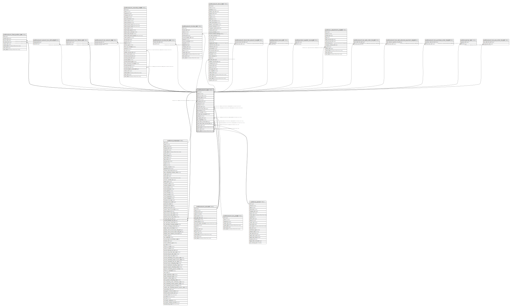

# public.account_tax

## Description

Tax

## Columns

| Name | Type | Default | Nullable | Children | Parents | Comment |
| ---- | ---- | ------- | -------- | -------- | ------- | ------- |
| id | integer | nextval('account_tax_id_seq'::regclass) | false | [public.res_company](public.res_company.md) [public.account_fiscal_position_tax](public.account_fiscal_position_tax.md) [public.account_account_tax_default_rel](public.account_account_tax_default_rel.md) [public.account_tax_filiation_rel](public.account_tax_filiation_rel.md) [public.account_tax_account_tag](public.account_tax_account_tag.md) [public.account_reconcile_model](public.account_reconcile_model.md) [public.account_invoice_line_tax](public.account_invoice_line_tax.md) [public.account_invoice_tax](public.account_invoice_tax.md) [public.account_move_line](public.account_move_line.md) [public.account_move_line_account_tax_rel](public.account_move_line_account_tax_rel.md) [public.product_taxes_rel](public.product_taxes_rel.md) [public.product_supplier_taxes_rel](public.product_supplier_taxes_rel.md) [public.tax_adjustments_wizard](public.tax_adjustments_wizard.md) [public.account_tax_sale_order_line_rel](public.account_tax_sale_order_line_rel.md) [public.account_tax_sale_advance_payment_inv_rel](public.account_tax_sale_advance_payment_inv_rel.md) [public.account_tax_purchase_order_line_rel](public.account_tax_purchase_order_line_rel.md) [public.expense_tax](public.expense_tax.md) [public.account_tax_pos_order_line_rel](public.account_tax_pos_order_line_rel.md) |  |  |
| name | varchar |  | false |  |  | Tax Name |
| type_tax_use | varchar |  | false |  |  | Tax Scope |
| amount_type | varchar |  | false |  |  | Tax Computation |
| active | boolean |  | true |  |  | Active |
| company_id | integer |  | false |  | [public.res_company](public.res_company.md) | Company |
| sequence | integer |  | false |  |  | Sequence |
| amount | numeric |  | false |  |  | Amount |
| account_id | integer |  | true |  | [public.account_account](public.account_account.md) | Tax Account |
| refund_account_id | integer |  | true |  | [public.account_account](public.account_account.md) | Tax Account on Credit Notes |
| description | varchar |  | true |  |  | Label on Invoices |
| price_include | boolean |  | true |  |  | Included in Price |
| include_base_amount | boolean |  | true |  |  | Affect Base of Subsequent Taxes |
| analytic | boolean |  | true |  |  | Include in Analytic Cost |
| tax_group_id | integer |  | false |  | [public.account_tax_group](public.account_tax_group.md) | Tax Group |
| tax_exigibility | varchar |  | true |  |  | Tax Due |
| cash_basis_account_id | integer |  | true |  | [public.account_account](public.account_account.md) | Tax Received Account |
| cash_basis_base_account_id | integer |  | true |  | [public.account_account](public.account_account.md) | Base Tax Received Account |
| create_uid | integer |  | true |  | [public.res_users](public.res_users.md) | Created by |
| create_date | timestamp without time zone |  | true |  |  | Created on |
| write_uid | integer |  | true |  | [public.res_users](public.res_users.md) | Last Updated by |
| write_date | timestamp without time zone |  | true |  |  | Last Updated on |

## Constraints

| Name | Type | Definition | Comment |
| ---- | ---- | ---------- | ------- |
| account_tax_create_uid_fkey | FOREIGN KEY | FOREIGN KEY (create_uid) REFERENCES res_users(id) ON DELETE SET NULL |  |
| account_tax_write_uid_fkey | FOREIGN KEY | FOREIGN KEY (write_uid) REFERENCES res_users(id) ON DELETE SET NULL |  |
| account_tax_company_id_fkey | FOREIGN KEY | FOREIGN KEY (company_id) REFERENCES res_company(id) ON DELETE SET NULL |  |
| account_tax_account_id_fkey | FOREIGN KEY | FOREIGN KEY (account_id) REFERENCES account_account(id) ON DELETE RESTRICT |  |
| account_tax_cash_basis_account_id_fkey | FOREIGN KEY | FOREIGN KEY (cash_basis_account_id) REFERENCES account_account(id) ON DELETE SET NULL |  |
| account_tax_cash_basis_base_account_id_fkey | FOREIGN KEY | FOREIGN KEY (cash_basis_base_account_id) REFERENCES account_account(id) ON DELETE SET NULL |  |
| account_tax_refund_account_id_fkey | FOREIGN KEY | FOREIGN KEY (refund_account_id) REFERENCES account_account(id) ON DELETE RESTRICT |  |
| account_tax_tax_group_id_fkey | FOREIGN KEY | FOREIGN KEY (tax_group_id) REFERENCES account_tax_group(id) ON DELETE SET NULL |  |
| account_tax_pkey | PRIMARY KEY | PRIMARY KEY (id) |  |
| account_tax_name_company_uniq | UNIQUE | UNIQUE (name, company_id, type_tax_use) | unique(name, company_id, type_tax_use) |

## Indexes

| Name | Definition |
| ---- | ---------- |
| account_tax_pkey | CREATE UNIQUE INDEX account_tax_pkey ON public.account_tax USING btree (id) |
| account_tax_name_company_uniq | CREATE UNIQUE INDEX account_tax_name_company_uniq ON public.account_tax USING btree (name, company_id, type_tax_use) |

## Relations

---

> Generated by [tbls](https://github.com/k1LoW/tbls)
