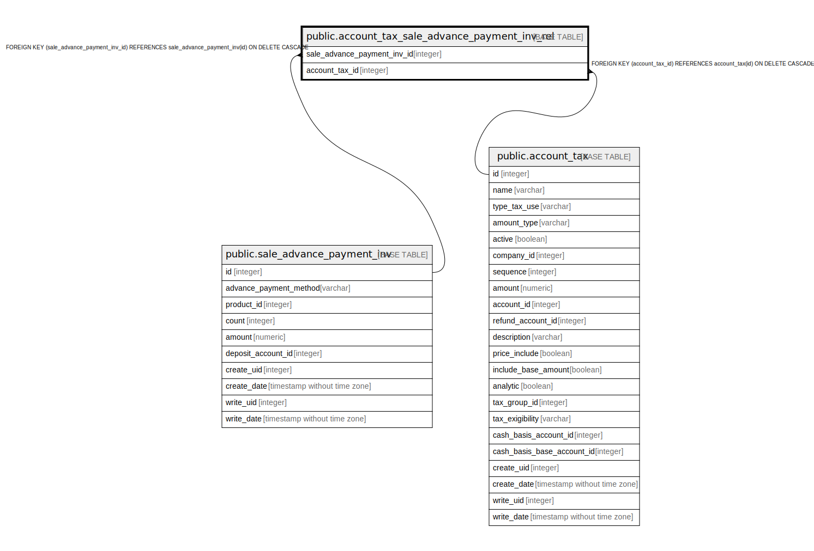

# public.account_tax_sale_advance_payment_inv_rel

## Description

RELATION BETWEEN sale_advance_payment_inv AND account_tax

## Columns

| Name | Type | Default | Nullable | Children | Parents | Comment |
| ---- | ---- | ------- | -------- | -------- | ------- | ------- |
| sale_advance_payment_inv_id | integer |  | false |  | [public.sale_advance_payment_inv](public.sale_advance_payment_inv.md) |  |
| account_tax_id | integer |  | false |  | [public.account_tax](public.account_tax.md) |  |

## Constraints

| Name | Type | Definition |
| ---- | ---- | ---------- |
| account_tax_sale_advance_payment_inv_rel_account_tax_id_fkey | FOREIGN KEY | FOREIGN KEY (account_tax_id) REFERENCES account_tax(id) ON DELETE CASCADE |
| account_tax_sale_advance_payme_sale_advance_payment_inv_id_fkey | FOREIGN KEY | FOREIGN KEY (sale_advance_payment_inv_id) REFERENCES sale_advance_payment_inv(id) ON DELETE CASCADE |
| account_tax_sale_advance_paym_sale_advance_payment_inv_id_a_key | UNIQUE | UNIQUE (sale_advance_payment_inv_id, account_tax_id) |

## Indexes

| Name | Definition |
| ---- | ---------- |
| account_tax_sale_advance_paym_sale_advance_payment_inv_id_a_key | CREATE UNIQUE INDEX account_tax_sale_advance_paym_sale_advance_payment_inv_id_a_key ON public.account_tax_sale_advance_payment_inv_rel USING btree (sale_advance_payment_inv_id, account_tax_id) |
| account_tax_sale_advance_paymen_sale_advance_payment_inv_id_idx | CREATE INDEX account_tax_sale_advance_paymen_sale_advance_payment_inv_id_idx ON public.account_tax_sale_advance_payment_inv_rel USING btree (sale_advance_payment_inv_id) |
| account_tax_sale_advance_payment_inv_rel_account_tax_id_idx | CREATE INDEX account_tax_sale_advance_payment_inv_rel_account_tax_id_idx ON public.account_tax_sale_advance_payment_inv_rel USING btree (account_tax_id) |

## Relations

---

> Generated by [tbls](https://github.com/k1LoW/tbls)
