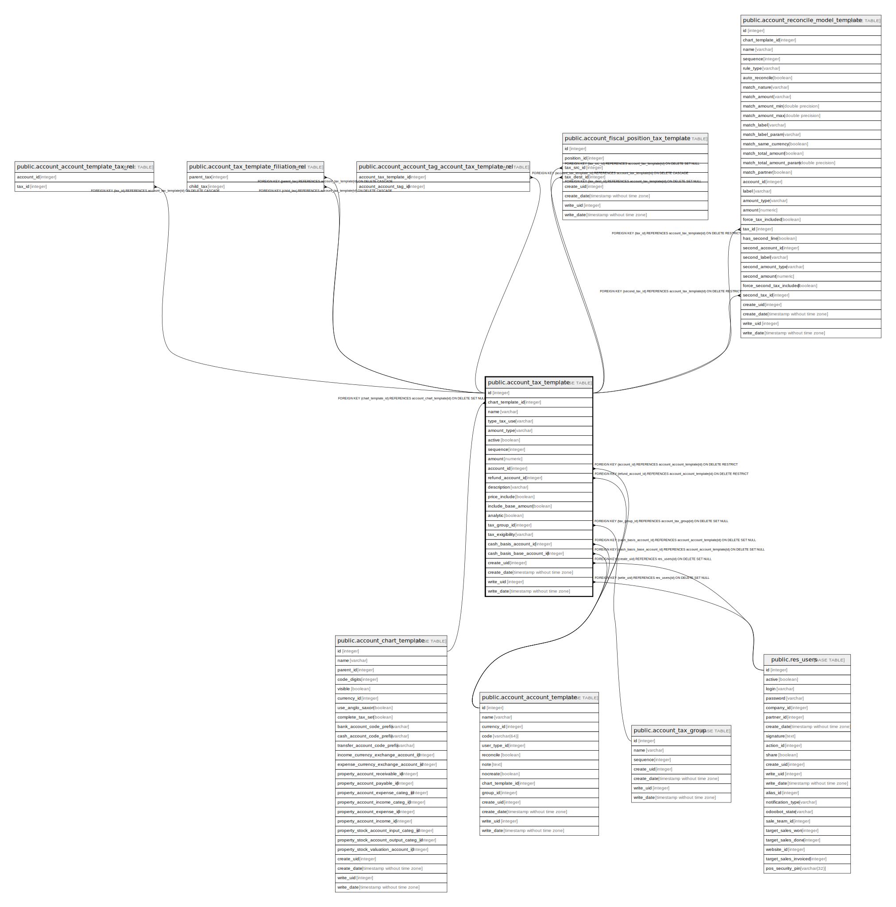

# public.account_tax_template

## Description

Templates for Taxes

## Columns

| Name | Type | Default | Nullable | Children | Parents | Comment |
| ---- | ---- | ------- | -------- | -------- | ------- | ------- |
| id | integer | nextval('account_tax_template_id_seq'::regclass) | false | [public.account_account_template_tax_rel](public.account_account_template_tax_rel.md) [public.account_tax_template_filiation_rel](public.account_tax_template_filiation_rel.md) [public.account_account_tag_account_tax_template_rel](public.account_account_tag_account_tax_template_rel.md) [public.account_fiscal_position_tax_template](public.account_fiscal_position_tax_template.md) [public.account_reconcile_model_template](public.account_reconcile_model_template.md) |  |  |
| chart_template_id | integer |  | false |  | [public.account_chart_template](public.account_chart_template.md) | Chart Template |
| name | varchar |  | false |  |  | Tax Name |
| type_tax_use | varchar |  | false |  |  | Tax Scope |
| amount_type | varchar |  | false |  |  | Tax Computation |
| active | boolean |  | true |  |  | Active |
| sequence | integer |  | false |  |  | Sequence |
| amount | numeric |  | false |  |  | Amount |
| account_id | integer |  | true |  | [public.account_account_template](public.account_account_template.md) | Tax Account |
| refund_account_id | integer |  | true |  | [public.account_account_template](public.account_account_template.md) | Tax Account on Refunds |
| description | varchar |  | true |  |  | Display on Invoices |
| price_include | boolean |  | true |  |  | Included in Price |
| include_base_amount | boolean |  | true |  |  | Affect Subsequent Taxes |
| analytic | boolean |  | true |  |  | Analytic Cost |
| tax_group_id | integer |  | true |  | [public.account_tax_group](public.account_tax_group.md) | Tax Group |
| tax_exigibility | varchar |  | true |  |  | Tax Due |
| cash_basis_account_id | integer |  | true |  | [public.account_account_template](public.account_account_template.md) | Tax Received Account |
| cash_basis_base_account_id | integer |  | true |  | [public.account_account_template](public.account_account_template.md) | Base Tax Received Account |
| create_uid | integer |  | true |  | [public.res_users](public.res_users.md) | Created by |
| create_date | timestamp without time zone |  | true |  |  | Created on |
| write_uid | integer |  | true |  | [public.res_users](public.res_users.md) | Last Updated by |
| write_date | timestamp without time zone |  | true |  |  | Last Updated on |

## Constraints

| Name | Type | Definition | Comment |
| ---- | ---- | ---------- | ------- |
| account_tax_template_create_uid_fkey | FOREIGN KEY | FOREIGN KEY (create_uid) REFERENCES res_users(id) ON DELETE SET NULL |  |
| account_tax_template_write_uid_fkey | FOREIGN KEY | FOREIGN KEY (write_uid) REFERENCES res_users(id) ON DELETE SET NULL |  |
| account_tax_template_tax_group_id_fkey | FOREIGN KEY | FOREIGN KEY (tax_group_id) REFERENCES account_tax_group(id) ON DELETE SET NULL |  |
| account_tax_template_account_id_fkey | FOREIGN KEY | FOREIGN KEY (account_id) REFERENCES account_account_template(id) ON DELETE RESTRICT |  |
| account_tax_template_cash_basis_account_id_fkey | FOREIGN KEY | FOREIGN KEY (cash_basis_account_id) REFERENCES account_account_template(id) ON DELETE SET NULL |  |
| account_tax_template_cash_basis_base_account_id_fkey | FOREIGN KEY | FOREIGN KEY (cash_basis_base_account_id) REFERENCES account_account_template(id) ON DELETE SET NULL |  |
| account_tax_template_refund_account_id_fkey | FOREIGN KEY | FOREIGN KEY (refund_account_id) REFERENCES account_account_template(id) ON DELETE RESTRICT |  |
| account_tax_template_chart_template_id_fkey | FOREIGN KEY | FOREIGN KEY (chart_template_id) REFERENCES account_chart_template(id) ON DELETE SET NULL |  |
| account_tax_template_pkey | PRIMARY KEY | PRIMARY KEY (id) |  |
| account_tax_template_name_company_uniq | UNIQUE | UNIQUE (name, type_tax_use, chart_template_id) | unique(name, type_tax_use, chart_template_id) |

## Indexes

| Name | Definition |
| ---- | ---------- |
| account_tax_template_pkey | CREATE UNIQUE INDEX account_tax_template_pkey ON public.account_tax_template USING btree (id) |
| account_tax_template_name_company_uniq | CREATE UNIQUE INDEX account_tax_template_name_company_uniq ON public.account_tax_template USING btree (name, type_tax_use, chart_template_id) |

## Relations

---

> Generated by [tbls](https://github.com/k1LoW/tbls)
