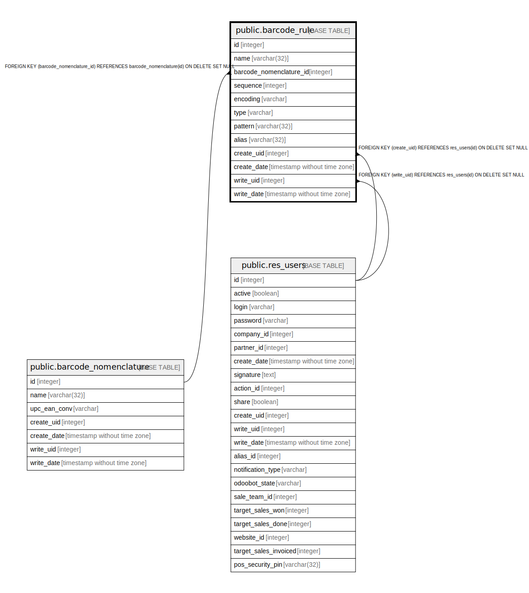

# public.barcode_rule

## Description

Barcode Rule

## Columns

| Name | Type | Default | Nullable | Children | Parents | Comment |
| ---- | ---- | ------- | -------- | -------- | ------- | ------- |
| id | integer | nextval('barcode_rule_id_seq'::regclass) | false |  |  |  |
| name | varchar(32) |  | false |  |  | Rule Name |
| barcode_nomenclature_id | integer |  | true |  | [public.barcode_nomenclature](public.barcode_nomenclature.md) | Barcode Nomenclature |
| sequence | integer |  | true |  |  | Sequence |
| encoding | varchar |  | false |  |  | Encoding |
| type | varchar |  | false |  |  | Type |
| pattern | varchar(32) |  | false |  |  | Barcode Pattern |
| alias | varchar(32) |  | false |  |  | Alias |
| create_uid | integer |  | true |  | [public.res_users](public.res_users.md) | Created by |
| create_date | timestamp without time zone |  | true |  |  | Created on |
| write_uid | integer |  | true |  | [public.res_users](public.res_users.md) | Last Updated by |
| write_date | timestamp without time zone |  | true |  |  | Last Updated on |

## Constraints

| Name | Type | Definition |
| ---- | ---- | ---------- |
| barcode_rule_create_uid_fkey | FOREIGN KEY | FOREIGN KEY (create_uid) REFERENCES res_users(id) ON DELETE SET NULL |
| barcode_rule_write_uid_fkey | FOREIGN KEY | FOREIGN KEY (write_uid) REFERENCES res_users(id) ON DELETE SET NULL |
| barcode_rule_barcode_nomenclature_id_fkey | FOREIGN KEY | FOREIGN KEY (barcode_nomenclature_id) REFERENCES barcode_nomenclature(id) ON DELETE SET NULL |
| barcode_rule_pkey | PRIMARY KEY | PRIMARY KEY (id) |

## Indexes

| Name | Definition |
| ---- | ---------- |
| barcode_rule_pkey | CREATE UNIQUE INDEX barcode_rule_pkey ON public.barcode_rule USING btree (id) |

## Relations

---

> Generated by [tbls](https://github.com/k1LoW/tbls)
