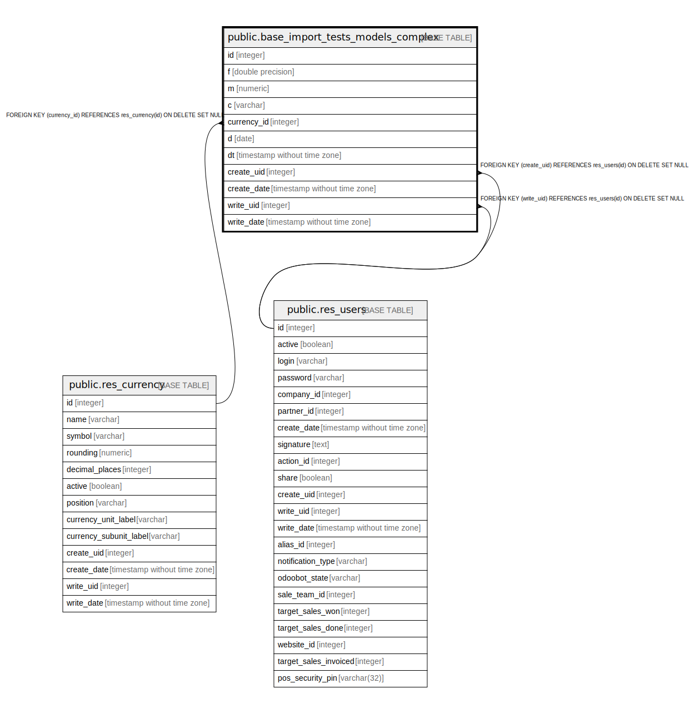

# public.base_import_tests_models_complex

## Description

Tests: Base Import Model Complex

## Columns

| Name | Type | Default | Nullable | Children | Parents | Comment |
| ---- | ---- | ------- | -------- | -------- | ------- | ------- |
| id | integer | nextval('base_import_tests_models_complex_id_seq'::regclass) | false |  |  |  |
| f | double precision |  | true |  |  | F |
| m | numeric |  | true |  |  | M |
| c | varchar |  | true |  |  | C |
| currency_id | integer |  | true |  | [public.res_currency](public.res_currency.md) | Currency |
| d | date |  | true |  |  | D |
| dt | timestamp without time zone |  | true |  |  | Dt |
| create_uid | integer |  | true |  | [public.res_users](public.res_users.md) | Created by |
| create_date | timestamp without time zone |  | true |  |  | Created on |
| write_uid | integer |  | true |  | [public.res_users](public.res_users.md) | Last Updated by |
| write_date | timestamp without time zone |  | true |  |  | Last Updated on |

## Constraints

| Name | Type | Definition |
| ---- | ---- | ---------- |
| base_import_tests_models_complex_create_uid_fkey | FOREIGN KEY | FOREIGN KEY (create_uid) REFERENCES res_users(id) ON DELETE SET NULL |
| base_import_tests_models_complex_write_uid_fkey | FOREIGN KEY | FOREIGN KEY (write_uid) REFERENCES res_users(id) ON DELETE SET NULL |
| base_import_tests_models_complex_currency_id_fkey | FOREIGN KEY | FOREIGN KEY (currency_id) REFERENCES res_currency(id) ON DELETE SET NULL |
| base_import_tests_models_complex_pkey | PRIMARY KEY | PRIMARY KEY (id) |

## Indexes

| Name | Definition |
| ---- | ---------- |
| base_import_tests_models_complex_pkey | CREATE UNIQUE INDEX base_import_tests_models_complex_pkey ON public.base_import_tests_models_complex USING btree (id) |

## Relations

---

> Generated by [tbls](https://github.com/k1LoW/tbls)
