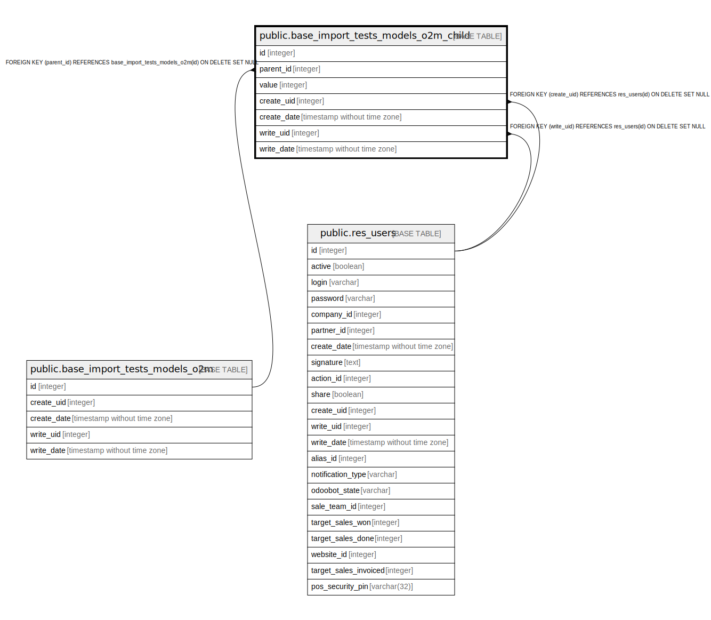

# public.base_import_tests_models_o2m_child

## Description

Tests : Base Import Model, One to Many child

## Columns

| Name | Type | Default | Nullable | Children | Parents | Comment |
| ---- | ---- | ------- | -------- | -------- | ------- | ------- |
| id | integer | nextval('base_import_tests_models_o2m_child_id_seq'::regclass) | false |  |  |  |
| parent_id | integer |  | true |  | [public.base_import_tests_models_o2m](public.base_import_tests_models_o2m.md) | Parent |
| value | integer |  | true |  |  | Value |
| create_uid | integer |  | true |  | [public.res_users](public.res_users.md) | Created by |
| create_date | timestamp without time zone |  | true |  |  | Created on |
| write_uid | integer |  | true |  | [public.res_users](public.res_users.md) | Last Updated by |
| write_date | timestamp without time zone |  | true |  |  | Last Updated on |

## Constraints

| Name | Type | Definition |
| ---- | ---- | ---------- |
| base_import_tests_models_o2m_child_create_uid_fkey | FOREIGN KEY | FOREIGN KEY (create_uid) REFERENCES res_users(id) ON DELETE SET NULL |
| base_import_tests_models_o2m_child_write_uid_fkey | FOREIGN KEY | FOREIGN KEY (write_uid) REFERENCES res_users(id) ON DELETE SET NULL |
| base_import_tests_models_o2m_child_parent_id_fkey | FOREIGN KEY | FOREIGN KEY (parent_id) REFERENCES base_import_tests_models_o2m(id) ON DELETE SET NULL |
| base_import_tests_models_o2m_child_pkey | PRIMARY KEY | PRIMARY KEY (id) |

## Indexes

| Name | Definition |
| ---- | ---------- |
| base_import_tests_models_o2m_child_pkey | CREATE UNIQUE INDEX base_import_tests_models_o2m_child_pkey ON public.base_import_tests_models_o2m_child USING btree (id) |

## Relations

---

> Generated by [tbls](https://github.com/k1LoW/tbls)
