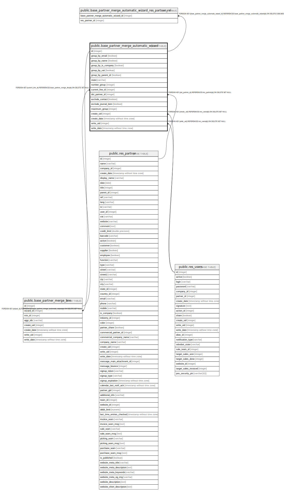

# public.base_partner_merge_automatic_wizard

## Description

Merge Partner Wizard

## Columns

| Name | Type | Default | Nullable | Children | Parents | Comment |
| ---- | ---- | ------- | -------- | -------- | ------- | ------- |
| id | integer | nextval('base_partner_merge_automatic_wizard_id_seq'::regclass) | false | [public.base_partner_merge_line](public.base_partner_merge_line.md) [public.base_partner_merge_automatic_wizard_res_partner_rel](public.base_partner_merge_automatic_wizard_res_partner_rel.md) |  |  |
| group_by_email | boolean |  | true |  |  | Email |
| group_by_name | boolean |  | true |  |  | Name |
| group_by_is_company | boolean |  | true |  |  | Is Company |
| group_by_vat | boolean |  | true |  |  | VAT |
| group_by_parent_id | boolean |  | true |  |  | Parent Company |
| state | varchar |  | false |  |  | State |
| number_group | integer |  | true |  |  | Group of Contacts |
| current_line_id | integer |  | true |  | [public.base_partner_merge_line](public.base_partner_merge_line.md) | Current Line |
| dst_partner_id | integer |  | true |  | [public.res_partner](public.res_partner.md) | Destination Contact |
| exclude_contact | boolean |  | true |  |  | A user associated to the contact |
| exclude_journal_item | boolean |  | true |  |  | Journal Items associated to the contact |
| maximum_group | integer |  | true |  |  | Maximum of Group of Contacts |
| create_uid | integer |  | true |  | [public.res_users](public.res_users.md) | Created by |
| create_date | timestamp without time zone |  | true |  |  | Created on |
| write_uid | integer |  | true |  | [public.res_users](public.res_users.md) | Last Updated by |
| write_date | timestamp without time zone |  | true |  |  | Last Updated on |

## Constraints

| Name | Type | Definition |
| ---- | ---- | ---------- |
| base_partner_merge_automatic_wizard_create_uid_fkey | FOREIGN KEY | FOREIGN KEY (create_uid) REFERENCES res_users(id) ON DELETE SET NULL |
| base_partner_merge_automatic_wizard_write_uid_fkey | FOREIGN KEY | FOREIGN KEY (write_uid) REFERENCES res_users(id) ON DELETE SET NULL |
| base_partner_merge_automatic_wizard_dst_partner_id_fkey | FOREIGN KEY | FOREIGN KEY (dst_partner_id) REFERENCES res_partner(id) ON DELETE SET NULL |
| base_partner_merge_automatic_wizard_current_line_id_fkey | FOREIGN KEY | FOREIGN KEY (current_line_id) REFERENCES base_partner_merge_line(id) ON DELETE SET NULL |
| base_partner_merge_automatic_wizard_pkey | PRIMARY KEY | PRIMARY KEY (id) |

## Indexes

| Name | Definition |
| ---- | ---------- |
| base_partner_merge_automatic_wizard_pkey | CREATE UNIQUE INDEX base_partner_merge_automatic_wizard_pkey ON public.base_partner_merge_automatic_wizard USING btree (id) |

## Relations

---

> Generated by [tbls](https://github.com/k1LoW/tbls)
