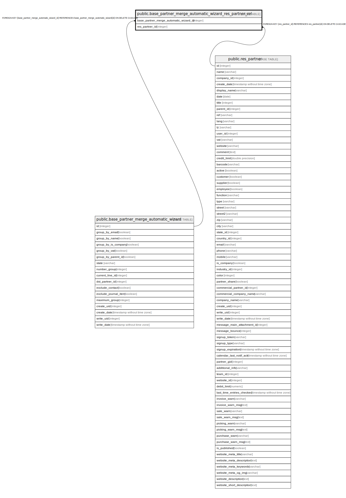

# public.base_partner_merge_automatic_wizard_res_partner_rel

## Description

RELATION BETWEEN base_partner_merge_automatic_wizard AND res_partner

## Columns

| Name | Type | Default | Nullable | Children | Parents | Comment |
| ---- | ---- | ------- | -------- | -------- | ------- | ------- |
| base_partner_merge_automatic_wizard_id | integer |  | false |  | [public.base_partner_merge_automatic_wizard](public.base_partner_merge_automatic_wizard.md) |  |
| res_partner_id | integer |  | false |  | [public.res_partner](public.res_partner.md) |  |

## Constraints

| Name | Type | Definition |
| ---- | ---- | ---------- |
| base_partner_merge_automatic_wizard_res_par_res_partner_id_fkey | FOREIGN KEY | FOREIGN KEY (res_partner_id) REFERENCES res_partner(id) ON DELETE CASCADE |
| base_partner_merge_automatic__base_partner_merge_automatic_fkey | FOREIGN KEY | FOREIGN KEY (base_partner_merge_automatic_wizard_id) REFERENCES base_partner_merge_automatic_wizard(id) ON DELETE CASCADE |
| base_partner_merge_automatic__base_partner_merge_automatic__key | UNIQUE | UNIQUE (base_partner_merge_automatic_wizard_id, res_partner_id) |

## Indexes

| Name | Definition |
| ---- | ---------- |
| base_partner_merge_automatic__base_partner_merge_automatic__key | CREATE UNIQUE INDEX base_partner_merge_automatic__base_partner_merge_automatic__key ON public.base_partner_merge_automatic_wizard_res_partner_rel USING btree (base_partner_merge_automatic_wizard_id, res_partner_id) |
| base_partner_merge_automatic__base_partner_merge_automatic__idx | CREATE INDEX base_partner_merge_automatic__base_partner_merge_automatic__idx ON public.base_partner_merge_automatic_wizard_res_partner_rel USING btree (base_partner_merge_automatic_wizard_id) |
| base_partner_merge_automatic_wizard_res_part_res_partner_id_idx | CREATE INDEX base_partner_merge_automatic_wizard_res_part_res_partner_id_idx ON public.base_partner_merge_automatic_wizard_res_partner_rel USING btree (res_partner_id) |

## Relations

---

> Generated by [tbls](https://github.com/k1LoW/tbls)
