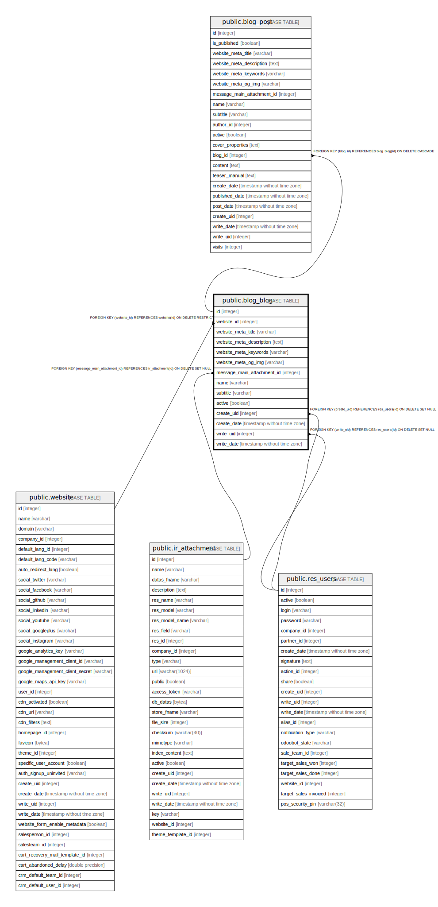

# public.blog_blog

## Description

Blogs

## Columns

| Name | Type | Default | Nullable | Children | Parents | Comment |
| ---- | ---- | ------- | -------- | -------- | ------- | ------- |
| id | integer | nextval('blog_blog_id_seq'::regclass) | false | [public.blog_post](public.blog_post.md) |  |  |
| website_id | integer |  | true |  | [public.website](public.website.md) | Website |
| website_meta_title | varchar |  | true |  |  | Website meta title |
| website_meta_description | text |  | true |  |  | Website meta description |
| website_meta_keywords | varchar |  | true |  |  | Website meta keywords |
| website_meta_og_img | varchar |  | true |  |  | Website opengraph image |
| message_main_attachment_id | integer |  | true |  | [public.ir_attachment](public.ir_attachment.md) | Main Attachment |
| name | varchar |  | false |  |  | Blog Name |
| subtitle | varchar |  | true |  |  | Blog Subtitle |
| active | boolean |  | true |  |  | Active |
| create_uid | integer |  | true |  | [public.res_users](public.res_users.md) | Created by |
| create_date | timestamp without time zone |  | true |  |  | Created on |
| write_uid | integer |  | true |  | [public.res_users](public.res_users.md) | Last Updated by |
| write_date | timestamp without time zone |  | true |  |  | Last Updated on |

## Constraints

| Name | Type | Definition |
| ---- | ---- | ---------- |
| blog_blog_create_uid_fkey | FOREIGN KEY | FOREIGN KEY (create_uid) REFERENCES res_users(id) ON DELETE SET NULL |
| blog_blog_write_uid_fkey | FOREIGN KEY | FOREIGN KEY (write_uid) REFERENCES res_users(id) ON DELETE SET NULL |
| blog_blog_message_main_attachment_id_fkey | FOREIGN KEY | FOREIGN KEY (message_main_attachment_id) REFERENCES ir_attachment(id) ON DELETE SET NULL |
| blog_blog_website_id_fkey | FOREIGN KEY | FOREIGN KEY (website_id) REFERENCES website(id) ON DELETE RESTRICT |
| blog_blog_pkey | PRIMARY KEY | PRIMARY KEY (id) |

## Indexes

| Name | Definition |
| ---- | ---------- |
| blog_blog_pkey | CREATE UNIQUE INDEX blog_blog_pkey ON public.blog_blog USING btree (id) |
| blog_blog_message_main_attachment_id_index | CREATE INDEX blog_blog_message_main_attachment_id_index ON public.blog_blog USING btree (message_main_attachment_id) |

## Relations

---

> Generated by [tbls](https://github.com/k1LoW/tbls)
