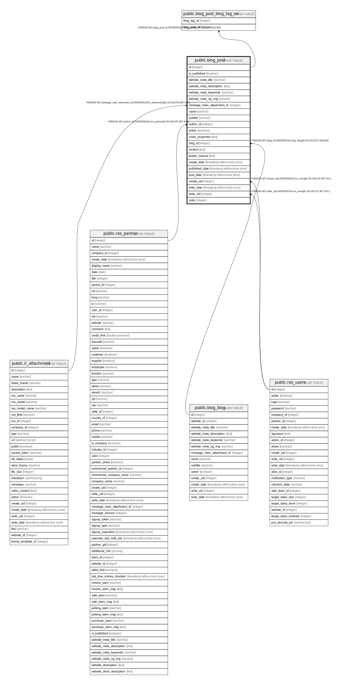

# public.blog_post

## Description

Blog Post

## Columns

| Name | Type | Default | Nullable | Children | Parents | Comment |
| ---- | ---- | ------- | -------- | -------- | ------- | ------- |
| id | integer | nextval('blog_post_id_seq'::regclass) | false | [public.blog_post_blog_tag_rel](public.blog_post_blog_tag_rel.md) |  |  |
| is_published | boolean |  | true |  |  | Is published |
| website_meta_title | varchar |  | true |  |  | Website meta title |
| website_meta_description | text |  | true |  |  | Website meta description |
| website_meta_keywords | varchar |  | true |  |  | Website meta keywords |
| website_meta_og_img | varchar |  | true |  |  | Website opengraph image |
| message_main_attachment_id | integer |  | true |  | [public.ir_attachment](public.ir_attachment.md) | Main Attachment |
| name | varchar |  | false |  |  | Title |
| subtitle | varchar |  | true |  |  | Sub Title |
| author_id | integer |  | true |  | [public.res_partner](public.res_partner.md) | Author |
| active | boolean |  | true |  |  | Active |
| cover_properties | text |  | true |  |  | Cover Properties |
| blog_id | integer |  | false |  | [public.blog_blog](public.blog_blog.md) | Blog |
| content | text |  | true |  |  | Content |
| teaser_manual | text |  | true |  |  | Teaser Content |
| create_date | timestamp without time zone |  | true |  |  | Created on |
| published_date | timestamp without time zone |  | true |  |  | Published Date |
| post_date | timestamp without time zone |  | true |  |  | Publishing date |
| create_uid | integer |  | true |  | [public.res_users](public.res_users.md) | Created by |
| write_date | timestamp without time zone |  | true |  |  | Last Updated on |
| write_uid | integer |  | true |  | [public.res_users](public.res_users.md) | Last Contributor |
| visits | integer |  | true |  |  | No of Views |

## Constraints

| Name | Type | Definition |
| ---- | ---- | ---------- |
| blog_post_create_uid_fkey | FOREIGN KEY | FOREIGN KEY (create_uid) REFERENCES res_users(id) ON DELETE SET NULL |
| blog_post_write_uid_fkey | FOREIGN KEY | FOREIGN KEY (write_uid) REFERENCES res_users(id) ON DELETE SET NULL |
| blog_post_author_id_fkey | FOREIGN KEY | FOREIGN KEY (author_id) REFERENCES res_partner(id) ON DELETE SET NULL |
| blog_post_message_main_attachment_id_fkey | FOREIGN KEY | FOREIGN KEY (message_main_attachment_id) REFERENCES ir_attachment(id) ON DELETE SET NULL |
| blog_post_blog_id_fkey | FOREIGN KEY | FOREIGN KEY (blog_id) REFERENCES blog_blog(id) ON DELETE CASCADE |
| blog_post_pkey | PRIMARY KEY | PRIMARY KEY (id) |

## Indexes

| Name | Definition |
| ---- | ---------- |
| blog_post_pkey | CREATE UNIQUE INDEX blog_post_pkey ON public.blog_post USING btree (id) |
| blog_post_message_main_attachment_id_index | CREATE INDEX blog_post_message_main_attachment_id_index ON public.blog_post USING btree (message_main_attachment_id) |
| blog_post_create_date_index | CREATE INDEX blog_post_create_date_index ON public.blog_post USING btree (create_date) |
| blog_post_create_uid_index | CREATE INDEX blog_post_create_uid_index ON public.blog_post USING btree (create_uid) |
| blog_post_write_date_index | CREATE INDEX blog_post_write_date_index ON public.blog_post USING btree (write_date) |
| blog_post_write_uid_index | CREATE INDEX blog_post_write_uid_index ON public.blog_post USING btree (write_uid) |

## Relations

---

> Generated by [tbls](https://github.com/k1LoW/tbls)
