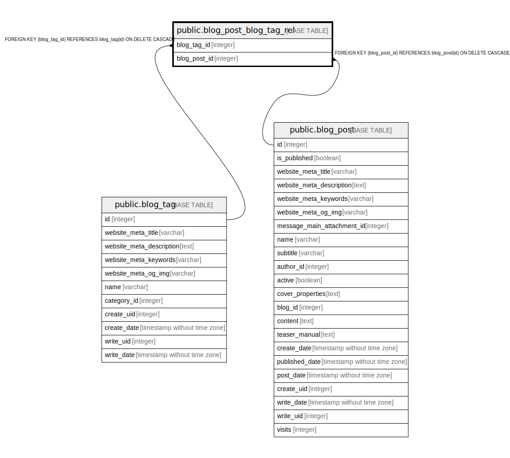

# public.blog_post_blog_tag_rel

## Description

RELATION BETWEEN blog_tag AND blog_post

## Columns

| Name | Type | Default | Nullable | Children | Parents | Comment |
| ---- | ---- | ------- | -------- | -------- | ------- | ------- |
| blog_tag_id | integer |  | false |  | [public.blog_tag](public.blog_tag.md) |  |
| blog_post_id | integer |  | false |  | [public.blog_post](public.blog_post.md) |  |

## Constraints

| Name | Type | Definition |
| ---- | ---- | ---------- |
| blog_post_blog_tag_rel_blog_tag_id_fkey | FOREIGN KEY | FOREIGN KEY (blog_tag_id) REFERENCES blog_tag(id) ON DELETE CASCADE |
| blog_post_blog_tag_rel_blog_tag_id_blog_post_id_key | UNIQUE | UNIQUE (blog_tag_id, blog_post_id) |
| blog_post_blog_tag_rel_blog_post_id_fkey | FOREIGN KEY | FOREIGN KEY (blog_post_id) REFERENCES blog_post(id) ON DELETE CASCADE |

## Indexes

| Name | Definition |
| ---- | ---------- |
| blog_post_blog_tag_rel_blog_tag_id_blog_post_id_key | CREATE UNIQUE INDEX blog_post_blog_tag_rel_blog_tag_id_blog_post_id_key ON public.blog_post_blog_tag_rel USING btree (blog_tag_id, blog_post_id) |
| blog_post_blog_tag_rel_blog_tag_id_idx | CREATE INDEX blog_post_blog_tag_rel_blog_tag_id_idx ON public.blog_post_blog_tag_rel USING btree (blog_tag_id) |
| blog_post_blog_tag_rel_blog_post_id_idx | CREATE INDEX blog_post_blog_tag_rel_blog_post_id_idx ON public.blog_post_blog_tag_rel USING btree (blog_post_id) |

## Relations

---

> Generated by [tbls](https://github.com/k1LoW/tbls)
